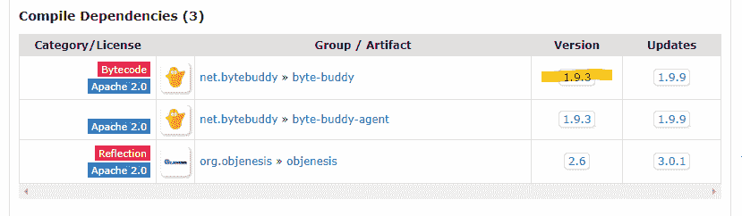

# [已解决] IllegalStateException：无法初始化插件 MockMaker

> 原文： [https://howtodoinjava.com/mockito/plugin-mockmaker-error/](https://howtodoinjava.com/mockito/plugin-mockmaker-error/)

如果您正在使用 [**Spring boot 2.x**](https://howtodoinjava.com/spring-boot2/spring-boot-mockmvc-example/) 应用，它们自动包含 **[Mockito](https://howtodoinjava.com/mockito/junit-mockito-example/) Core** 依赖项，那么您将遇到此错误，那么您 可以尝试建议的解决方案。

## 1\. 问题

Mockito 核心依赖于称为**字节伙伴**的库，而当 mocito 找不到匹配的字节伙伴 jar 版本时，通常会出现此问题。 错误看起来像这样：

```java
java.lang.IllegalStateException: Could not initialize plugin: interface org.mockito.plugins.MockMaker (alternate: null)
	at org.mockito.internal.configuration.plugins. PluginLoader$1.invoke(PluginLoader.java:74) ~[mockito-core-2.23.4.jar:na]
	at com.sun.proxy.$Proxy61.getHandler(Unknown Source) ~[na:na]
	at org.mockito.internal.util. MockUtil.isMock(MockUtil.java:81) ~[mockito-core-2.23.4.jar:na]
	...
	...
Caused by: java.lang.NoClassDefFoundError: net/bytebuddy/dynamic/loading/ ClassInjector$UsingReflection
	at org.mockito.internal.creation.bytebuddy. SubclassInjectionLoader.<init>(SubclassInjectionLoader.java:28) ~[mockito-core-2.23.4.jar:na]
	at org.mockito.internal.creation.bytebuddy. SubclassByteBuddyMockMaker.<init>(SubclassByteBuddyMockMaker.java:33) ~[mockito-core-2.23.4.jar:na]
	at org.mockito.internal.creation.bytebuddy. ByteBuddyMockMaker.<init>(ByteBuddyMockMaker.java:21) ~[mockito-core-2.23.4.jar:na]

	...
	...
	[spring-test-5.1.4.RELEASE.jar:5.1.4.RELEASE]
	... 19 common frames omitted
Caused by: java.lang.ClassNotFoundException: net.bytebuddy.dynamic. loading.ClassInjector$UsingReflection
	at java.net.URLClassLoader.findClass(Unknown Source) ~[na:1.8.0_171]
	at java.lang.ClassLoader.loadClass(Unknown Source) ~[na:1.8.0_171]
	at sun.misc.Launcher$AppClassLoader.loadClass(Unknown Source) ~[na:1.8.0_171]
	at java.lang.ClassLoader.loadClass(Unknown Source) ~[na:1.8.0_171]
	... 42 common frames omitted

```

## 2\. 解决方案

*   Find out the **mockito core** version your project is using. In eclipse, you can check in project build path by navigating to

    > 右键单击“项目 -> 属性 -> Java 构建路径 -> 库选项卡”

    

    Mockito 核心依赖项


*   在 Maven 仓库中搜索该版本的 Mockito Core。 对我来说是： [https://mvnrepository.com/artifact/org.mockito/mockito-core/2.23.4](https://mvnrepository.com/artifact/org.mockito/mockito-core/2.23.4)
*   Look at the **Compile Dependencies** section. Note down the correct dependent version of **byte-buddy** and include in the project. If the jar is already included with some other version, override the version with this correct version.

    

    正确的 jar 版本


生成应用，然后再次运行测试。 您与 **MockMaker** 有关的问题必须立即解决。

学习愉快！