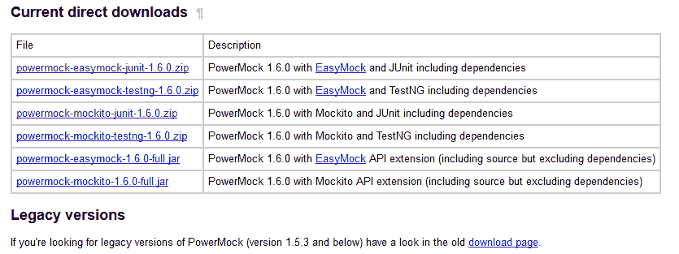

# 使用 PowerMock 进行模拟测试（带有 JUnit 和 Mockito）

> 原文： [https://howtodoinjava.com/library/mock-testing-using-powermock-with-junit-and-mockito/](https://howtodoinjava.com/library/mock-testing-using-powermock-with-junit-and-mockito/)

**PowerMock** 是 Java 世界的开源模拟库。 它扩展了现有的模拟框架，例如 **[EasyMock](http://www.easymock.org/ "easymock")** 和 **[Mockito](https://code.google.com/p/mockito/ "mockito")** ，为它们添加了更强大的功能。 PowerMock 使我们能够为最不可测试的代码编写良好的单元测试。 Java 中的大多数模拟框架都不能模拟静态方法或最终类。 但是使用 PowerMock，我们可以模拟几乎任何类。

PowerMock currently extends the EasyMock and Mockito mocking frameworks. Depending on which extension is preferred, the syntax to write any unit test differs slightly. In this tutorial, I am using PowerMock with Mockito.

本教程将演示一个使用 PowerMock 的非常简单的模拟示例。 它将向我们展示创建模拟和验证方法调用的基本语法。

## 具有依赖性的 PowerMock 安装

PowerMock 是一个正在积极开发的开源模拟框架。 您可以按照以下步骤在计算机中进行设置。

1）首先下载 PowerMock 1.5。 通过 [http://code.google.com/p/powermock/](https://code.google.com/p/powermock/ "powermock home") 访问 PowerMock 主页。

2）点击页面上的下载选项卡，您应该看到如下内容：



3）由于我们将使用 Mockito 扩展和 JUnit 测试框架来开发所有示例，因此请下载 **powermock-mockito-junit-1.6.zip** 文件。

4）将 ZIP 文件解压缩到某个文件夹中。 该 ZIP 文件包含使用 PowerMock 编写单元测试所需的所有从属 JAR 文件。

5）将所有 jar 文件复制到项目的 lib 文件夹中，并将其添加为依赖项。

你完成了！

You may need to additionally include “[hamcrest-core-1.3.jar](https://code.google.com/p/hamcrest/downloads/detail?name=hamcrest-core-1.3.jar "hamcrest")” if you do not have already.

## 参加班

为了完整起见，让我首先在下面的类中写下我们将在测试示例中使用的类。

**Employee.java**

```java
public class Employee {
	private String fName;

	public String getfName() {
		return fName;
	}

	public void setfName(String fName) {
		this.fName = fName;
	}
}

```

**EmployeeService.java**

```java
public class EmployeeService 
{
	public int getEmployeeCount() {
		throw new UnsupportedOperationException();
	}

	public void saveEmployee(Employee employee) {
        //return nothing
    }
}

```

**EmployeeController.java**

```java
public class EmployeeController 
{
	private EmployeeService employeeService;

    public EmployeeController(EmployeeService employeeService) {
        this.employeeService = employeeService;
    }

    public int getProjectedEmployeeCount()
    {
        final int actualEmployeeCount = employeeService.getEmployeeCount();
        return actualEmployeeCount * 2;
    }

    public void saveEmployee(Employee employee) {
        employeeService.saveEmployee(employee);
    }
}

```

## 没有 PowerMock 的首次测试

让我们编写一个简单的测试来获得不使用模拟的员工人数。 如您所见`EmployeeService.getEmployeeCount()`方法抛出`UnsupportedOperationException`，则测试应失败。

```java
@Test
public void shouldGetCountOfEmployees()
{
	EmployeeController employeeController =new EmployeeController(new EmployeeService());
	Assert.assertEquals(10,employeeController.getProjectedEmployeeCount());
}

```

在运行测试时，它肯定会失败，并带有以下异常。

```java
java.lang.UnsupportedOperationException
	at com.howtodoinjava.powermock.examples.service.EmployeeService.getEmployeeCount(EmployeeService.java:8)
	at com.howtodoinjava.powermock.examples.controller.EmployeeController.getProjectedEmployeeCount(EmployeeController.java:16)
	at com.howtodoinjava.powermock.examples.test.EmployeeControllerTestOne.shouldGetCountOfEmployees(EmployeeControllerTestOne.java:15)

```

在不允许您使用某种方法的任何应用程序中都可能出现这种情况，并且原因可以是无限的。 在这种情况下，您可能希望模拟上述方法，以便可以测试应用程序的其他部分。

## 使用 PowerMock 模拟一种简单的方法

在上面的示例中，不支持`getEmployeeCount()`方法，但我们想使用它。 在这种情况下，我们可以使用 powermock 模拟它。

```java
@Test
public void firstMockTest() 
{
	//Creating a mock using the PowerMockito.mock
	//method for the EmployeeService class.
	EmployeeService mock =PowerMockito.mock(EmployeeService.class);

	//Next statement essentially says that when getProjectedEmployeeCount method
	//is called on the mocked EmployeeService instance, return 8.
	PowerMockito.when(mock.getEmployeeCount()).thenReturn(8);

	EmployeeController employeeController = new EmployeeController(mock);

	Assert.assertEquals(16, employeeController.getProjectedEmployeeCount());
}

```

以上测试将成功执行。 在此，当调用`employeeController.getProjectedEmployeeCount()`时，它依次从模拟对象中调用方法`getEmployeeCount()`，该方法返回值 8。控​​制器将其乘以 2，返回值为 16。该返回值等于 assert 语句中的期望值， 因此测试通过了。

## 验证是否真的调用了模拟方法？

有时，单元测试只需要调用一个方法而忘记它。 主要是因为 method 不返回任何值。 您肯定可以通过再次从数据源获取值来测试 DB 中是否存在值。 但是，如果您的测试仅需要验证方法是否已被调用，就可以使用 powermock 进行。

```java
@Test
public void verifyMethodInvokationTest() 
{
	EmployeeService mock =PowerMockito.mock(EmployeeService.class);
	EmployeeController employeeController = new EmployeeController(mock);

	Employee employee = new Employee();
	employeeController.saveEmployee(employee);

	//Verifying that controller did call the
	//saveEmployee() method on the mocked service instance.
	Mockito.verify(mock).saveEmployee(employee);
}

```

在上面的测试示例中，我们使用 verify（mock）方法验证了`saveEmployee(employee)`是否确实已被调用。 如果您通过测试，则将通过。

要验证上述代码是否正常运行，请在`EmployeeController.java`的下面一行中注释掉。

```java
public void saveEmployee(Employee employee) {
	//employeeService.saveEmployee(employee); //Comment this line
}

```

现在，如果您再次运行测试，它将失败并显示此错误。

```java
Wanted but not invoked:
employeeService.saveEmployee(
    com.howtodoinjava.powermock.examples.model.Employee@7808b9
);
-> at com.howtodoinjava.powermock.examples.test.EmployeeControllerTestOne.verifyMethodInvokationTest(EmployeeControllerTestOne.java:47)
Actually, there were zero interactions with this mock.

```

您可以在单元测试中拥有非常好的功能。

## 使用模拟设置获取有关测试运行的更多信息

这些模拟设置很少使用，但在某些情况下很有用。 如果您想为模拟命名，以供将来调试之用，请使用它们。 或者您想启用详细日志记录以获取更多信息。 当您要注册一个侦听器来通知该模拟方法的调用时，可以使用它。 甚至在尚未实现实际对象的模拟对象上实现一些额外的接口。

```java
@Test
public void mockSettingsTest() {
	EmployeeService mock =PowerMockito.mock(EmployeeService.class, Mockito
		.withSettings()
		.name("EmployeeServiceMock")
		.verboseLogging());
	EmployeeController employeeController = new EmployeeController(mock);

	Employee employee = new Employee();
	employeeController.saveEmployee(employee);

	//Verifying that controller did call the
	//saveEmployee method on the mocked service
	//instance.
	Mockito.verify(mock).saveEmployee(employee);
}

```

运行以上测试以在控制台中获得以下结果：

```java
############ Logging method invocation #1 on mock/spy ########
employeeService.saveEmployee(
    com.howtodoinjava.powermock.examples.model.Employee@c9131c
);
   invoked: -> at com.howtodoinjava.powermock.examples.controller.EmployeeController.saveEmployee(EmployeeController.java:21)
   has returned: "null"

############ Logging method invocation #2 on mock/spy ########
employeeService.saveEmployee(
    com.howtodoinjava.powermock.examples.model.Employee@c9131c
);
   invoked: -> at com.howtodoinjava.powermock.examples.test.EmployeeControllerTestOne.mockSettingsTest(EmployeeControllerTestOne.java:64)
   has returned: "null"

```

这就是有关 powermock 的初学者教程的全部内容，可帮助您入门。 我将在下一组教程中介绍一些复杂的主题。

**祝您学习愉快！**