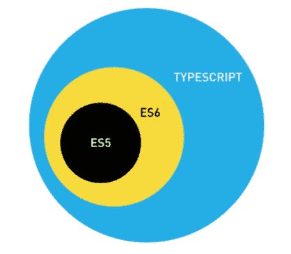

# TypeScript 教程

> 原文： [https://howtodoinjava.com/typescript/typescript-tutorial/](https://howtodoinjava.com/typescript/typescript-tutorial/)

TypeScript 是一种开放源代码编程语言，由 Microsoft 在 2012 年开发和维护。TypeScript 将“类型”（或数据类型）引入 JavaScript。

通常，类型在程序存储或操纵所提供的值之前会检查其有效性。 这样可以确保代码按预期方式运行，并防止您不小心破坏程序。 这有助于使 JavaScript 更接近其他强类型语言，例如`Java`和`C#`。

在本教程中，我们将在开始使用语言之前，全面了解 TypeScript 的全部知识。

```java
Table of Contents

TypeScript vs JavaScript
TypeScript Compiler
Install TypeScript
Run TypeScript

```

## TypeScript 与 JavaScript

<figure aria-describedby="caption-attachment-10675" class="wp-caption aligncenter" id="attachment_10675" style="width: 418px">

<figcaption class="wp-caption-text" id="caption-attachment-10675">TypeScript vs JavaScript</figcaption>

</figure>

1.  TypeScript 是 JavaScript 的 **ES6 版本，还有其他一些 TypeScript 仅具有**，而 Angular 需要这些才能工作。
2.  **TypeScript 是 JavaScript** 的超集。 它通过数据类型支持扩展 JavaScript。
3.  现有的 JavaScript 程序也是有效的 TypeScript 程序。
4.  TypeScript 支持可以包含现有 JavaScript 库的类型信息的定义文件。
5.  TypeScript 仅用于开发。 要在浏览器中运行，必须将其转换为 ES6 或 ES5 版本的 JavaScript。

## TypeScript 编译器

浏览器不支持 TypeScript。 因此，必须使用支持的 JavaScript 源代码重写用 TypeScript 编写的程序源代码。 为此，TypeScript 发行版附带了名为`tsc`的 TypeScript 编译器。

默认情况下，当前版本的编译器支持 ES 5。 TypeScript 可以将源代码编译为任何模块模式-`[AMD](https://en.wikipedia.org/wiki/Asynchronous_module_definition)`，`[CommonJS](https://en.wikipedia.org/wiki/CommonJS)`，`ES 6`，`SystemJS`等。

与任何`npm`软件包一样，您可以在本地或全局安装它，或同时在这两者中安装，并通过在命令行上运行`tsc`来编译 TS 文件。

```java
$ tsc helloworld.ts 	//It compile the file into helloworld.js

```

#### 编译器配置

TypeScipt 编译器选项在`tsconfig.js`中给出。 示例配置文件如下所示：

```java
{
  "compileOnSave": false,
  "compilerOptions": {
    "baseUrl": "./",
    "outDir": "./dist/out-tsc",
    "sourceMap": true,
    "declaration": false,
    "moduleResolution": "node",
    "emitDecoratorMetadata": true,
    "experimentalDecorators": true,
    "target": "es5",
    "typeRoots": [
      "node_modules/@types"
    ],
    "lib": [
      "es2017",
      "dom"
    ]
  }
}

```

## 安装 TypeScript

由于 TypeScript 仅用于开发目的，而不是在运行时使用，因此应将其**安装为 dev 依赖项**。

```java
$ npm install typescript --save-dev   //As dev dependency

$ npm install typescript -g          //Install as global module

$ npm install typescript@latest -g   //Install latest if you have older version

```

## 运行 TypeScript

在工作区中创建文件`helloworld.ts`。 在文件下面添加控制台日志语句。

```java
console.log("Welcome to TypeScript !!");

```

要将**从打字稿编译为 javascript** ，请使用命令`tsc filename`。

```java
$ tsc helloworld.ts 	//Generates file helloworld.js

```

要执行文件，请使用`node`命令运行。

```java
$ node helloworld.ts 	//Output "Welcome to TypeScript !!"

```

<figure aria-describedby="caption-attachment-10678" class="wp-caption aligncenter" id="attachment_10678" style="width: 453px">

<figcaption class="wp-caption-text" id="caption-attachment-10678">Run TypeScript from Console</figcaption>

</figure>

以上就是**对打字稿**的介绍。

将我的问题放在评论部分。

学习愉快！