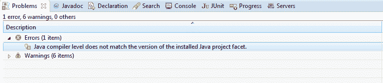

# 已解决：Java 编译器级别与已安装的 Java 项目方面的版本不匹配

> 原文： [https://howtodoinjava.com/maven/solved-java-compiler-level-does-not-match-the-version-of-the-installed-java-project-facet/](https://howtodoinjava.com/maven/solved-java-compiler-level-does-not-match-the-version-of-the-installed-java-project-facet/)

很长一段时间以来，我一直没有解决这个问题。 每次遇到此问题时，我都会去修改 Eclipse 中项目方面菜单的项目编译器级别。 今天，我决定结束一切。

eclipse 中的此错误如下所示：



Maven 编译器级别不匹配错误


## 原因：

此错误是由于默认的 Maven 编译器插件。 目前是 1.5。 因此，如果您使用 Java 1.6 构建项目，则每次运行此命令时都会遇到此问题：

```java
mvn eclipse:eclipse -Dwtpversion=2.0
```

根据 maven 文档：“目前，默认源设置为 1.5，默认目标设置为 1.5，与运行 Maven 的 JDK 无关。 如果要更改这些默认值，则应按照 Java 编译器的`-source`和`-target`设置所述设置源和目标。”

我的情况更糟，因为当时默认值为 Java 1.4。🙁

## 解决方案

要解决此问题，您需要在`pom.xml`文件中进行一次更新。 此更新用于覆盖 Maven 编译器插件中的默认编译器级别。

```java
<plugins>
	<plugin>
	  <artifactId>maven-compiler-plugin</artifactId>
		<configuration>
		  <source>1.6</source>
		  <target>1.6</target>
		</configuration>
	</plugin>
</plugins>

```

使用所需的 Java 版本更新上述编译器属性。 并将此配置放置在`pom.xml`文件的`build`节点中，如下所示：

```java
<build>
	<finalName>JerseyHelloWorld</finalName>
	<plugins>
		<plugin>
		  <artifactId>maven-compiler-plugin</artifactId>
			<configuration>
			  <source>1.6</source>
			  <target>1.6</target>
			</configuration>
		</plugin>
  </plugins>
</build>

```

以上更改将纠正错误。

**祝您学习愉快！**

参考： [http://maven.apache.org/plugins/maven-compiler-plugin/](https://maven.apache.org/plugins/maven-compiler-plugin/)