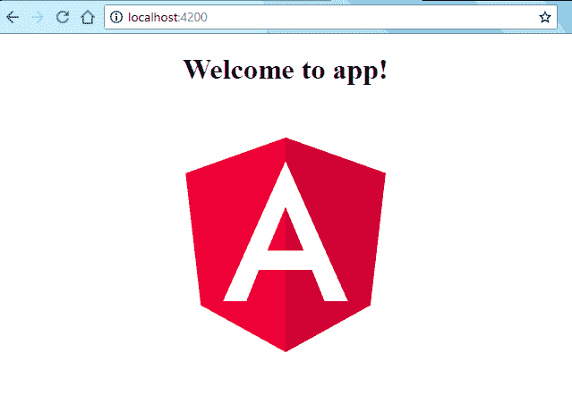

# Angular 开发工作区设置

> 原文： [https://howtodoinjava.com/angular/dev-workspace-setup/](https://howtodoinjava.com/angular/dev-workspace-setup/)

学习在本地工作站中为 Angular，Node 和 TypeScript 设置开发环境，以开发下一代 UI 应用。

```java
Table of Contents

Install Node
Install Git
Install Packages
Create Angular Hello world
Demo
```

## 安装节点

1.  转到[节点下载页面](https://nodejs.org/en/download/)，然后根据您的机器配置下载安装程序。
2.  执行安装程序。 如果要在任何备用位置上安装节点，请选择路径。 我建议使用默认选项。
3.  验证是否已使用此命令安装了节点。

    ```java
    $ node --version

    v8.11.3		//output

    ```

## 安装 Git

1.  转到 [Git 下载页面](https://git-scm.com/)，然后根据您的机器配置下载安装程序。
2.  执行安装程序。 如果要在任何备用位置上安装节点，请选择路径。 我建议使用默认选项。
3.  验证是否已使用此命令安装了节点。

    ```java
    $ git --version
    git version 2.17.1.windows.2	//Output

    ```

另外，运行以下命令来设置您的 git 身份。

```java
$ git config --global user.email "you@example.com"	//Use your git email id
$ git config --global user.name "Your Name"			//Use your git name

```

## 安装套件

现在，在安装了 node 和 git 之后，该安装必要的`npm`软件包了。

```java
$ npm install -g rxjs
$ npm install -g typescript
$ npm install -g webpack
$ npm install -g webpack-cli
$ npm install -g @angular/core
$ npm install -g @angular/cli
$ npm install -g gulp

```

## 创建 Angular Hello 世界

在命令提示符下转到您的工作区，然后运行此命令。 此命令将在`helloworld`文件夹中创建一个新的 Angular 应用–其中包含所有必需的文件。

```java
$ ng new helloworld

```


Angular CLI Generated Files


## 演示

要运行上面创建的应用，请从应用文件夹中运行命令`ng serve`。

```java
$ cd helloworld

$ ng serve

** Angular Live Development Server is listening on localhost:4200, open your browser on http://localhost:4200/ **

Date: 2018-06-18T17:10:50.638Z
Hash: 832b348b3a35e13efaf8
Time: 6365ms
chunk {main} main.js, main.js.map (main) 10.7 kB [initial] [rendered]
chunk {polyfills} polyfills.js, polyfills.js.map (polyfills) 227 kB [initial] [rendered]
chunk {runtime} runtime.js, runtime.js.map (runtime) 5.22 kB [entry] [rendered]
chunk {styles} styles.js, styles.js.map (styles) 15.6 kB [initial] [rendered]
chunk {vendor} vendor.js, vendor.js.map (vendor) 3.06 MB [initial] [rendered]
i ｢wdm｣: Compiled successfully.

```

打开浏览器，然后在`http://localhost:4200/`中验证正在运行的应用。



Angular Hello World in Browser


您的 Angular 开发环境已启动并正在运行。

将我的问题放在评论部分。

学习愉快！