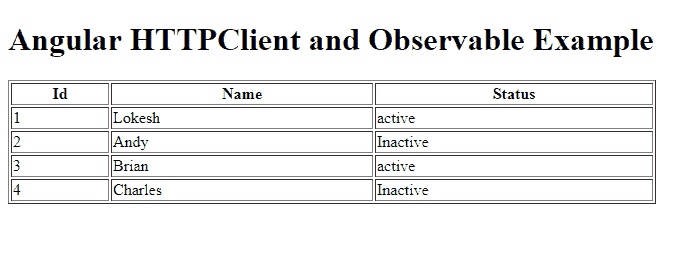

# 带有 RxJS 的 Angular HttpClient 可观察的示例

> 原文： [https://howtodoinjava.com/angular/rxjs-observable-httpclient/](https://howtodoinjava.com/angular/rxjs-observable-httpclient/)

了解如何使用角度`HttpClient`服务从在线 REST API 获取数据，并将其作为`Observable`对象/数组返回。 在发生任何数据事件时，`observable`的订户将做出反应。

```java
Table of Contents

HTTPClient Setup
Create service which return Observable
Create observer which subscribe to Observable
View HTML Template
Demo
```

## HTTPClient 设置

要使用`HTTPClient`服务，您需要执行两个步骤：

1.  #### 在根模块中导入 HttpClientModule

    从`@angular/common/http`包中导入`HttpClientModule`模块，并将其条目添加到`@NgModule`的`imports`属性中。

    ```java
    import { BrowserModule } from '@angular/platform-browser';
    import { HttpClientModule } from '@angular/common/http'; 
    import { NgModule } from '@angular/core';
    import { AppComponent } from './app.component';

    @NgModule({
      declarations: [
        AppComponent
      ],
      imports: [
        BrowserModule,
        HttpClientModule
      ],
      providers: [],
      bootstrap: [AppComponent]
    })
    export class AppModule { }

    ```

2.  #### 在服务构造函数中注入 HttpClient

    现在，在开始使用它时，在服务代码中注入实际的`HttpClient`服务。

    ```java
    import { Injectable } from '@angular/core';
    import { HttpClient } from '@angular/common/http';

    @Injectable({
      providedIn: 'root'
    })
    export class EmployeeService {

      constructor(private http: HttpClient) { }

    }

    ```

## 创建返回 Observable 的服务

我们将使用通过 [REST 模拟服务器](https://howtodoinjava.com/angular/mock-rest-server/)创建的 REST API。 让我们编辑员工服务类别的代码，并从中返回`Observable`。

```java
import { Injectable } from '@angular/core';
import { HttpClient } from '@angular/common/http';
import { Employee } from '../model/employee';
import { Observable } from 'rxjs';

@Injectable({
  providedIn: 'root'
})
export class EmployeeService {

  constructor(private http: HttpClient) { }

  public getEmployees(): Observable<Employee[]> 
  {
    const url = 'http://localhost:3000/employees';

    return this.http.get<Employee[]>(url);
  }
}

```

上面的代码点击 REST API `"/employees"`并获取`employee`数组。 然后，它返回 employee 数组作为可观察的集合。 任何方法都可以订阅它来侦听此数组上的数据事件。

仅供参考，`Employee`是用于存储数据的模型类。

```java
export class Employee {

  public id: number;
  public name: string;
  public status: string;

  constructor(id:number, name:string, status:string) {
    this.id = id;
    this.name = name;
    this.status = status;
  }

}

```

## 创建订阅了 Observable 的观察者

我们将在组件文件中创建订户。 它将从可观察数组中读取数据并分配给模型属性。 模型属性可用于映射来自 UI 的数据。

```java
import { Component } from '@angular/core';
import { EmployeeService } from './service/employee.service';
import { Employee } from './model/employee';

@Component({
  selector: 'app-root',
  templateUrl: './app.component.html',
  styleUrls: ['./app.component.css']
})
export class AppComponent {
  title = 'app';
  employees = new Array<Employee>();

  constructor( empService:EmployeeService ) {

    empService.getEmployees().subscribe(response => 
    {
      this.employees = response.map(item => 
      {
        return new Employee( 
            item.id,
            item.name,
            item.status
        );
      });
    });

  } 
}

```

## 查看 HTML 模板

是时候更新视图 HTML 了，该 HTML 将尽快提供`employee array`数据。

```java
<h1>
  Angular HTTP Service Example
</h1>
<table border="1" style="width: 33%">
  <tr>
    <th>Id</th>
    <th>Name</th>
    <th>Status</th>
  </tr>
  <tr *ngFor="let emp of employees">
    <td>{{ emp.id }}</td>
    <td>{{ emp.name }}</td>
    <td>{{ emp.status }}</td>
  </tr>
</table>

```

## 演示版

要测试以上编写的代码，您将启动模拟 REST 服务器以及 angular 应用程序。

1.  使用此命令启动 Mock 服务器。

    ```java
    $ json-server --watch 'E:\ngexamples\db.json'

    ```

2.  使用命令启动角度应用程序。

    ```java
    $ ng serve

    ```

在浏览器中检查应用程序。

<figure aria-describedby="caption-attachment-10736" class="wp-caption aligncenter" id="attachment_10736" style="width: 683px">

<figcaption class="wp-caption-text" id="caption-attachment-10736">Angular HttpClient with RxJS Observable Example</figcaption>

</figure>

将您的评论放在源代码中。

学习愉快！

[Sourcecode Download](https://howtodoinjava.com/wp-content/downloads/Angular2 Http Service Example.zip)