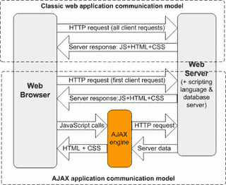
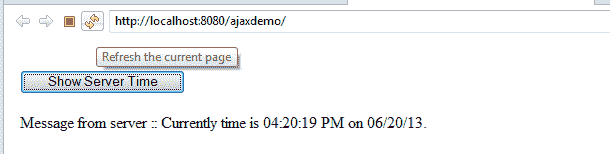

# Ajax 教程–面向初学者的 Ajax 指南

> 原文： [https://howtodoinjava.com/ajax/complete-ajax-tutorial/](https://howtodoinjava.com/ajax/complete-ajax-tutorial/)

异步 JavaScript 和 XML（ [**AJAX**](https://en.wikipedia.org/wiki/Ajax_%28programming%29 "ajax") ）是一种与服务器交换数据并更新网页的某些部分的技术，而无需重新加载整个网页。 换句话说， **AJAX** 允许通过与幕后服务器交换少量数据来异步更新网页。 如果应用未使用 AJAX，则必须在用户提出的每个请求上重新加载网页。

在本面向初学者的 *ajax 教程中，我将介绍在开发基于 ajax 的应用之前，您应该了解的所有基本和重要事实，以充分利用 ajax 的功能。*

```java
Table of Contents

1\. How ajax works?
2\. Ajax XMLHttpRequest object
3\. XMLHttpRequest methods (open(), setRequestHeader(), send(), abort())
4\. Synchronous and Asynchronous requests
    - onreadystatechange event, Handling server response
5\. Ajax demo
    - Asynchronous example, Synchronous example
6\. Popular ajax libraries
    - JQuery, Prototype
7\. 下载源码

```

## 1\. ajax 如何工作？

重要的是要了解 Ajax 不是单一技术，而是一组技术，例如 HTML，CSS，DOM 和 JavaScript 等。 [**HTML**](https://en.wikipedia.org/wiki/HTML "html") 和 [**CSS**](https://en.wikipedia.org/wiki/Cascading_Style_Sheets "css") 可以组合使用以标记和样式信息。 通过 [**JavaScript**](https://en.wikipedia.org/wiki/JavaScript "JavaScript") 访问 [**DOM**](https://en.wikipedia.org/wiki/Document_Object_Model "dom") ，以动态显示所呈现的信息，并允许用户与之交互。 JavaScript 和 [**XMLHttpRequest**](https://en.wikipedia.org/wiki/XMLHttpRequest "XMLHttpRequest") 对象提供了一种在浏览器和服务器之间异步交换数据以避免重新加载整个页面的方法。

近年来，XML 的本质已经减少。 [**JSON**](https://en.wikipedia.org/wiki/JSON "json") （JavaScript 对象表示法）通常用作数据交换的替代格式，尽管其他格式（例如预格式化的 HTML 或纯文本）也可以用于数据目的。

#### 1.1 Ajax 生命周期

通常，对服务器的 ajax 调用和从服务器获取响应（**生命周期事件**）涉及以下步骤：

*   您在浏览器的地址栏中键入网页的 URL，然后按 Enter。 页面已加载到浏览器窗口中。
*   某些操作会触发事件，例如用户单击按钮。
*   事件触发 ajax 调用，并使用 xml 或 json 向服务器发送请求。
*   服务器服务从 ajax / http 请求获取输入，并处理该请求。 如果需要，它还会准备响应数据。
*   服务器将数据发送回发出请求的原始网页。
*   另一个 JavaScript 函数称为回调函数，该函数接收数据并更新网页。

很容易，对吧？ 让我们在下面的图片中查看所有动作。



**How AJAX works?**


## 2\. Ajax XMLHttpRequest 对象

AJAX 的核心是 **XMLHttpRequest** 对象（可在客户端脚本语言（如 javascript）中使用）。 XMLHttpRequest 对象用于与后台的服务器交换数据。 所有现代浏览器（IE7 +，Firefox，Chrome，Safari 和 Opera）都具有内置的 XMLHttpRequest 对象。

如果您使用的是 IE 5 或 IE6（我想知道是否有人仍在使用它），则 **ActiveXObject** 将用于服务器通信以发送 Ajax 请求。

#### 2.1 创建 XMLHttpRequest 对象

这样创建一个 XMLHttpRequest 的新对象：

```java
	//Creating a new XMLHttpRequest object
	var xmlhttp;
	if (window.XMLHttpRequest)
	{
		xmlhttp = new XMLHttpRequest(); //for IE7+, Firefox, Chrome, Opera, Safari
	}
	else
	{
		xmlhttp = new ActiveXObject("Microsoft.XMLHTTP"); //for IE6, IE5
	}

```

可以重新使用此 xmlhttp 变量**发送多个 ajax 请求**，而无需创建新对象。 出于安全原因，XMLHttpRequest 受浏览器的*相同来源策略*约束。 这意味着只有在向原始网页提供服务的同一服务器上发出请求时，请求才会成功。

## 3\. XMLHttpRequest 方法

为了发送请求和设置请求属性，XMLHttpRequest 对象具有一些方法。 让我们来看看他们：

#### 3.1 打开（方法，URL，isAsync，用户名，密码）

必须通过打开方法初始化 **XMLHttpRequest 对象的 HTTP 和 HTTPS 请求。 此方法指定请求的类型（GET，POST 等），URL，以及是否应异步处理请求。 我将在下一部分中介绍第三个参数。**

第四个和第五个参数分别是用户名和密码。 如果服务器需要此参数，则可以提供这些参数或仅提供用户名以进行身份​​验证和授权。

例：

```java
	xmlhttp.open("GET","report_data.xml",true);
	xmlhttp.open("GET","sensitive_data.xml",false);
	xmlhttp.open("POST","saveData",true,"myUserName","somePassord");

```

#### 3.2 setRequestHeader（名称，值）

成功初始化请求后，可以调用 XMLHttpRequest 对象的 setRequestHeader 方法**来发送带有请求**的 HTTP 标头。

Example:

```java
	//Tells server that this call is made for ajax purposes.
	xmlhttp.setRequestHeader('X-Requested-With', 'XMLHttpRequest');  

```

#### 3.3 发送（有效负载）

**要发送 HTTP 请求**，必须调用 XMLHttpRequest 的 send 方法。 此方法接受单个参数，该参数包含要与请求一起发送的内容。
在 POST 请求中，该内容是必需的。 对于 GET 方法，隐式传递 null 作为参数。

Example:

```java
	xmlhttp.send(null); //Request with no data in request body; Mostly used in GET requests.
	xmlhttp.send( {"id":"23423"} ); //Request with data in request body; Mostly used in POST/ PUT requests.

```

#### 3.4 流产()

如果 XMLHttpRequest 对象的 readyState 尚未变为 4 （请求完成），则此方法**将中止请求。 abort 方法确保回调方法不会在异步请求中被调用。**

句法：

```java
	//Abort the processing
	xmlhttp.abort();

```

除上述方法外，onreadystatechange 事件监听器非常重要，我们将在下一部分中进行讨论。

## 4\. 同步和异步 ajax 请求

XMLHttpRequest 对象能够根据网页中的要求发送同步和异步请求。 该行为由打开方法的第三个参数**控制。 对于异步请求，此参数设置为**，对于同步请求**，此参数设置为 false。**

```java
	xmlhttp.open("GET", "report_data.xml", true); //Asynchrnonos request as third parameter is true
	xmlhttp.open("GET", "report_data.xml", false); Synchrnonos request as third parameter is false

```

如果未提供，则此参数的**默认值为“ true”** 。

异步 Ajax 请求不会阻止网页，并且在服务器上处理请求时，用户可以继续与页面上的其他元素进行交互。 您应该始终使用异步 Ajax 请求，因为同步 Ajax 请求会使 UI（浏览器）无响应。 这意味着在请求完成之前，用户将无法与网页进行交互。

在极少数情况下，应格外小心地使用同步请求。 例如，如果您要使用 ajax 在客户端上嵌入新的 JavaScript 文件，然后再引用该 JavaScript 文件中的类型和/或对象，则应使用同步 Ajax 请求。 然后，应该通过使用同步 Ajax 请求来包括对该新 JS 文件的提取。

#### 4.1 同步 ajax 请求示例

```java
var request = new XMLHttpRequest();
request.open('GET', '/bar/foo.txt', false);  //"false" makes the request synchronous
request.send(null);

if(request.status === 200) 
{
	//request successful; handle the response
}
else
{
	//Request failed; Show error message
}

```

#### 4.2 异步 Ajax 请求示例

```java
var request = new XMLHttpRequest();
request.open('GET', '/bar/foo.txt', true);  //"true" makes the request asynchronous

request.onreadystatechange = function() {
	if (request.readyState == 4) { 
		if (request.status == 200) 
		{
			//request succeed
		} 
		else
		{
			//request failed
		}
	}
};

request.send(null)

```

#### 4.3 onreadystatechange 事件

在上面的示例中，onreadystatechange 是向 XMLHttpRequest 请求注册的事件监听器。 onreadystatechange 存储一个函数，该函数将处理从服务器返回的响应。 在请求的生命周期中，所有重要事件都将被调用。 每次在请求处理中完成一个步骤时，readyState 的值都会更改并设置为其他值。 让我们看一下可能的值：

0：未初始化请求
1：建立服务器连接
2：接收请求
3：处理请求
4：请求已完成，响应已准备就绪

#### 4.4 处理来自服务器的响应

要从服务器获取响应，请使用 XMLHttpRequest 对象的 responseText 或 responseXML 属性。 如果来自服务器的响应是 XML，并且您要将其解析为 XML 对象，请使用 responseXML 属性。 如果来自服务器的响应不是 XML，请使用 responseText 属性。

**responseText** ：从服务器获取响应作为字符串
**responseXML** ：从服务器获取 XML 响应

**示例代码：**

```java
if (xmlhttp.readyState == 4) { 
	if (xmlhttp.status == 200) 
	{
		document.getElementById("message").innerHTML = xmlhttp.responseText;
	} 
	else {
		alert('Something is wrong !!');
	}
}

```

## 5\. Ajax 教程–演示

出于演示目的，我创建了一个非常简单的 hello world 应用。 在此应用中，网页发送 ajax GET 请求以查询当前服务器的系统时间。 作为响应，服务器发送当前时间。 很简单。


#### 5.1 异步请求示例

为了使网页能够发送此类请求，我在 JSP 页面中编写了以下 javascript 代码：

```java
function ajaxAsyncRequest(reqURL)
{
	//Creating a new XMLHttpRequest object
	var xmlhttp;
	if (window.XMLHttpRequest){
		xmlhttp = new XMLHttpRequest(); //for IE7+, Firefox, Chrome, Opera, Safari
	} else {
		xmlhttp = new ActiveXObject("Microsoft.XMLHTTP"); //for IE6, IE5
	}
	//Create a asynchronous GET request
	xmlhttp.open("GET", reqURL, true);

	//When readyState is 4 then get the server output
	xmlhttp.onreadystatechange = function() {
		if (xmlhttp.readyState == 4) { 
			if (xmlhttp.status == 200) 
			{
				document.getElementById("message").innerHTML = xmlhttp.responseText;
				//alert(xmlhttp.responseText);
			} 
			else
			{
				alert('Something is wrong !!');
			}
		}
	};

	xmlhttp.send(null);
}

```

并触发 ajax 请求，应单击一个按钮，其内容为：

```java
	<input type="button" value="Show Server Time" onclick='ajaxAsyncRequest("get-current-time")'/>

```

为了处理服务器端的请求，我编写了一个像这样的 servlet：

```java
public class GetTimeServlet extends HttpServlet 
{
	private static final long serialVersionUID = 1L;

	public void doGet (HttpServletRequest request,HttpServletResponse response) 
			throws ServletException, IOException 
	{
		response.setHeader("Cache-Control", "no-cache");
		response.setHeader("Pragma", "no-cache");
		PrintWriter out = response.getWriter();
		Date currentTime= new Date();
		String message = String.format("Currently time is %tr on %tD.",currentTime, currentTime);
		out.print(message);
	}
}

```

上面的代码将以文本形式返回当前服务器时间，以客户端代码的形式接收并打印在网页上。



#### 5.2 同步请求示例

要发送同步 ajax 请求，请使用以下命令更改 index.jsp 文件中的 javascript 代码：

```java
function ajaxSyncRequest(reqURL)
{
	//Creating a new XMLHttpRequest object
	var xmlhttp;
	if (window.XMLHttpRequest){
		xmlhttp = new XMLHttpRequest(); //for IE7+, Firefox, Chrome, Opera, Safari
	} else {
		xmlhttp = new ActiveXObject("Microsoft.XMLHTTP"); //for IE6, IE5
	}
	//Create a asynchronous GET request
	xmlhttp.open("GET", reqURL, false);
	xmlhttp.send(null);

	//Execution blocked till server send the response
	if (xmlhttp.readyState == 4) { 
		if (xmlhttp.status == 200) 
		{
			document.getElementById("message").innerHTML = xmlhttp.responseText;
		} 
		else
		{
			alert('Something is wrong !!');
		}
	}
}

```

您无需在同步请求中检查就绪状态，因为仅当请求完成时响应才可用。 到此为止，页面将被阻止。

## 6\. 流行的 ajax 库

显而易见，如今，ajax 是使网页具有高度交互性和用户友好性的非常流行的技术。 为了简化与 Ajax 相关组件的开发，当今市场上的开发人员可以使用各种框架。 好消息是它们都可以免费使用。

#### 6.1 jQuery 查询

[**jQuery**](https://jquery.com/ "jquery") 可能在其替代品中很受欢迎。 它拥有自己的开发者社区，该社区也非常活跃。 使用 jquery 发送 ajax 请求的示例代码如下：

```java
//Current request reference; can be used else where
var request;

/* attach a submit handler to the form */
$("#buttonId").submit(function(event) {

	// abort any pending request
    if (request) {
        request.abort();
    }

  /* stop form from submitting normally */
  event.preventDefault();

  /*clear result div*/
   $("#result").html('');

  /* get some values from elements on the page: */
   var values = $(this).serialize();

  /* Send the data using post and put the results in a div */
  request =$.ajax({
      url: "ajaxRequest",
      type: "post",
      data: values,
      success: function(){
           $("#result").html('submitted successfully');
      },
      error:function(){
          $("#result").html('there is error while submit');
      }   
  }); 
});

```

#### 6.2 原型

[**原型**](http://prototypejs.org/ "prototype") 是另一个用于相同目的的流行框架。 但是，请注意，已知原型与某些其他框架不兼容。 使用原型发送 ajax 请求的示例代码如下所示：

```java
new Ajax.Request('/some_url',
 {
	method:'get',
	onSuccess: function(transport) 
	{
		var response = transport.responseText || "no response text";
	},
	onFailure: function() 
	{ 
		alert('Something went wrong...'); 
	}
});

```

这就是 **ajax 教程**的全部内容。 将来我会在 ajax 上写更多文章。 您可能想注册您的电子邮件 ID，以获取更新通知。

## Ajax 教程源代码下载

[**源码下载**](https://docs.google.com/file/d/0B7yo2HclmjI4LUxndDZ1SUxjX3M/edit?usp=sharing "ajax demo source code")

学习愉快！