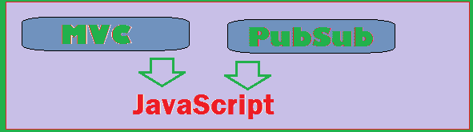
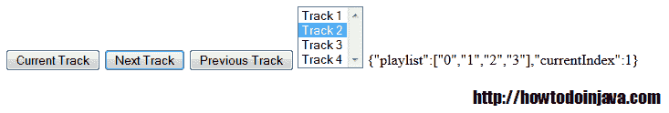

# 在 JavaScript 中实现 MVC 和 PubSub

> 原文： [https://howtodoinjava.com/javascript/implement-mvc-and-pubsub-in-javascript/](https://howtodoinjava.com/javascript/implement-mvc-and-pubsub-in-javascript/)

我们知道什么是 MVC？ MVC 代表 [**模型 - 视图 - 控制器**](https://en.wikipedia.org/wiki/Model%E2%80%93view%E2%80%93controller "MVC") 。 简而言之，MVC 是一种设计技术，其中将应用组件分为 3 组，以便可以独立开发它们而无需考虑它们将如何交互。 如果构建正确，则很少有配置代码可以绑定它们，并且可以立即使用。

[**PubSub（发布者订阅者）**](https://en.wikipedia.org/wiki/Publish%E2%80%93subscribe_pattern "pubsub") 模型是设计范式，其中多个订阅者正在监听源上的更改事件，并且一旦发生任何更改，便会立即通知监听器。 在用户交互影响屏幕上多个部分的大型系统中，此模式消除了许多硬编码，并提供了设计灵活性。



PubSub + MVC in JavaScript


在本教程中，我们将学习以下概念：

```java
Building Model-View-Controller components
Building Publisher Subscriber infrastructure
Understanding Event Notification mechanism
Demo application

```

让我们从构建 MVC 组件开始。

## **构建模型视图控制器组件**

在 JavaScript 中，如果必须开发 MVC 结构，则至少需要编写 3 个对象。 我只花 3 个使例子更加关注概念。

例如，我以媒体播放器为例。 此媒体播放器附有一个播放列表，用户可以使用按键事件在此播放列表上向前和向后移动。

**型号：**存储当前视图状态

播放列表–数组对象将所有曲目存储在当前可用的播放列表中。
currentIndex –当前播放的曲目

模型还包含帮助用户在用户交互后保持其当前状态更改的功能。

```java
var Model = {
   playlist: new Array(),
   currentIndex : 0,
   reLoad: function() {
		currentIndex = 0;
		var tracks = document.getElementById("playListSelector").options;
		for(var i=0; i<tracks.length; i++)
		{
			this.playlist&#91;i&#93; = tracks&#91;i&#93;.value;
		}
   },
   next: function () {
        if(this.currentIndex < (this.playlist.length-1))
			this.currentIndex++;
		publish(this);
   },
   prev: function () {
		if(this.currentIndex > 0)
			this.currentIndex--;
		publish(this);
   },
   current: function () {
		publish(this);
   }
};

```

**视图：**表示用户与之交互的屏幕

该对象只有一种方法可以在屏幕上呈现用户事件的结果。

```java
var View = {
   notify: function(model) {
		document.getElementById("playListSelector").selectedIndex = model.currentIndex;
   }
};

```

**控制器：**视图调用控制器以更改模型

控制器具有在用户交互期间将被调用的功能。

```java
var Controller = {
   model: Model,
   moveNext: function () {
     this.model.next(); 
     return this; 
   },
   movePrev: function () {
     this.model.prev(); 
     return this; 
   },
   getCurrent: function () {
     this.model.current(); 
     return this; 
   }
};

```

## **构建发布者订阅服务器基础结构**

到目前为止，一切都很好。 现在，我们将添加一些 pub-sub 逻辑，以便无论何时触发任何用户事件，都会通知所有已注册的视图，并且它们可以进行所需的视觉更改。

```java
//All subscribers for a event
var subscribers = [];

function publish(event) {
   for (i in subscribers) {
     subscribers[i].notify(event);
   }
};

```

上面的代码声明了一个数组，该数组可用于存储所有感兴趣的视图以将其自身注册为事件监听器。 每当任何事件作为用户交互触发时，都会通知他们该事件。

要将视图注册为事件监听器，将使用以下代码：

```java
//Subscribe for updates
subscribers.push(View); 

```

### **了解事件通知机制** 

事件处理按以下顺序执行：

视图触发事件 -> 控制器触发模型更新 -> 模型将通知发送到 pubsub -> pubsub 通知所有有关事件的视图，以便它们可以更新用户屏幕

在上面的代码段中，假设用户按下了播放列表中的下一首曲目。 这是控制流：

1.  用户按下“下一首”按钮
2.  控制器的 moveNext()方法称为
3.  moveNext()触发模型的 next()方法
4.  next()方法增加当前正在播放曲目的 currentIndex
5.  next()方法使用 publish()方法发布事件
6.  publish()方法调用 notify()方法是所有注册的订户
7.  Views notify()方法根据模型的当前状态更新用户屏幕

这样，所有可能的事件都将从 Controller 处理到视图层。 最后，我们一直都处于模型的当前状态。

## **演示应用**

我已经在一个文件中使用了上述所有代码段，并使用 HTML select 元素进行了虚拟播放列表行为。 select 的当前选定选项代表媒体播放器中当前播放的曲目。

让我们看一下完整的演示代码：

```java
<html>
<head>
<meta charset="utf-8">
<script language="javascript">
// PubSub
var subscribers = [];
function publish(event) {
   for (i in subscribers) {
     subscribers[i].notify(event);
   }
};

// MVC
var Model = {
   playlist: new Array(),
   currentIndex : 0,
   reLoad: function() {
		currentIndex = 0;
		var tracks = document.getElementById("playListSelector").options;
		for(var i=0; i<tracks.length; i++)
		{
			this.playlist&#91;i&#93; = tracks&#91;i&#93;.value;
		}
   },
   next: function () {
        if(this.currentIndex < (this.playlist.length-1))
			this.currentIndex++;
		publish(this);
   },
   prev: function () {
		if(this.currentIndex > 0)
			this.currentIndex--;
		publish(this);
   },
   current: function () {
		publish(this);
   }
};

var View = {
   notify: function(model) {
		document.getElementById("output").innerHTML = JSON.stringify(model);
		document.getElementById("playListSelector").selectedIndex = model.currentIndex;
   }
};

var Controller = {
   model: Model,
   moveNext: function () {
     this.model.next(); 
     return this; 
   },
   movePrev: function () {
     this.model.prev(); 
     return this; 
   },
   getCurrent: function () {
     this.model.current(); 
     return this; 
   }
};

subscribers.push(View); // Subscribe for updates

function initializeModel()
{
	Model.reLoad();
}

</script>
</head>
<body onload="initializeModel()">
	<input type="button" onclick="Controller.getCurrent();" value="Current Track">
	<input type="button" onclick="Controller.moveNext();" value="Next Track">
	<input type="button" onclick="Controller.movePrev();" value="Previous Track">

	<select id="playListSelector" multiple readonly>
		<option value="0">Track 1</option>
		<option value="1">Track 2</option>
		<option value="2">Track 3</option>
		<option value="3">Track 4</option>
	</select>
       <span id="output" />
</body>
</html>

```

上面的代码还有另外一个方法 initializeModel()，该方法用于在页面加载时使用播放列表项初始化模型对象。 现在，当我们按“下一个曲目”时，选择元素中的下一个选项被选中。 同样，按下“上一曲目”按钮，则在选择列表中选择了上一个选项。

您将看到如下运行代码：



Demo Screen of MVC + PubSub w2ith JavaScript


如果不清楚或您有任何建议/查询，请发表评论。

————————————————————————————————————
**更新：**

经过简短的邮件讨论后，Brook Monroe 向我发送了类似示例的更好的代码示例。 尽管本教程的目的不是更好的代码实践，而是详细介绍了概念。 我在下面共享更新的代码以供参考。 它可能会帮助您。

```java
<html>
<head>
<meta charset="utf-8">
<script src="./pubsub.js"></script>
</head>
<body>
    <button id="btnCurrent">Current Track</button>
    <button id="btnNext">Next Track</button>
    <button id="btnPrev">Previous Track</button>

    <select id="playListSelector" multiple readonly>
        <option value="0" selected>Track 1</option>
        <option value="1">Track 2</option>
        <option value="2">Track 3</option>
        <option value="3">Track 4</option>
    </select>
    <span id="output"></span>
</body>
</html>

//pubsub.js

// PubSub
( function () {
  "use strict";
  var subscribers = [],
      elCache = {},
      Model = {
          playlist : [],
          currentIndex : 0,
          reLoad : function() 
          {
              var tracks = Array.prototype.slice.call(elCache.get("playListSelector").options);
              this.playlist = [];
              tracks.forEach( function (e,i) { this.playlist.push(tracks[i].value); }, Model);
              this.currentIndex = 0;
          },
          next : function () 
          {
              if (this.currentIndex < (this.playlist.length-1)) {
                this.currentIndex++;
              }
              subscribers.publish(this);
          },
          prev : function () 
          {
              if (this.currentIndex > 0) {
                  this.currentIndex--;
              }
              subscribers.publish(this);
          },
          current : function () 
          {
              subscribers.publish(this);
          }
      },
	// MVC
      View = {
        notify : function(model) 
        {
          elCache.get("output").innerHTML = JSON.stringify(model);
          elCache.get("playListSelector").selectedIndex = model.currentIndex;
        }
      },
      Controller = {
        moveNext: function () 
        {
          Model.next(); 
          return this; 
        },
        movePrev: function () 
        {
          Model.prev(); 
          return this; 
        },
        getCurrent: function () 
        {
          Model.current(); 
          return this; 
        }
      };

  function start()
  {
    elCache.get = function (elId)
    {
      return this[elId] || ( this[elId] = document.getElementById(elId) );
    };

    subscribers.publish = function (event)
    {
      this.forEach( function (e) { e.notify(event); } );
    };

    subscribers.push(View); // Subscribe for updates

    elCache.get("btnCurrent").addEventListener("click", Controller.getCurrent.bind(Model));
    elCache.get("btnNext").addEventListener("click", Controller.moveNext.bind(Model));
    elCache.get("btnPrev").addEventListener("click", Controller.movePrev.bind(Model));
    Model.reLoad.bind(Model)();
  }

  window.addEventListener("load",start,false);
} )();

```

**祝您学习愉快！**