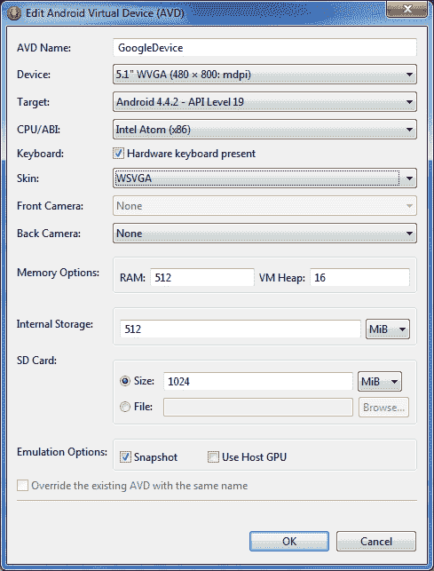
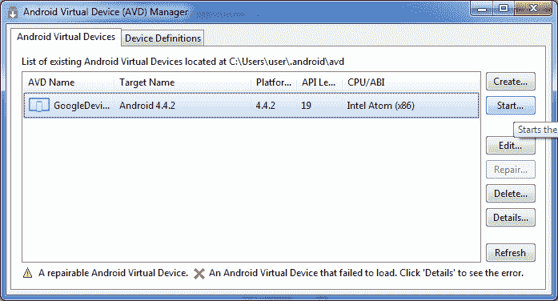
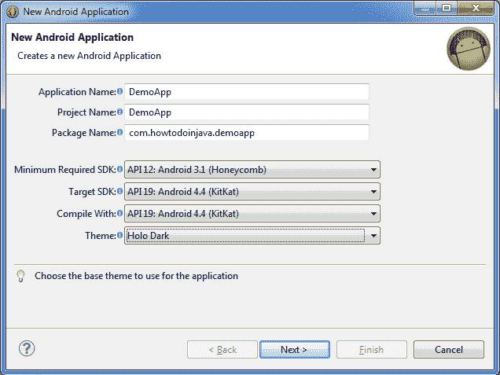
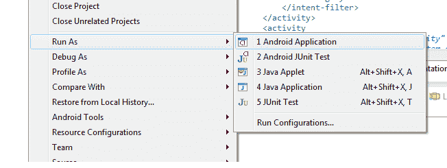

# Android 教程：在 Windows 上安装 Android

> 原文： [https://howtodoinjava.com/android/android-tutorial-install-android-on-windows/](https://howtodoinjava.com/android/android-tutorial-install-android-on-windows/)

在之前的 android 教程中，我们学习了 [**android 开发中使用的常用术语**](//howtodoinjava.com/android/android-tutorial-key-concepts/ "Android Tutorial : Key Concepts") ，以及一些概念，这些内容将在您开发任何 android 应用程序时为您提供帮助。 在未来的教程中，我将讨论您需要针对 android 应用程序进行开发设置的概念。 因此，在进入实际的 Development / android 概念之前，我们先准备一下开发机器。 我按顺序列出了所需的步骤。 按照给定的所有步骤，您还应该能够准备环境并开始进行实际的 android 应用程序开发。

```java
Table of Contents

1) Download ADT Bundle
2) Add SDK Packages
3) Configure Virtual Devices
4) Test your development environment
```

## 1）下载 ADT 捆绑包

我遵循为您的机器配置 android 开发环境的最短根目录。 您只需要下载 ADT（Android 开发者工具包）并开始使用它即可。 无需配置 IDE，环境变量或其他任何东西。 只需下载并开始开发。
**在下载之前，仅需检查一下您的计算机是 32 位还是 64 位。** 对于较麻烦的计算机版本，有单独的 ADT 下载。

[Download ADT for 32 bit Windows](https://dl.google.com/android/adt/adt-bundle-windows-x86-20140702.zip "32 bit ADT") | [Download ADT for 64 bit Windows](https://dl.google.com/android/adt/adt-bundle-windows-x86_64-20140702.zip "64 bit ADT")

**从上述任何位置下载 zip 文件**后，**将其解压缩到计算机**中的任何文件夹。 请确保**不在原始位置**中移动分布式 ADT 中的任何文件。 它可能会破坏开发环境。 只需复制，提取和开发应用程序即可。

该 ADT 包随附 Android SDK，eclipse IDE 和 SDK Manager 的快捷方式，您将使用该快捷方式将新功能更新/导入开发环境。

## 2）添加 SDK 包

将 ADT 提取到计算机中的某个位置后，单击“ **SDK Manager.exe** ”。 现在，选择要在计算机中安装的一组所需软件包。 接受所有条款和条件； 然后单击确定。 它将下载计算机中所有必需的软件包并自动配置。 您可以一次使用它们，设置完成。

在我的机器中，导入的软件包如下（截至日期）：


SDK-Manager-Preview


除了上述软件包外，您还应该从“其他”选项中下载“ Android 支持库”和“ Android 支持库”，这些选项隐藏在上图中的滚动条下方。

## 3）配置虚拟设备

您是开发测试应用程序还是生产类应用程序。 您需要先进行测试的设备，对吗？ AVD 管理器将帮助您执行此操作，并创建一些测试应用程序的虚拟设备。

*   **单击“ AVD 管理器”**


Configure Android Virtual Device Icon


*   **创建新的虚拟设备**


Configure Android Virtual Device Create Button


*   **填写 AVD 详细信息**



Configure Android Virtual Device – Create Options


*   **点击完成**



Configure Android Virtual Device – AVD Created


## 4）测试您的开发环境

与实际在环境中创建和运行应用程序相比，这是测试环境的更好方法。 请按照下面列出的屏幕快照来创建应用程序并在我们在第三步中创建的 AVD 中进行部署。

*   **创建新的 Android 项目**


Create Android Project – Android Application Project File Option


*   **向导选项 1：填写项目详细信息**



Create Android Project – New Project Wizard – Step 1


*   **选择项目配置**

包

Create Android Project – New Project Wizard – Step 2


*   **选择图标**


Create Android Project – New Project Wizard – Step 3


*   **选择活动**


Create Android Project – New Project Wizard – Step 4


*   **填写其他详细信息并完成**


Create Android Project – New Project Wizard – Finish


*   **作为 Android 应用程序**运行该应用程序



Run As – Android Application


*   **查看在模拟器**中运行的应用


Application-Running


而已。 您的 android 开发环境已经准备就绪，您还可以准备使用一些应用程序开发工具来弄脏您的手。 开始探索，我很快就会发布新内容。

**祝您学习愉快！**