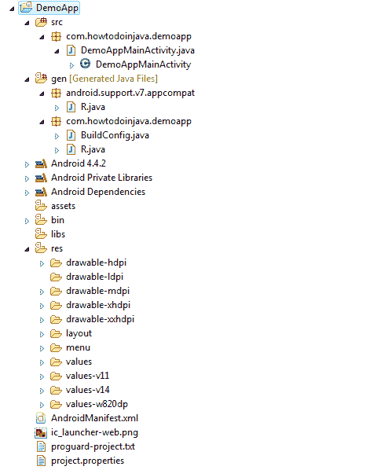
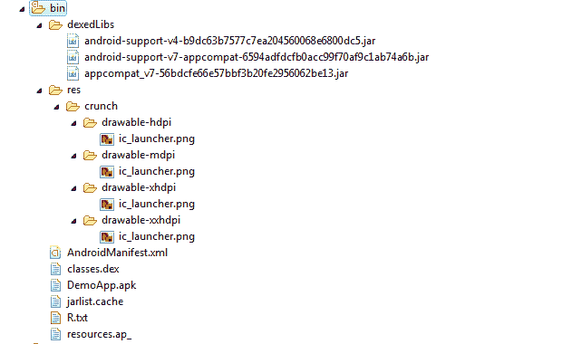

# Android 教程：Android 项目结构，文件和资源

> 原文： [https://howtodoinjava.com/android/android-tutorial-android-project-structure-files-and-resources/](https://howtodoinjava.com/android/android-tutorial-android-project-structure-files-and-resources/)

在上一个教程中，我们了解了 [**创建示例 android 应用**](//howtodoinjava.com/android/android-tutorial-how-to-create-android-app-project/ "Android Tutorial : How to Create Android App / Project") 并在 [**android 虚拟设备（AVD）**](//howtodoinjava.com/android/how-to-speed-up-a-slow-android-avdemulator/ "How to speed up a slow android AVD/emulator") 中运行。 在本教程中，我将简要介绍 android 应用的**项目结构，在 android 应用中创建的**文件和文件夹及其用法**。 这些信息将在以后的教程中进行更详细的讨论，但是目前，仅进行少量介绍将为进一步发展打下基础。**

Android app project structure

## 1）项目根目录/文件夹

当您创建新的 Android 项目（例如，通过 android create project）时，您会在项目的根目录中找到几项，包括：

1.  **AndroidManifest.xml** 是描述正在构建的应用以及该应用正在提供哪些组件（活动，服务等）的 XML 文件。
2.  **bin /** 文件夹，用于在应用编译后保存该应用（请注意：此目录将在您首次构建应用时创建。通常，在 Eclipse 中启用了“自动构建”功能，因此您将在获取后直接获得它 项目已创建。）
3.  **res /** 文件夹，其中包含“ *资源*”，例如图标，GUI 布局等，将与已编译的应用打包在一起
4.  **src /** 文件夹，其中包含应用的 Java 源代码
5.  **lib /** 文件夹，其中包含运行时所需的额外 jar 文件（如果有）
6.  **资产/** 文件夹，其中包含您希望与应用打包在一起以部署到设备上的其他静态文件
7.  **gen /** 文件夹包含 Android 构建工具生成的源代码

## 2）Java 源代码

创建项目时（例如，通过 android create project），您为应用（例如`com.howtodoinjava.DemoApp`）提供了“ **main** ”活动的全限定类名。 然后，您会发现项目的 src /树已经安装了包的目录树，还有代表您的主要活动的 Stub Activity 子类（例如 **`src/com/howtodoinjava/DemoAppMainActivity.java`** ）。 欢迎您修改此文件，并根据需要将其他文件添加到 src /树中，以实现您的应用。

首次在项目包的目录中编译该项目时，Android 构建链将创建`R.java`。 它包含许多与您在 res /目录树中放置的各种资源相关联的常量。

You should not modify `R.java` yourself, letting the Android tools handle it for you.

## 3）Android 应用资源

您还将发现您的项目具有 res /目录树。 它包含“资源”-与您的应用打包在一起的静态文件，它们可以是原始形式，也可以是预处理形式。 在 res /下可以找到或创建的一些子目录包括：

1.  **res / drawable /** 用于图像（PNG，JPEG 等）
2.  **res / layout /** 用于基于 XML 的 UI 布局规范
3.  **res / menu /** 用于基于 XML 的菜单规范
4.  **res / raw /** 用于通用文件（例如，音频片段，帐户信息的 CSV 文件）
5.  **res / values /** 用于字符串，尺寸和类似内容
6.  **res / xml /** 用于您希望随应用一起提供的其他通用 XML 文件

一些目录名称可能带有后缀，例如 **res / drawable-hdpi /** 。 这表明资源目录仅应在某些情况下使用-在这种情况下，可绘制资源应仅在具有**高密度屏幕**的设备上使用。

在我们的初始项目中，您将找到以下文件：

*   **res / drawable-hdpi / icon.png** ， **res / drawable-ldpi / icon.png** 和 **res / drawable-mdpi / icon.png** ， 是您的**高，低和中密度屏幕**的应用的占位符图标的三种表示形式
*   **res / layout / main.xml** ，其中包含一个 XML 文件，该文件描述了用户界面的非常简单的布局
*   **res / values / strings.xml** ，其中包含外部化的字符串，尤其是应用的占位符名称

## 4）当我们编译 android 项目时会发生什么

当您编译项目（通过 ant 或 IDE）时，结果进入项目根目录下的 bin /目录。

Android bin folder content

特别：

1.  **bin / classes /** 保存已编译的 Java 类
2.  **bin / classes.dex** 包含从那些编译的 Java 类创建的可执行文件
3.  **bin / resources.ap_** 保存您应用的资源，打包为 ZIP 文件（其中 yourapp 是应用的名称）
4.  **bin / DemoApp.apk** 是实际的 Android 应用

.apk 文件是一个 ZIP 存档，其中包含.dex 文件，资源的编译版本，任何未编译的资源（例如，放入 res / raw /的资源）和`AndroidManifest.xml`文件。

如果您构建应用的调试版本-您将`DemoApp-debug.apk`和`DemoApp-debug-aligned.apk`作为 APK 的两个版本。 后者已使用 [zipalign 工具](https://developer.android.com/tools/help/zipalign.html "zipalign")进行了优化，以使其运行更快。

这就是这篇小介绍性文章的全部内容，讨论了默认情况下每个 android 应用创建的各种文件和文件夹。 我们将在以后的教程中根据需要更深入地讨论它们。

**祝您学习愉快！**