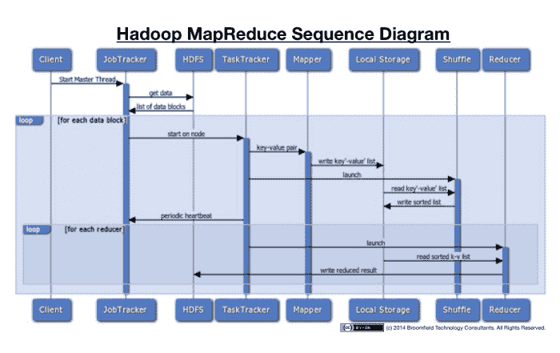
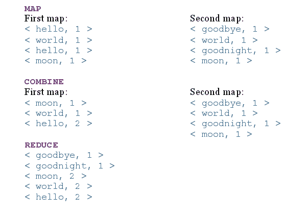

# Hadoop MapReduce 初学者教程

> 原文： [https://howtodoinjava.com/hadoop/hadoop-mapreduce-tutorial-for-beginners/](https://howtodoinjava.com/hadoop/hadoop-mapreduce-tutorial-for-beginners/)

[**Hadoop**](//howtodoinjava.com/big-data/hadoop/hadoop-big-data-tutorial/) **MapReduce** 是一种软件框架，可轻松编写可在大型集群（数千个）上并行并行处理大量数据（多 TB 数据集）的应用程序 商品硬件的节点）以可靠，容错的方式。 与 **[HDFS](//howtodoinjava.com/big-data/hadoop/hdfs-hadoop-distributed-file-system-architecture-tutorial/)** 相似，Hadoop MapReduce 甚至可以在商用硬件中执行，并且假定节点可以随时发生故障并且仍在处理作业。 通过将一个任务划分为多个独立的子任务，MapReduce 可以并行处理大量数据。 与 HDFS 相似，MapReduce 也具有主从结构。

MapReduce 作业通常将输入数据集分成独立的块，这些块由**映射**任务以完全并行的方式处理。 框架对地图的输出进行排序，然后将其输入到**简化**任务中。 通常，作业的输入和输出都存储在文件系统中。

输入和输出，甚至是 MapReduce 作业中的中间输出，都是`<key, value>`对的形式。 键和值必须是可序列化的，并且不使用 Java 序列化程序包，而是具有一个接口，该接口必须实现并且可以有效地序列化，因为数据处理必须从一个节点移动到另一个节点。

## MapReduce 应用程序中的步骤

在大数据中，您希望将大数据集分解为许多较小的部分，并使用相同的算法并行处理它们。 使用 HDFS，文件已经被分割成一口大小的片段。 MapReduce 可帮助您处理所有这些数据。

MapReduce 作业很复杂，涉及多个步骤。 某些步骤是由 Hadoop 以默认行为执行的，可以在需要时将其覆盖。 以下是在 MapReduce 中依次执行的必需步骤：

1.  #### 映射器

    在 MapReduce 中，Mapper 代码应具有逻辑，该逻辑可以独立于其他块数据。 映射器逻辑应利用算法中所有可能的并行步骤。 在特定的 InputFormat 类型和必须在其上运行 Mapper 进程的文件的驱动程序中设置对 Mapper 的输入。 Mapper 的输出将是一个映射`<key, value>`，在 Mapper 输出中设置的键和值不会保存在 HDFS 中，而是会在 OS 空间路径中创建一个中间文件，并且该文件会被读取，随机播放和排序。

2.  #### 随机排序（合并）

    随机排序和排序是 Mapper 和 Reducer 之间 MapReduce 中的中间步骤，由 Hadoop 处理，可以根据需要覆盖。 随机播放过程通过对 Mapper 输出的键值进行分组来聚合所有 Mapper 输出，并且该值将附加在值列表中。 因此，随机播放输出格式将为映射`<key, List<list of values>>`。

3.  #### 减速器

    Reducer 是聚合器过程，将经过随机排序和排序后的数据发送到具有`<key, List<list of values>>`的 Reducer，然后 Reducer 将在值列表上进行处理。 每个密钥可以发送到不同的 Reducer。 Reducer 可以设置该值，并将其合并到 MapReduce 作业的最终输出中，并且该值将作为最终输出保存在 HDFS 中。

MapReduce Process

让我们来看看序列图的所有动作信息。 这将有助于更好地可视化整个过程。

MapReduce Sequence Diagram

让我们来看一个上述步骤的示例。 考虑一下，我们将一个文件分为两个节点，文件内容为：

1.  **file1 内容**：“ hello world hello moon”
2.  **file2 内容**：“再见世界晚安月亮”

现在，在每个步骤之后，MapReduce 的结果如下：

MapReduce Steps Output

Applications without a reducer are known as **map-only jobs**, which can be useful when there’s no need to combine the result sets from the map tasks.

## 用 Java 编写 MapReduce 应用程序

要对 HDFS 中存储的大数据使用 MapReduce，必须提供以下输入：

*   指定输入/输出位置
*   通过实现适当的接口和/或抽象类来提供映射并简化功能

Map 和 Reduce 函数必须与 Serializable 键和值一起使用，因为它们将在不同的节点之间移动。

对于序列化，Hadoop 使用以下两个接口：

1.  #### 可写界面（用于值）

    `Writable`接口用于序列化和反序列化的值。 一些实现`Writable`接口的类是`ArrayWritable`，`BooleanWritable`和`ByteWritable`等。我们可以创建自己的自定义`Writable`类，该类可在 MapReduce 中使用。 为了创建自定义类，我们必须实现`Writable`类并实现以下两种方法：

    **无效写入（数据输出输出）**：序列化对象。
    **void readFields（输入数据输入）**：这将读取输入流并将其转换为对象。

2.  #### WritableComparable 接口（用于密钥）

    `WritableComparable`用于键，键是从`Writable`接口继承的，并实现可比较的接口以提供值对象的比较。 其中的一些实现是`BooleanWritable`，`BytesWritable`和`ByteWritable`等。为了创建自定义`WritableComparable`类，我们必须实现`WritableComparable`类并实现以下三种方法：

    **无效写入（DataPutput 输出）**：序列化对象
    **无效 readFields（DataInput 输入）**：读取输入流并将其转换为对象
    **Int compareTo（Object obj）**：比较排序键所需的值

将以上输入合并到 MapReduce 作业中后，可以将其提交到 **JobTracker** 。

## JobTracker 和 TaskTracker 流程

为了执行上面讨论的所有事情，MapReduce 具有以下两个守护进程：

1.  #### JobTracker（主流程）

    JobTracker 的主要功能是资源管理，跟踪资源可用性和任务处理周期。 JobTracker 识别 TaskTracker 来执行某些任务，并监视任务的进度和状态。 JobTracker 是 MapReduce 流程的单点故障。

2.  #### TaskTracker（从属进程）

    TaskTracker 是从属守护程序进程，它执行 JobTracker 分配的任务。 TaskTracker 定期将心跳消息发送到 JobTracker，以通知有关可用插槽的信息，并将有关任务的状态发送给 JobTracker，并检查是否必须执行任何任务。

## 投机执行

MapReduce 作业分为多个 Mapper 和 Reducer 流程以及一些中间任务，因此一个作业可以产生数百或数千个任务，并且某些任务或节点可能需要很长时间才能完成任务。 Hadoop 监视和检测任务何时运行得比预期的慢，并且如果该节点的执行历史较慢，则它将在另一个节点中启动相同的任务作为备份，这称为推测性执行任务。 Hadoop 不会尝试修复或诊断节点或进程，因为该进程不会出错，但是速度很慢，并且由于硬件降级，软件配置错误，网络拥塞等原因会导致速度变慢。

一旦标记了执行缓慢的任务，JobTracker 就会在另一个节点上启动该任务，并获取该任务的结果，该结果首先完成并杀死其他任务并记录情况。 如果某个节点始终落后，则 JobTracker 对该节点的优先级会降低。

可以启用或禁用推测性执行，并且默认情况下将其启用，因为它是一个有用的过程。 推测执行必须监视每个任务，在某些情况下会影响性能和资源。 不建议在执行某些任务的情况下执行推测执行，在这些任务中，特别是 reduce 的任务由于特定 reducer 上的数据偏斜而可能获得数百万个值，这比其他任务需要更长的时间，而启动另一个任务也无济于事。

## MapReduce 的局限性？

1.  您无法控制地图或缩小的运行顺序。
2.  为了获得最大的并行度，您需要 Maps 和 Reduces 不依赖于同一 MapReduce 作业中生成的数据（即两者都应该是无状态的）。
3.  在所有地图都完成之前，不会进行归约操作。
4.  一般的假设，Reduce 的输出小于 Map 的输入。
5.  由于带有索引的数据库将始终比未索引数据上的 MapReduce 作业快，因此性能可能下降。

**祝您学习愉快！**