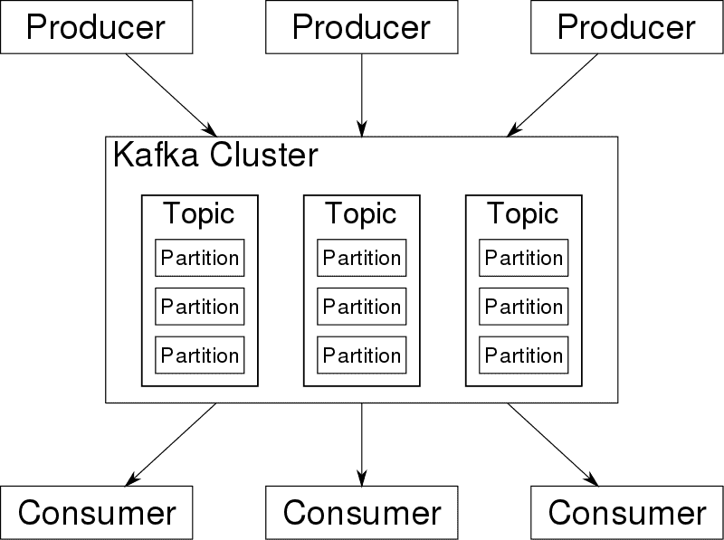

# Apache Kafka –简介

> 原文： [https://howtodoinjava.com/kafka/tutorial-introduction/](https://howtodoinjava.com/kafka/tutorial-introduction/)

从头开始学习下载和设置 Apache Kafka 和内置的 zookeeper。 本教程适用于绝对的初学者，他们可以在长期学习 Kafka 的同时为他们提供一些技巧。

## 1\. 什么是 Apache Kafka？

Apache Kafka 是基于**发布/订阅**消息传递系统的**分布式流平台**。 Kafka 使用的另一个术语是“分布式提交日志”。

就像我们将事务性数据存储在数据库中一样，以便以后可以检索它以做出一些业务决策时，Kafka 还以消息形式存储数据。 Kafka 中的数据按顺序持久存储，并可以确定性地读取。

Kafka 的主要特征是其**伸缩能力**以及**使用数据复制来防止故障**的能力。

#### 1.1 信息

卡夫卡中数据的**单位称为消息。 将此视为数据库表中的一行。**

按摩有两个部分– **键和主体**。 两者都只是一个字节数组，Kafka 并没有做任何神奇的读取和理解这些字节的事情。 它可以是 XML，JSON，String 或其他任何形式。 许多 Kafka 开发人员赞成使用 **Apache Avro** ，这是最初为 Hadoop 开发的序列化框架。 Kafka 不在乎并存储所有内容。

密钥用于以更可控的方式将消息写入分区。 Kafka 只是简单地找到密钥的哈希值，并使用它来查找必须在其中写入消息的分区号（逻辑并不是那么简单，当然）。

这样可以确保始终将具有相同密钥的消息写入同一分区。

#### 1.2 批量

批处理只是消息的**集合，所有消息都针对*相同的主题和分区*生成。**

邮件以批处理的形式在网络中移动。 这样做是为了提高网络利用率。

批处理通常也被压缩，以一些处理能力为代价提供更有效的数据传输和存储。

#### 1.3 主题

Kafka 主题与数据库表或文件系统中的文件夹非常相似。 主题还分为多个分区。

例如，考虑我们有一个名为“ `activity-log`”的主题，该主题有 3 个分区，它们的名称分别为：

*   `activity-log-0`
*   `activity-log-1`
*   `activity-log-2`

当源系统将消息发送到`activity-log`主题时，可以基于负载和各种其他因素将这些消息（1-n）存储在任一分区中。

此处，`message-1`仅存储在一个分区中。 同样，`message-2`将存储在相同或另一个分区中。 没有消息将存储在给定主题的多个分区中。

请注意，如果所有消息之间都有顺序，则 Kafka 仅确保将消息顺序存储在单个分区中。 无法保证存储在多个分区中的所有消息的顺序。

**流**被视为存储特定类别数据的单个主题，而不管其分区数如何。 与其他系统一起使用时，Kafka 将此`topic`（例如`activity-log`）显示为这些消息流的生产者或消费者。

#### 1.4 博克和集群

一台 Kafka 服务器称为代理。 代理从生产者客户端接收消息，分配和维护其偏移量，并将消息存储在存储系统中。

它还为使用者提供服务，响应对分区的提取请求并响应已提交到磁盘的消息。

如果硬件支持良好，则单个代理可以轻松处理每秒数千个分区和数百万条消息。

卡夫卡经纪人旨在作为集群的一部分进行运营。 在代理群集中，一个代理还将充当**群集控制器**，该控制器负责管理操作，包括为代理分配分区并监视代理故障。

## 2\. 优势

*   Kafka 能够提供**高吞吐量**，同时处理**多个生产者**，它们向单个主题或多个主题发送数据集。 这使得 Kafka 可以处理来自前端系统的大量事件/消息，这些事件/消息记录了页面浏览，鼠标跟踪或用户行为。
*   Kafka **多个使用者**读取任何单个消息流而不会互相干扰。 每个消息可以读取 N 次，因为**消息是持久的**。
*   Durable messages also means that consumer can work on **historical data**. Though, Kafka support **real time processing** as well.

    这也意味着，如果某些消费者在一段时间内处于脱机状态，则他们不会丢失任何数据并在重新连接时获取数据。

*   Kafka 具有高度的可伸缩性，可以在运行时添加或删除博克（节点）。 无需停止集群。
*   Kafka 提供出色的性能，并且能够在支持的硬件或基础架构中每秒处理数百万条记录。

## 3\. 结论

这篇文章主要是对 Kafka 的外观进行非常高级别的概述。 当涉及到更详细的细节时，您将阅读很多项目。

在下一篇文章中，我们将学习下载并启动 Kafka 代理，并将运行一些初学者命令。

学习愉快！

参考文献： [Kafka 网站](https://kafka.apache.org/intro)