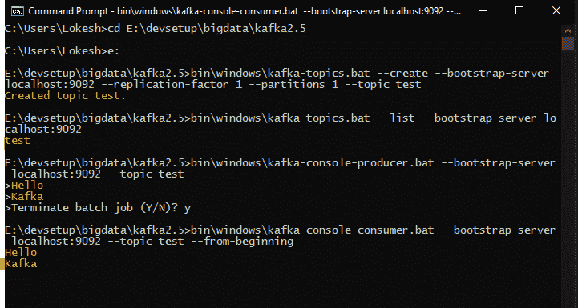

# Apache Kafka – Windows 10 入门

> 原文： [https://howtodoinjava.com/kafka/getting-started-windows-10/](https://howtodoinjava.com/kafka/getting-started-windows-10/)

学习**在 Windows 10** 上安装 [Apache Kafka](https://howtodoinjava.com/kafka/tutorial-introduction/) 并执行与 Kafka 和 Zookeeper 相关的*启动服务器*和**停止服务器**脚本。 我们还将通过创建主题，向其生成少量消息，然后使用用户读取用 Kafka 编写的消息来验证 Kafka 的安装。

## 1\. 先决条件

*   **需要 Java 8** 才能从 Kafka 网站运行最新下载。
*   **Zookeeper** （用于存储有关 Kafka 群集的元数据）也是必需的。 Kafka 首先内置了 Zookeeper。 但是建议在生产环境中单独安装 Zookeeper。 从其[官方网站](https://zookeeper.apache.org/releases.html)下载它。
*   Kafka 可以在任何操作系统上运行。 推荐使用 linux 操作系统。 使用 Windows，Kafka 有一些已知的错误。

> 本教程适用于初学者，并且不使用单独的 zookeeper 实例-保持简单，仅专注于 Kafka。

## 2\. 下载并安装 Kafka

*   从[官方网站](https://kafka.apache.org/downloads.html)下载 Kafka。 我今天下载了最新版本 2.5.0，文件名为“ [kafka_2.12-2.5.0.tgz](https://www.apache.org/dyn/closer.cgi?path=/kafka/2.5.0/kafka_2.12-2.5.0.tgz) ”。
*   将下载的文件复制到某个文件夹，然后使用`tar`命令将其解压缩。

    ```java
    > tar -xzf kafka_2.12-2.5.0.tgz
    ```

*   Copy the extracted folder in desired location. I have put it on location “`E:\devsetup\bigdata\kafka2.5`“.

    安装几乎完成了！

## 3\. 启动和关闭

要启动 Kafka，我们需要先**启动 Zookeeper，然后再启动 Kafka** 。 我正在编写小的批处理文件，这些文件首先移至 Kafka 安装目录，然后在新的命令提示符窗口中执行命令。

#### 3.1 启动 Zookeeper

要启动 Zookeeper，我们需要运行`zookeeper-server-start.bat`脚本并传递 zookeeper 配置文件路径。

```java
cd E:\devsetup\bigdata\kafka2.5
start cmd /k bin\windows\zookeeper-server-start.bat config\zookeeper.properties

```

#### 3.2 启动卡夫卡

要启动 Kafka，我们需要运行`kafka-server-start.bat`脚本并传递代理配置文件路径。

```java
cd E:\devsetup\bigdata\kafka2.5
start cmd /k bin\windows\kafka-server-start.bat config\server.properties

```

#### 3.3 关闭卡夫卡

要停止 Kafka，我们需要运行`kafka-server-stop.bat`脚本。

```java
cd E:\devsetup\bigdata\kafka2.5
start cmd /k bin\windows\kafka-server-stop.bat

```

#### 3.4 关闭动物园管理员

要停止 Zookeeper，我们需要运行`zookeeper-server-stop.bat`脚本。

```java
cd E:\devsetup\bigdata\kafka2.5
start cmd /k bin\windows\zookeeper-server-stop.bat

```

> 不要使用`CTRL+C`命令停止 zookeeper 和 kafka。 始终使用上面的`.bat`文件或命令。 否则可能会发生数据损坏。

## 4\. 验证 Kafka 安装

首先，使用上述脚本启动 Zookeeper 和 Kafka。

*   打开一个新的命令提示符，然后**创建一个新的 Kafka 主题**。

    ```java
    > bin\windows\kafka-topics.bat --create --bootstrap-server localhost:9092 --replication-factor 1 --partitions 1 --topic test

    //Output:

    Created topic test.

    ```

*   现在**列出所有主题**以验证创建的主题是否存在于此列表中。 在这一步，我们只有一个主题。

    ```java
    > bin\windows\kafka-topics.bat --list --bootstrap-server localhost:9092

    //Output:

    test

    ```

*   现在列出所有主题，以验证创建的主题是否存在于此列表中。 在这一步，我们只有一个主题。

    ```java
    > bin\windows\kafka-topics.bat --list --bootstrap-server localhost:9092

    //Output:

    test

    ```

*   **产生一些消息**并提交给`test`主题。 我添加了两个消息，即“ Hello”和“ Kafka”。

    ```java
    > bin\windows\kafka-console-producer.bat --bootstrap-server localhost:9092 --topic test

    ```

*   **使用消息**并提交到`test`主题。

    ```java
    > bin\windows\kafka-console-consumer.bat --bootstrap-server localhost:9092 --topic test --from-beginning

    //Output:

    Hello
    Kafka

    ```



Verify Kafka Installation


## 5\. 总结

在本教程中，我们学习了与 Zookeeper 一起安装 Kafka。 我们学会了启动和停止这两个服务器。 此外，我们通过创建主题，发布一些消息然后使用控制台用户脚本进行使用来验证安装。

需要注意的重要一点是，我们永远不要通过 kill 进程或`CTRL+C`命令来停止服务器。 始终使用脚本来停止服务器。

学习愉快！

参考：

[源码下载](https://github.com/lokeshgupta1981/Kafka)