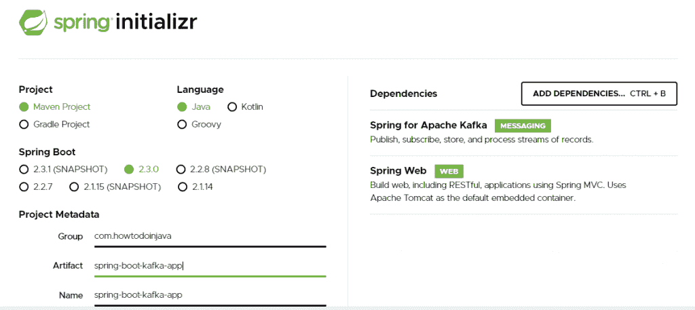

# Kafka 的 Spring Boot – Hello World 示例

> 原文： [https://howtodoinjava.com/kafka/spring-boot-with-kafka/](https://howtodoinjava.com/kafka/spring-boot-with-kafka/)

学习创建一个[弹簧启动](https://howtodoinjava.com/spring-boot-tutorials/)应用程序，该应用程序能够连接给定的 [Apache Kafka](https://howtodoinjava.com/kafka/tutorial-introduction/) 代理实例。 另外，从 Kafka 主题中学习产生和消费消息。

我们将遵循的步骤：

*   创建具有 Kafka 依赖项的 Spring Boot 应用程序
*   在`application.yaml`中配置 kafka 代理实例
*   使用`[KafkaTemplate](https://docs.spring.io/spring-kafka/api/org/springframework/kafka/core/KafkaTemplate.html)`将消息发送到主题
*   使用`[@KafkaListener](https://docs.spring.io/spring-kafka/api/org/springframework/kafka/annotation/KafkaListener.html)`实时收听发送到主题的消息

## 1.先决条件

*   请按照本指南在您的机器上设置 [Kafka](https://howtodoinjava.com/kafka/getting-started-windows-10/) 。
*   我们正在创建一个基于 Maven 的 Spring 引导应用程序，因此您的计算机应至少安装 [Java 8](https://howtodoinjava.com/java/basics/jdk-jre-jvm/#downloads) 和 [Maven](https://howtodoinjava.com/maven/how-to-install-maven-on-windows/) 。

## 2\. Spring Boot 应用程序

打开 [spring initializr](https://start.spring.io/) 并创建具有以下依赖项的 spring boot 应用程序：

*   Apache Kafka 的 Spring
*   Spring Web

<figure aria-describedby="caption-attachment-13317" class="wp-caption aligncenter" id="attachment_13317" style="width: 1024px">

<figcaption class="wp-caption-text" id="caption-attachment-13317">Create Spring boot kafka application</figcaption>

</figure>

生成的项目在`pom.xml`中具有以下依赖性。

```java
<dependencies>
	<dependency>
		<groupId>org.springframework.boot</groupId>
		<artifactId>spring-boot-starter-web</artifactId>
	</dependency>
	<dependency>
		<groupId>org.springframework.kafka</groupId>
		<artifactId>spring-kafka</artifactId>
	</dependency>

	<dependency>
		<groupId>org.springframework.boot</groupId>
		<artifactId>spring-boot-starter-test</artifactId>
		<scope>test</scope>
		<exclusions>
			<exclusion>
				<groupId>org.junit.vintage</groupId>
				<artifactId>junit-vintage-engine</artifactId>
			</exclusion>
		</exclusions>
	</dependency>
	<dependency>
		<groupId>org.springframework.kafka</groupId>
		<artifactId>spring-kafka-test</artifactId>
		<scope>test</scope>
	</dependency>
</dependencies>

```

在首选的 IDE 中导入项目。

## 3.配置 Kafka 代理

在`application.yaml`文件中，添加 kafka 代理地址以及与消费者和生产者相关的配置。

```java
server:
  port: 9000
spring:
  kafka:
    consumer:
      bootstrap-servers: localhost:9092
      group-id: group-id
      auto-offset-reset: earliest
      key-deserializer: org.apache.kafka.common.serialization.StringDeserializer
      value-deserializer: org.apache.kafka.common.serialization.StringDeserializer
    producer:
      bootstrap-servers: localhost:9092
      key-deserializer: org.apache.kafka.common.serialization.StringDeserializer
      value-deserializer: org.apache.kafka.common.serialization.StringDeserializer

```

## 4\. KafKaProducerService 和 KafKaConsumerService

`KafKaProducerService`类使用自动连接的`KafkaTemplate`将消息发送到已配置的主题名称。 同样，`KafKaConsumerService`类使用`@KafkaListener`来接收来自已配置主题名称的消息。

```java
import org.slf4j.Logger;
import org.slf4j.LoggerFactory;
import org.springframework.beans.factory.annotation.Autowired;
import org.springframework.kafka.core.KafkaTemplate; 
import org.springframework.stereotype.Service;
import com.howtodoinjava.kafka.demo.common.AppConstants;

@Service
public class KafKaProducerService 
{
	private static final Logger logger = 
			LoggerFactory.getLogger(KafKaProducerService.class);

	@Autowired
	private KafkaTemplate<String, String> kafkaTemplate;

	public void sendMessage(String message) 
	{
		logger.info(String.format("Message sent -> %s", message));
		this.kafkaTemplate.send(AppConstants.TOPIC_NAME, message);
	}
}

```

```java
import org.slf4j.Logger;
import org.slf4j.LoggerFactory;
import org.springframework.kafka.annotation.KafkaListener;
import org.springframework.stereotype.Service;
import com.howtodoinjava.kafka.demo.common.AppConstants;

@Service
public class KafKaConsumerService 
{
	private final Logger logger = 
			LoggerFactory.getLogger(KafKaConsumerService.class);

	@KafkaListener(topics = AppConstants.TOPIC_NAME, 
			groupId = AppConstants.GROUP_ID)
	public void consume(String message) 
	{
		logger.info(String.format("Message recieved -> %s", message));
	}
}

```

```java
public class AppConstants 
{
	public static final String TOPIC_NAME = "test";
	public static final String GROUP_ID = "group_id";
}

```

## 5.控制器

控制器负责使用 REST API 从用户获取消息，并将消息移交给生产者服务以将其发布到 kafka 主题。

```java
import org.springframework.beans.factory.annotation.Autowired;
import org.springframework.web.bind.annotation.PostMapping;
import org.springframework.web.bind.annotation.RequestMapping;
import org.springframework.web.bind.annotation.RequestParam;
import org.springframework.web.bind.annotation.RestController;
import com.howtodoinjava.kafka.demo.service.KafKaProducerService;

@RestController
@RequestMapping(value = "/kafka")
public class KafkaProducerController 
{
	private final KafKaProducerService producerService;

	@Autowired
	public KafkaProducerController(KafKaProducerService producerService) 
	{
		this.producerService = producerService;
	}

	@PostMapping(value = "/publish")
	public void sendMessageToKafkaTopic(@RequestParam("message") String message) 
	{
		this.producerService.sendMessage(message);
	}
}

```

## 6.测试

使用任何 REST API 测试器并将少量消息发布到查询参数`"message"`中的 API `http://localhost:9000/kafka/publish`。

留言栏：`http://localhost:9000/kafka/publish?message=Alphabet`

观察控制台日志：

```java
2020-05-24 23:36:47.132  INFO 2092 --- [nio-9000-exec-4] 
c.h.k.demo.service.KafKaProducerService  : Message sent -> Alphabet

2020-05-24 23:36:47.138  INFO 2092 --- [ntainer#0-0-C-1] 
c.h.k.demo.service.KafKaConsumerService  : Message recieved -> Alphabet

```

如果您已经在命令提示符下打开了 Kafka 控制台使用者，那么您也会看到该消息。

<figure aria-describedby="caption-attachment-13318" class="wp-caption aligncenter" id="attachment_13318" style="width: 702px">

<figcaption class="wp-caption-text" id="caption-attachment-13318">Kafka console consumer</figcaption>

</figure>

## 7.结论

在 **spring boot kafka 教程**中，我们学习了如何创建 spring boot 应用程序和配置 Kafka 服务器。 另外，我们通过使用`KafkaTemplate`发布一些消息，然后使用`@KafkaListener`使用这些消息来验证该应用程序。

学习愉快！

[Sourcecode Download](https://github.com/lokeshgupta1981/Kafka-Tutorials)