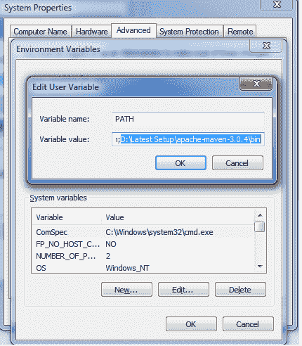
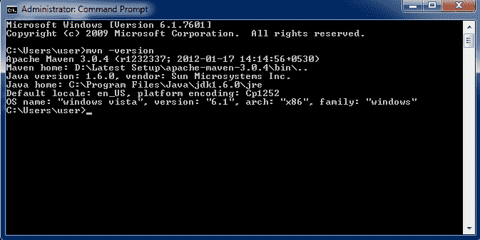

# 如何在 Windows 上安装 Maven

> 原文： [https://howtodoinjava.com/maven/how-to-install-maven-on-windows/](https://howtodoinjava.com/maven/how-to-install-maven-on-windows/)

[Maven](https://howtodoinjava.com/maven/) 是用于基于 Java 的应用开发的构建和依赖项管理工具。 与其他基于 Java 的开发工具一样，它不会作为 Windows 服务安装，而是使用 Windows [环境变量](https://howtodoinjava.com/security/windows-7-set-environment-variables-without-admin-access/)进行配置。

在此 **maven 教程**中，我将在 **Windows 7 32 位**机器上安装 maven。

> **Windows 环境变量位置：**
> 控制面板>所有控制面板项目>系统>高级系统设置>环境变量

请按照在 Windows 操作系统上安装 Maven 所需的步骤进行操作。

## 第 1 步）安装 JDK 并添加“ JAVA_HOME”环境变量

要安装 Java，请[下载 JDK 安装程序](http://www.oracle.com/technetwork/java/javase/downloads/index.html "download java")和**将`JAVA_HOME`变量添加/更新到 JDK 安装文件夹。**


## 第 2 步）下载 Maven 并添加`MAVEN_HOME`和`M2_HOME`环境变量

可以从此[**位置**](https://maven.apache.org/download.cgi "maven download")下载 Maven。 我已将其提取到位置 – `D:/Latest Setup/apache-maven-3.0.4`。 您可以选择自己的位置。

**将`M2_HOME`和`MAVEN_HOME`变量设置为 maven 安装文件夹。**


## 第 3 步）在`PATH`变量中包含`maven/bin`目录

**要从命令提示符运行 maven，这是必需的。 用`'Maven-installation/bin' directory`** 更新`PATH`变量。



## 步骤 4）在控制台中验证 Maven

Maven 安装完成。 现在让我们从 Windows 命令提示符下对其进行测试。

1.  转到开始菜单，然后在应用位置搜索框中键入`cmd`。
2.  按`ENTER`。 将打开一个新的命令提示符。
3.  在命令提示符下键入`mvn -version`并点击`ENTER`。

```java
$ mvn -version

```



这应该显示已安装的 maven 的版本信息。 如果显示任何错误，请交叉检查上述所有步骤。

在本教程中，我们学习了**如何在 Windows** 上安装 maven。

学习愉快！