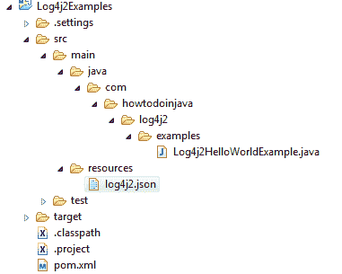

# Log4j 2 JSON 配置示例

> 原文： [https://howtodoinjava.com/log4j2/log4j-2-json-configuration-example/](https://howtodoinjava.com/log4j2/log4j-2-json-configuration-example/)

[Apache Log4j 2](https://logging.apache.org/log4j/2.x/) 是对 Log4j 1.x 的升级，在性能上进行了重大改进，改进了配置文件的自动重装，java 8 lambda 支持和自定义日志级别，从而大大改进了 Log4j1.x。 除了 [XML](//howtodoinjava.com/log4j2/log4j-2-xml-configuration-example/) 和[属性](//howtodoinjava.com/log4j2/log4j-2-properties-file-configuration-example)文件外，还可以使用 **JSON** 配置 Log4j。

## Log4j2 依赖项

要在项目中包含 **Log4j2** ，请在项目中包含以下依赖项。

```java
<dependency>
	<groupId>org.apache.logging.log4j</groupId>
	<artifactId>log4j-api</artifactId>
	<version>2.6.1</version>
</dependency>
<dependency>
	<groupId>org.apache.logging.log4j</groupId>
	<artifactId>log4j-core</artifactId>
	<version>2.6.1</version>
</dependency>

```

Log4j2 使用 [Jackson](https://github.com/FasterXML/jackson) 解析 JSON 文件 - 因此，我们还要添加它的依赖项。

```java
<dependency>
	<groupId>com.fasterxml.jackson.core</groupId>
	<artifactId>jackson-core</artifactId>
	<version>2.7.4</version>
</dependency>
<dependency>
	<groupId>com.fasterxml.jackson.core</groupId>
	<artifactId>jackson-databind</artifactId>
	<version>2.7.4</version>
</dependency>
<dependency>
	<groupId>com.fasterxml.jackson.core</groupId>
	<artifactId>jackson-annotations</artifactId>
	<version>2.7.4</version>
</dependency>

```

## 用于控制台记录的`log4j2.json`

您可以使用下面的`src/main/resources/log4j2.json`文件将日志输出到控制台。 请注意，如果找不到配置文件，则将使用`DefaultConfiguration`。 这也将日志输出到控制台。

```java
{
    "configuration": {
        "status": "error",
        "name": "JSONConfigDemo",
        "packages": "com.howtodoinjava",
        "ThresholdFilter": {
            "level": "debug"
        },
        "appenders": {
            "Console": {
                "name": "STDOUT",
                "PatternLayout": {
                    "pattern": "%d [%t] %-5p %c - %m%n"
                }
            }
        },
        "loggers": {
            "root": {
                "level": "debug",
                "AppenderRef": {
                    "ref": "STDOUT"
                }
            }
        }
    }
}

```

## 用于滚动文件记录的`log4j2.json`

您可以使用下面的`log4j2.json`文件将日志输出到基于大小的滚动文件中。

```java
{
   "configuration": {
      "name": "Default",
      "appenders": {
         "RollingFile": {
            "name":"File",
            "fileName":"C:/logs/howtodoinjava.log",
            "filePattern":"C:/logs/howtodoinjava-backup-%d{MM-dd-yy-HH-mm-ss}-%i.log.gz",
            "PatternLayout": {
               "pattern":"%d{yyyy-MM-dd HH:mm:ss} %-5p %c{1}:%L - %m%n"
            },
            "Policies": {
               "SizeBasedTriggeringPolicy": {
                  "size":"10 MB"
               }
            },
            "DefaultRolloverStrategy": {
               "max":"10"
            }
         }
      },
      "loggers": {
         "root": {
            "level":"debug",
            "appender-ref": {
              "ref":"File"
            }
         }
      }
   }
}

```

## log4j2.json 文件位置

您应该将`log4j2.json`放在应用程序的类路径中的任何位置。 Log4j2 将扫描所有类路径位置以查找此文件，然后将其加载。



`Log4j2.json`文件位置


## `log4j2.json`示例

让我们写一个 Java 类并写一些日志语句来验证日志是否也出现在控制台和日志文件中。

```java
package com.howtodoinjava.log4j2.examples;

import org.apache.logging.log4j.LogManager;
import org.apache.logging.log4j.Logger;

public class Log4j2HelloWorldExample 
{
	private static final Logger LOGGER = LogManager.getLogger(Log4j2HelloWorldExample.class.getName());

	public static void main(String[] args) 
	{
		LOGGER.debug("Debug Message Logged !!!");
		LOGGER.info("Info Message Logged !!!");
		LOGGER.error("Error Message Logged !!!", new NullPointerException("NullError"));
	}
}

```

现在，当您运行上述程序时，您将在控制台中获得以下日志。

```java
2016-06-16 15:06:25 DEBUG Log4j2HelloWorldExample:12 - Debug Message Logged !!!
2016-06-16 15:06:25 INFO  Log4j2HelloWorldExample:13 - Info Message Logged !!!
2016-06-16 15:06:25 ERROR Log4j2HelloWorldExample:14 - Error Message Logged !!!

java.lang.NullPointerException: NullError at com.howtodoinjava.log4j2.examples.Log4j2HelloWorldExample.main
(Log4j2HelloWorldExample.java:14) [classes/:?]

```

学习愉快！