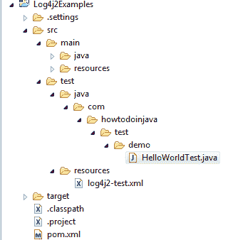

# 为 JUnit 测试用例配置 Log4j2

> 原文： [https://howtodoinjava.com/log4j2/configure-log4j2-for-junit/](https://howtodoinjava.com/log4j2/configure-log4j2-for-junit/)

大多数开发人员都希望使用不同的 [log4j2 配置文件](//howtodoinjava.com/log4j2/log4j-2-xml-configuration-example/)进行 junit 测试。 让我们学习一些推荐的配置 [Log4j2](https://logging.apache.org/log4j/2.x/manual/configuration.html) 的推荐方法，这些方法特定于 [junit](//howtodoinjava.com/junit-4/) 测试用例，并且与生产环境不同。

```java
Table of Contents

Place log4j2-test.xml in test folder
Use log4j.configurationFile property in @BeforeClass
```

## 将`log4j2-test.xml`放入测试文件夹

将`log4j2-test.xml`文件放置在`src/test/resources`文件夹中。 通过将`log4j2-test.xml`放入此目录，将导致使用它代替可能存在的`log4j2.xml`或`log4j2.json`。



用于 JUnit 的 Log4j2 配置


## 在`@BeforeClass`中使用`log4j.configurationFile`属性

为 junit 测试引入不同日志文件的另一种方法是 – 在任何测试类的`@BeforeClass`批注中设置`log4j.configurationFile`属性。

例如。 创建测试特定的日志记录配置文件`log4j2-testConfig.xml`，并将其放置在`resources`文件夹中。 现在，让我们在 JUnit 测试中使用该文件。

```java
import java.net.MalformedURLException;

import org.apache.logging.log4j.LogManager;
import org.apache.logging.log4j.Logger;
import org.junit.BeforeClass;
import org.junit.Test;

public class HelloWorldTest 
{
	private static Logger LOGGER = null;

	@BeforeClass
	public static void setLogger() throws MalformedURLException
	{
		System.setProperty("log4j.configurationFile","log4j2-testConfig.xml");
		LOGGER = LogManager.getLogger();
	}

	@Test
	public void testOne()
	{
		LOGGER.debug("Debug Message Logged !!!");
        LOGGER.info("Info Message Logged !!!");
        LOGGER.error("Error Message Logged !!!", new NullPointerException("NullError"));
	}
}

```

在注释部分中，将有关 junit 测试的 **log4j2 配置的问题交给我。**

学习愉快！