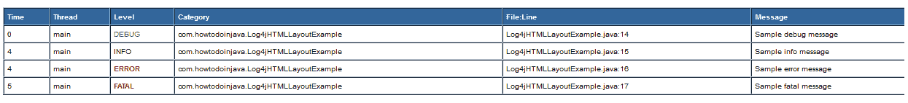

# Log4j HTMLLayout –以 HTML 格式创建日志

> 原文： [https://howtodoinjava.com/log4j/how-to-create-logs-in-html-format-using-log4j/](https://howtodoinjava.com/log4j/how-to-create-logs-in-html-format-using-log4j/)

[Log4j](//howtodoinjava.com/category/frameworks/log4j/ "log4j tutorials") 是一个简单而灵活的日志记录框架。 日志记录为开发人员提供了有关应用程序故障的详细上下文。 使用 log4j 可以在运行时启用日志记录，而无需修改应用程序二进制文件。 log4j 软件包的设计目的是使这些语句可以保留在出厂代码中，而不会造成高昂的性能成本。

Log4j 带有多个选项来格式化框架创建的日志文件。 它也可以创建简单的日志文件，html 日志文件或 xml 日志文件。

在这篇文章中，我将展示用于配置 log4j 以生成 html 格式的日志的示例代码。

**步骤 1）创建一个 Maven Java 项目并更新 log4j 依赖项**

请遵循与 **[和 maven](//howtodoinjava.com/log4j/how-to-configure-log4j-using-maven/)** 配置 log4j 有关的步骤。

**步骤 2）在 log4j.properties 文件**中配置 HTMLLayout

HTMLLayout 类扩展了抽象的 org.apache.log4j.Layout 类，并从其基类覆盖 format（）方法以提供 HTML 样式的格式设置。

这提供了以下信息以供显示：

*   从应用程序启动到生成特定日志事件之前所经过的时间。
*   调用日志记录请求的线程的名称。
*   与此日志记录请求关联的级别。
*   记录器和记录消息的名称。
*   程序文件的可选位置信息以及从中调用此日志记录的行号。

```java
# Define the root logger with file appender
log4j.rootLogger = DEBUG, HTML

# Define the file appender
log4j.appender.HTML=org.apache.log4j.FileAppender
log4j.appender.HTML.File=application.html

# Define the html layout for file appender
log4j.appender.HTML.layout=org.apache.log4j.HTMLLayout
log4j.appender.HTML.layout.Title=Application logs
log4j.appender.HTML.layout.LocationInfo=true
log4j.appender.HTML.Threshold=DEBUG
```

**步骤 3）配置 log4j.properties 并测试应用程序**

```java
package com.howtodoinjava;

import org.apache.log4j.Logger;
import org.apache.log4j.PropertyConfigurator;

public class Log4jHTMLLayoutExample
{
	static Logger log = Logger.getLogger(Log4jHTMLLayoutExample.class);

	public static void main(String[] args)
	{
		PropertyConfigurator.configure("log4j.properties");

		log.debug("Sample debug message");
		log.info("Sample info message");
		log.error("Sample error message");
		log.fatal("Sample fatal message");
	}
}

```

输出将记录在项目根文件夹的 application.html 中：

<figure aria-describedby="caption-attachment-1071" class="wp-caption aligncenter" id="attachment_1071" style="width: 750px">[](https://howtodoinjava.files.wordpress.com/2013/04/html-logs-log4j.png)

<figcaption class="wp-caption-text" id="caption-attachment-1071">HTML logs generated from log4j</figcaption>

</figure>

让我知道是否有任何问题。

**祝您学习愉快！**