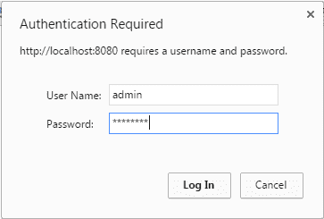
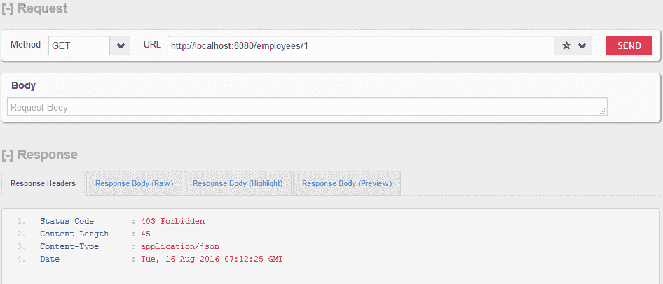

# Dropwizard – BasicAuth 安全示例

> 原文： [https://howtodoinjava.com/dropwizard/dropwizard-basic-auth-security-example/](https://howtodoinjava.com/dropwizard/dropwizard-basic-auth-security-example/)

使用 dropwizard，我们了解了[创建 REST API](//howtodoinjava.com/dropwizard/tutorial-and-hello-world-example/) ，[编写客户端代码](//howtodoinjava.com/dropwizard/client-configuration-and-examples/)和[添加运行状况检查过滤器](//howtodoinjava.com/dropwizard/health-check-configuration-example/)的知识。 在本教程中，我们将学习使用**基本认证**将**基于用户名/密码的认证**和基于**基于角色的授权**功能添加到 REST API 中。

```java
Table of Contents

Include Dropwizard Auth Module Maven Dependency
Add Custom Principal Object
Add Custom Authenticator
Add Custom Authorizer
Configure BasicCredentialAuthFilter
Secure REST APIs with @Auth Annotation
Test Dropwizard Basic Auth Code
```

## 包含 Dropwizard Auth 模块的 Maven 依赖项

认证功能在 dropwizard 应用中作为单独的模块添加。

```java
<properties>
	<dropwizard.version>1.0.0</dropwizard.version>
</properties>
<dependency>
	<groupId>io.dropwizard</groupId>
	<artifactId>dropwizard-auth</artifactId>
	<version>${dropwizard.version}</version>
</dependency>

```

## 添加自定义主体对象

在安全性方面，主要对象表示已为其提供凭据的用户。 它实现了`java.security.Principal`接口。

```java
package com.howtodoinjava.rest.auth;

import java.security.Principal;
import java.util.Set;

public class User implements Principal {
    private final String name;

    private final Set<String> roles;

    public User(String name) {
        this.name = name;
        this.roles = null;
    }

    public User(String name, Set<String> roles) {
        this.name = name;
        this.roles = roles;
    }

    public String getName() {
        return name;
    }

    public int getId() {
        return (int) (Math.random() * 100);
    }

    public Set<String> getRoles() {
        return roles;
    }
}

```

## 添加自定义认证器

`Authenticator`类负责验证基本认证标头中包含的用户名/密码凭证。 在企业应用中，您可以从数据库中获取用户密码，如果密码匹配，则将用户角色设置为主体对象。 在 dropwizard 中，您将需要实现`io.dropwizard.auth.Authenticator`接口以放置您的应用逻辑。

```java
package com.howtodoinjava.rest.auth;

import io.dropwizard.auth.AuthenticationException;
import io.dropwizard.auth.Authenticator;
import io.dropwizard.auth.basic.BasicCredentials;

import java.util.Map;
import java.util.Optional;
import java.util.Set;

import com.google.common.collect.ImmutableMap;
import com.google.common.collect.ImmutableSet;

public class AppBasicAuthenticator implements Authenticator<BasicCredentials, User> 
{
    private static final Map<String, Set<String>> VALID_USERS = ImmutableMap.of(
        "guest", ImmutableSet.of(),
        "user", ImmutableSet.of("USER"),
        "admin", ImmutableSet.of("ADMIN", "USER")
    );

    @Override
    public Optional<User> authenticate(BasicCredentials credentials) throws AuthenticationException 
    {
        if (VALID_USERS.containsKey(credentials.getUsername()) && "password".equals(credentials.getPassword())) 
        {
            return Optional.of(new User(credentials.getUsername(), VALID_USERS.get(credentials.getUsername())));
        }
        return Optional.empty();
    }
}

```

## 添加自定义授权人

`Authorizer`类负责匹配角色，并确定是否允许用户执行某些操作。

```java
package com.howtodoinjava.rest.auth;

import io.dropwizard.auth.Authorizer;

public class AppAuthorizer implements Authorizer<User> 
{
    @Override
    public boolean authorize(User user, String role) {
        return user.getRoles() != null && user.getRoles().contains(role);
    }
}

```

## 配置`BasicCredentialAuthFilter`

现在，让我们将自定义类注册到 dropwizard 安全框架中。

```java
package com.howtodoinjava.rest;

import io.dropwizard.Application;
import io.dropwizard.Configuration;
import io.dropwizard.auth.AuthDynamicFeature;
import io.dropwizard.auth.AuthValueFactoryProvider;
import io.dropwizard.auth.basic.BasicCredentialAuthFilter;
import io.dropwizard.client.JerseyClientBuilder;
import io.dropwizard.setup.Bootstrap;
import io.dropwizard.setup.Environment;

import javax.ws.rs.client.Client;

import org.glassfish.jersey.server.filter.RolesAllowedDynamicFeature;

import com.howtodoinjava.rest.auth.AppAuthorizer;
import com.howtodoinjava.rest.auth.AppBasicAuthenticator;
import com.howtodoinjava.rest.auth.User;
import com.howtodoinjava.rest.controller.EmployeeRESTController;
import com.howtodoinjava.rest.controller.RESTClientController;
import com.howtodoinjava.rest.healthcheck.AppHealthCheck;
import com.howtodoinjava.rest.healthcheck.HealthCheckController;

public class App extends Application<Configuration> {

	@Override
	public void initialize(Bootstrap<Configuration> b) {
	}

	@Override
	public void run(Configuration c, Environment e) throws Exception {
		e.jersey().register(new EmployeeRESTController(e.getValidator()));

		final Client client = new JerseyClientBuilder(e).build("DemoRESTClient");
		e.jersey().register(new RESTClientController(client));

		// Application health check
		e.healthChecks().register("APIHealthCheck", new AppHealthCheck(client));

		// Run multiple health checks
		e.jersey().register(new HealthCheckController(e.healthChecks()));

		//****** Dropwizard security - custom classes ***********/
		e.jersey().register(new AuthDynamicFeature(new BasicCredentialAuthFilter.Builder<User>()
								.setAuthenticator(new AppBasicAuthenticator())
								.setAuthorizer(new AppAuthorizer())
								.setRealm("BASIC-AUTH-REALM")
								.buildAuthFilter()));
		e.jersey().register(RolesAllowedDynamicFeature.class);
	    e.jersey().register(new AuthValueFactoryProvider.Binder<>(User.class));
	}

	public static void main(String[] args) throws Exception {
		new App().run(args);
	}
}

```

## 具有`@Auth`注解的安全 REST API

添加`@Auth`注解将在将其作为参数的任何 API 上触发认证过滤器。

#### 1）用户必须经过验证。 允许所有用户使用 API​​。

```java
@PermitAll
@GET
public Response getEmployees(@Auth User user) {
	return Response.ok(EmployeeDB.getEmployees()).build();
}

```

#### 2）用户必须经过验证。 仅角色为`ADMIN`的所有用户都可以使用 API​​。

```java
@RolesAllowed({ "ADMIN" })
@GET
@Path("/{id}")
public Response getEmployeeById(@PathParam("id") Integer id, @Auth User user) {
	Employee employee = EmployeeDB.getEmployee(id);
	if (employee != null)
		return Response.ok(employee).build();
	else
		return Response.status(Status.NOT_FOUND).build();
}

```

这样，您可以根据需要在所有 API 中添加各种认证方案。

## 测试 Dropwizard 基本验证码

让我们测试一下我们的安全 API。

#### 调用任何安全的 API



基本认证屏幕


#### `http://localhost:8080/employees`


经过认证并允许所有角色


#### `http://localhost:8080/employees/1`



经过认证并仅允许`ADMIN`角色


将我的问题放在评论部分。

学习愉快！

[源码下载](//howtodoinjava.com/wp-content/downloads/DropWizardExample.zip)