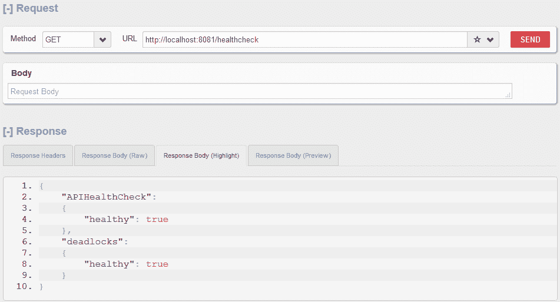

# Dropwizard 运行状况检查配置示例

> 原文： [https://howtodoinjava.com/dropwizard/health-check-configuration-example/](https://howtodoinjava.com/dropwizard/health-check-configuration-example/)

我们已经看到 [dropwizard](http://www.dropwizard.io/) 在开发[自包含的 REST API](//howtodoinjava.com/dropwizard/tutorial-and-hello-world-example/) 甚至 [REST 客户端服务](//howtodoinjava.com/dropwizard/client-configuration-and-examples/)方面如此有效。 Dropwizard 包含几乎所有必需的包，它们可以非常简单地构建 API，而无需使事情复杂化。 dropwizard 的一项易于实现的功能是**运行状况检查服务**，该服务可用于在运行时监视正在创建的应用/组件的状态。

## 实现 Dropwizard 运行状况检查

DropWizard 运行状况检查是通过扩展`HealthCheck`类并在一切正常的情况下返回`Result.healthy()`以及在某些情况下无效的情况下返回`Result.unhealthy()`来实现的-符合预期。

#### 运行状况检查配置

```java
public class AppHealthCheck extends HealthCheck 
{
	@Override
	protected Result check() throws Exception 
	{
		if(Check some condition == true){
			return Result.healthy();
		}
		return Result.unhealthy("Error message");
	}
}

```

要在 dropwizard 应用中注册此`AppHealthCheck`类，请使用`Environment.healthChecks()`注册表。

```java
public void run(Configuration c, Environment e) throws Exception 
{
	//Application health check
	e.healthChecks().register("APIHealthCheck", new AppHealthCheck());
}

```

#### 验证系统运行状况

Dropwizard 将在管理端口上的`/healthcheck`上使用 HTTP 资源终结点（默认为 8081）。 在默认情况下，Dropwizard 还包括对死锁的检查以及您定义的自定义运行状况检查`AppHealthCheck`。

```java
http://localhost:8081/healthcheck
```

上面的运行状况检查网址将返回一些结果，如下所示：

```java
{
	"APIHealthCheck": {
		"healthy": true
	},
	"deadlocks": {
		"healthy": true
	}
}
```

## 自定义 REST 资源以运行运行状况检查

如果您不想使用管理端口，则还可以创建一个自定义 REST 资源，该资源将为您运行运行状况检查，并以所需的响应格式返回结果。

要运行所有运行状况检查并获取所有结果，您将在 REST 资源中调用`registry.runHealthChecks()`。

```java
@Produces(MediaType.APPLICATION_JSON)
@Path("/status")
public class HealthCheckController 
{
	private HealthCheckRegistry registry;

	public HealthCheckController(HealthCheckRegistry registry) {
		this.registry = registry;
	}

	@GET
	public Set<Entry<String, Result>> getStatus(){
		return registry.runHealthChecks().entrySet();
	}
}

```

现在，当我们使用`http://localhost:8080/status`调用此 REST API 时，我们将得到如下响应：

```java
[
  {
    "APIHealthCheck": {
      "healthy": true,
      "message": null,
      "error": null
    }
  },
  {
    "deadlocks": {
      "healthy": true,
      "message": null,
      "error": null
    }
  }
]
```

您可以根据需要自定义消息。

## Dropwizard 运行状况检查示例

为了演示上述两种功能，我修改了 [dropwizard hello world 应用](//howtodoinjava.com/dropwizard/tutorial-and-hello-world-example/)中给出的代码。

**AppHealthCheck.java**

```java
package com.howtodoinjava.healthcheck;

import java.util.ArrayList;

import javax.ws.rs.client.Client;
import javax.ws.rs.client.Invocation;
import javax.ws.rs.client.WebTarget;
import javax.ws.rs.core.MediaType;
import javax.ws.rs.core.Response;

import com.codahale.metrics.health.HealthCheck;

public class AppHealthCheck extends HealthCheck {
	private final Client client;

	public AppHealthCheck(Client client) {
		super();
		this.client = client;
	}

	@Override
	protected Result check() throws Exception {
		WebTarget webTarget = client.target("http://localhost:8080/employees");
		Invocation.Builder invocationBuilder =  webTarget.request(MediaType.APPLICATION_JSON);
		Response response = invocationBuilder.get();
		@SuppressWarnings("rawtypes")
		ArrayList employees = response.readEntity(ArrayList.class);
		if(employees !=null && employees.size() > 0){
			return Result.healthy();
		}
		return Result.unhealthy("API Failed");
	}
}

```

**HealthCheckController.java**

```java
package com.howtodoinjava.healthcheck;

import java.util.Map.Entry;
import java.util.Set;

import javax.ws.rs.GET;
import javax.ws.rs.Path;
import javax.ws.rs.Produces;
import javax.ws.rs.core.MediaType;

import com.codahale.metrics.health.HealthCheck.Result;
import com.codahale.metrics.health.HealthCheckRegistry;

@Produces(MediaType.APPLICATION_JSON)
@Path("/status")
public class HealthCheckController 
{
	private HealthCheckRegistry registry;

	public HealthCheckController(HealthCheckRegistry registry) {
		this.registry = registry;
	}

	@GET
	public Set<Entry<String, Result>> getStatus(){
		return registry.runHealthChecks().entrySet();
	}
}

```

**App.java**

```java
package com.howtodoinjava.rest;

import io.dropwizard.Application;
import io.dropwizard.Configuration;
import io.dropwizard.client.JerseyClientBuilder;
import io.dropwizard.setup.Bootstrap;
import io.dropwizard.setup.Environment;

import javax.ws.rs.client.Client;

import com.howtodoinjava.healthcheck.AppHealthCheck;
import com.howtodoinjava.healthcheck.HealthCheckController;
import com.howtodoinjava.rest.controller.EmployeeRESTController;
import com.howtodoinjava.rest.controller.RESTClientController;

public class App extends Application<Configuration> {

	@Override
	public void initialize(Bootstrap<Configuration> b) {
	}

	@Override
	public void run(Configuration c, Environment e) throws Exception 
	{
		e.jersey().register(new EmployeeRESTController(e.getValidator()));

		final Client client = new JerseyClientBuilder(e).build("DemoRESTClient");
		e.jersey().register(new RESTClientController(client));

		//Application health check
		e.healthChecks().register("APIHealthCheck", new AppHealthCheck(client));

		//Run multiple health checks
		e.jersey().register(new HealthCheckController(e.healthChecks()));
	}

	public static void main(String[] args) throws Exception {
		new App().run(args);
	}
}

```

## 验证运行状况检查 URL

#### 1）`http://localhost:8081/healthcheck`



在管理端口上进行 Dropwizard 运行状况检查


#### 2）`http://localhost:8080/status`


在应用端口上进行 Dropwizard 运行状况检查


在评论部分让我知道您的问题。

学习愉快！

[源码下载](//howtodoinjava.com/wp-content/downloads/DropWizardExample.zip)

参考：

[Dropwizard 文档](http://metrics.dropwizard.io/3.1.0/manual/healthchecks/)