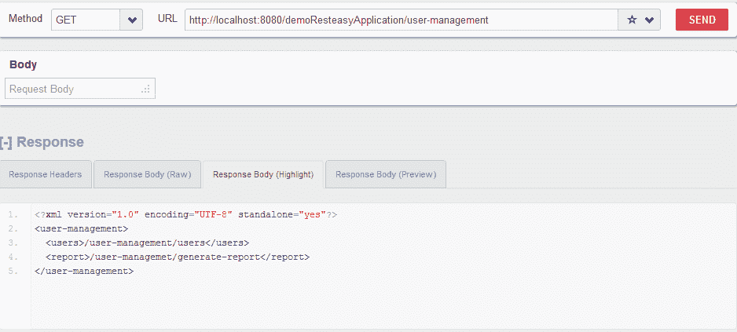

# Java REST HATEOAS 示例

> 原文： [https://howtodoinjava.com/resteasy/writing-restful-webservices-with-hateoas-using-jax-rs-and-jaxb-in-java/](https://howtodoinjava.com/resteasy/writing-restful-webservices-with-hateoas-using-jax-rs-and-jaxb-in-java/)

代表性状态转移（ [REST](https://restfulapi.net) ）是一种设计习语，它使用 Web 的无状态客户端 - 服务器架构将 REST Web 服务表示为 URL 标识的资源。 REST 风格的架构由客户端和服务器组成。 客户端向服务器发起请求； 服务器处理请求并返回适当的响应。 请求和响应围绕“资源”的“表示”的传递而构建。 资源可以是可以解决的任何连贯且有意义的概念。 资源的表示形式通常是捕获资源当前或预期状态的文档。

> 来源： [http://en.wikipedia.org/wiki/Representational_State_Transfer](https://en.wikipedia.org/wiki/Representational_State_Transfer) 。

请注意，此示例应用应部署在 **JBOSS 7 服务器**上。 如果您使用的是其他服务器，则需要更新[**这篇文章**](//howtodoinjava.com/resteasy/resteasy-tomcat-hello-world-application/)中提到的`pom.xml`和`web.xml`文件。

```java
 Table of Contents

What is HATEOAS?
Java REST HATEOAS Example
	Creating maven blank project
	Adding required dependencies in pom.xml
	Registering a new module or service
	Defining GET,PUT,POST and DELETE methods
	Annotating model classes
	Analyze the result

```

## 1\. 什么是 HATEOAS？

[HATEOAS](https://restfulapi.net/hateoas/) 是对 REST 的约束，它表示 REST 应用的客户端只需要知道一个固定的 URL 即可访问它。 应该通过返回的资源表示中包含的超链接从该 URL 动态发现任何资源。

理想情况下，您应该仅向最终用户提供您的服务根 URI。 从此以后，用户必须能够发现您服务中的所有其他 URI。 可以使用当前资源表示中的“链接”来发现这些 URI。 在下面给出的示例应用中，我们将看到 HATEOAS 的演示。

请记住，给定示例项目中的 HATEOAS 实现仅用于演示。 在企业级应用中，建议使用任何第三方 API 或某些自定义实现（最好使用注解）。

## 2\. Java REST HATEOAS 示例

让我们创建一个 Java REST 应用，并在其响应中添加 HATEOAS 链接。

#### 2.1 创建 Maven 项目

创建 Maven 项目就像在命令提示符下执行以下命令一样简单。 我假设您已经在系统中安装了 maven。

```java
mvn archetype:generate -DgroupId=com.demo.rest -DartifactId=sampleRestApp -DarchetypeArtifactId=maven-archetype-webapp -DinteractiveMode=false

```

如果您尚未安装 maven，请转到 maven 的主页并下载最新版本。

现在将上述项目转换为 Eclipse 支持的项目。 下面的命令将生成`.project`文件和其他 Eclipse 依赖项。

```java
mvn eclipse:eclipse -Dwtpversion=2.0

```

#### 2.2 更新`pom.xml`中的 Maven 依赖项

现在该为新创建的 Maven 项目提供所需的依赖项了。 以下是必需的依赖项。 将它们添加到`pom.xml`文件中。

```java
<project xmlns="http://maven.apache.org/POM/4.0.0" xmlns:xsi="http://www.w3.org/2001/XMLSchema-instance"
  xsi:schemaLocation="http://maven.apache.org/POM/4.0.0 http://maven.apache.org/maven-v4_0_0.xsd">

  <modelversion>4.0.0</modelversion>
  <groupid>com.demo.rest</groupid>
  <artifactid>demoResteasyApplication</artifactid>
  <packaging>war</packaging>
  <version>1.0-SNAPSHOT</version>
  <name>demoResteasyApplication Maven Webapp</name>
  <url>http://maven.apache.org</url>

  	<repositories>
	   	<repository>
	      <id>jboss</id>
	      <url>http://repository.jboss.org/maven2</url>
	   	</repository>
	</repositories>

  <dependencies>

    <dependency>
      <groupid>junit</groupid>
      <artifactid>junit</artifactid>
      <version>3.8.1</version>
      <scope>test</scope>
    </dependency>

    <!-- core library -->
	<dependency>
		<groupid>org.jboss.resteasy</groupid>
		 <artifactid>resteasy-jaxrs</artifactid>
		<version>2.3.1.GA</version>
		<scope>provided</scope>
	</dependency>

   <!-- JAXB support -->
   <dependency>
      <groupid>org.jboss.resteasy</groupid>
      	<artifactid>resteasy-jaxb-provider</artifactid>
      <version>2.3.1.GA</version>
   </dependency>

   <!-- multipart/form-data and multipart/mixed support -->
   <dependency>
      <groupid>org.jboss.resteasy</groupid>
      	<artifactid>resteasy-multipart-provider</artifactid>
      <version>2.3.1.GA</version>
   </dependency>

   <dependency>
		<groupid>net.sf.scannotation</groupid>
		<artifactid>scannotation</artifactid>
		<version>1.0.2</version>
	</dependency>

  </dependencies>

  <build>
    <finalname>demoResteasyApplication</finalname>
  </build>

</project>

```

#### 2.3 注册新的模块或服务

随着 **jax-rs 2.x** 的发布，我们无需在`web.xml`中指定任何内容。 Jax-rs 现在扫描`@ApplicationPath`注解以注册新的应用模块。

```java
package com.demo.rest;

import java.util.Arrays;
import java.util.HashSet;
import java.util.Set;

import javax.ws.rs.ApplicationPath;
import javax.ws.rs.core.Application;

import com.demo.rest.service.UserService;

@ApplicationPath("/")
public class ApplicationConfig extends Application 
{
    @SuppressWarnings("unchecked")
	public Set<class <?>> getClasses() 
	{
        return new HashSet<class <?>>(Arrays.asList(UserService.class));
    }
}

```

我们的模块类如下所示：

```java
@Path("/user-management")
public class UserService 
{
  //Some code
}

```

上面的模块注册代码将注册一个新的应用`"/user-management"`，并将所有相关的相对资源请求转发到此应用/模块。

#### 2.4 定义 REST 方法 -GET，PUT，POST 和 DELETE

如上所述，REST 服务映射了资源表示形式和将更改其内部表示形式的操作。 这些动作应被视为等同于数据库的`SELECT`，`INSERT`，`UPDATE`和`DELETE`操作。

如果我们谈论 HTTP 协议，则可以将它们映射到 GET，PUT，POST 和 DELETE 方法。 其中：

*   **GET** 方法将返回资源表示形式
*   **PUT** 将修改资源的内部状态
*   **POST** 通常用于添加新资源，但本质上不是
*   **DELETE** 用于删除资源

现在，让他们了解`user-management`模块。

1.  **GET** 应该返回所有用户或单个用户表示。
2.  **PUT** 方法应用于修改单个用户的表示。
3.  **POST** 方法应用于创建新的用户资源。
4.  同样，应该使用 **DELETE** 方法从系统中删除用户。

```java
package com.demo.rest.service;

import java.net.URI;
import java.net.URISyntaxException;
import java.util.ArrayList;

import javax.ws.rs.Consumes;
import javax.ws.rs.DELETE;
import javax.ws.rs.DefaultValue;
import javax.ws.rs.GET;
import javax.ws.rs.POST;
import javax.ws.rs.PUT;
import javax.ws.rs.Path;
import javax.ws.rs.PathParam;
import javax.ws.rs.Produces;
import javax.ws.rs.QueryParam;
import javax.ws.rs.core.Response;

import com.demo.rest.model.User;
import com.demo.rest.model.Users;

@Path("/user-management")
public class UserService {

	@GET
	@Path("/")
	@Produces("application/vnd.com.demo.user-management+xml;charset=UTF-8;version=1")
	public UserService getServiceInfo() {
		return new UserService();
	}

	@GET
	@Path("/users")
	@Produces("application/vnd.com.demo.user-management.users+xml;charset=UTF-8;version=1")
	public Users getAllUsers() {
		User user1 = new User();
		user1.setId(1);
		user1.setFirstName("demo");
		user1.setLastName("user");
		user1.setUri("/user-management/users/1");

		User user2 = new User();
		user2.setId(2);
		user2.setFirstName("demo");
		user2.setLastName("user");
		user2.setUri("/user-management/users/2");

		Users users = new Users();
		users.setUsers(new ArrayList());
		users.getUsers().add(user1);
		users.getUsers().add(user2);

		return users;
	}

	@GET
	@Path("/users/{id}")
	@Produces("application/vnd.com.demo.user-management.user+xml;charset=UTF-8;version=1")
	public User getUserById(@PathParam("id") int id) {
		User user = new User();
		user.setId(id);
		user.setFirstName("demo");
		user.setLastName("user");
		user.setUri("/user-management/users/" + id);
		return user;
	}

	@POST
	@Path("/users")
	@Consumes("application/vnd.com.demo.user-management.user+xml;charset=UTF-8;version=1")
	public Response createUser(User user,
			@DefaultValue("false") @QueryParam("allow-admin") boolean allowAdmin)
			throws URISyntaxException {
		System.out.println(user.getFirstName());
		System.out.println(user.getLastName());
		return Response.status(201)
				.contentLocation(new URI("/user-management/users/123")).build();
	}

	@PUT
	// @Path("/users/{id: [0-9]*}")
	@Path("/users/{id}")
	@Consumes("application/vnd.com.demo.user-management.user+xml;charset=UTF-8;version=1")
	@Produces("application/vnd.com.demo.user-management.user+xml;charset=UTF-8;version=1")
	public User updateUser(@PathParam("id") int id, User user)
			throws URISyntaxException {
		user.setId(id);
		user.setFirstName(user.getFirstName() + "updated");
		return user;
	}

	@DELETE
	@Path("/users/{id}")
	public Response deleteUser(@PathParam("id") int id)
			throws URISyntaxException {
		return Response.status(200).build();
	}
}

```

#### 2.5 注解模型类

到目前为止，我们已经创建了我们的服务类。 现在该创建资源表示形式了，用户可以使用它。

如果您还记得，HATEOAS 坚持您的应用应该有一个起点，此后，用户与应用的每次交互都应该是状态转移。 状态传输所需的信息应来自当前资源表示，即每次重新表示应提供嵌套状态传输的机制。

让我们用 [**JAXB 注解**](https://howtodoinjava.com/jaxb/jaxb-annotations/)来注解我们的服务和模型类，然后我们将看到在什么程度上遵循了 HATEOAS 准则。

**`Users.java`（用户集合的表示形式）**

```java
package com.demo.rest.model;

import java.util.ArrayList;

import javax.xml.bind.annotation.XmlAccessType;
import javax.xml.bind.annotation.XmlAccessorType;
import javax.xml.bind.annotation.XmlElement;
import javax.xml.bind.annotation.XmlRootElement;

@XmlAccessorType(XmlAccessType.NONE)
@XmlRootElement(name = "users")
public class Users {

	@XmlElement(name="user")
	private ArrayList users;

	public ArrayList getUsers() {
		return users;
	}

	public void setUsers(ArrayList users) {
		this.users = users;
	}
}

```

**`User.java`（单个用户的表示形式）**

```java
package com.demo.rest.model;

import java.io.Serializable;

import javax.xml.bind.annotation.XmlAccessType;
import javax.xml.bind.annotation.XmlAccessorType;
import javax.xml.bind.annotation.XmlAttribute;
import javax.xml.bind.annotation.XmlElement;
import javax.xml.bind.annotation.XmlRootElement;

@XmlAccessorType(XmlAccessType.NONE)
@XmlRootElement(name = "user")
public class User implements Serializable {

	private static final long serialVersionUID = 1L;

	@XmlAttribute(name = "id")
	private int id;

	@XmlAttribute(name="uri")
	private String uri;

	@XmlElement(name = "firstName")
	private String firstName;

	@XmlElement(name = "lastName")
	private String lastName;

	public int getId() {
		return id;
	}
	public void setId(int id) {
		this.id = id;
	}
	public String getFirstName() {
		return firstName;
	}
	public void setFirstName(String firstName) {
		this.firstName = firstName;
	}
	public String getLastName() {
		return lastName;
	}
	public void setLastName(String lastName) {
		this.lastName = lastName;
	}
	public String getUri() {
		return uri;
	}
	public void setUri(String uri) {
		this.uri = uri;
	}
}

```

**添加了 JAXB 注解的`UserService.java`（服务根的表示）**

```java
package com.demo.rest.service;

import java.net.URI;
import java.net.URISyntaxException;
import java.util.ArrayList;

import javax.ws.rs.Consumes;
import javax.ws.rs.DELETE;
import javax.ws.rs.DefaultValue;
import javax.ws.rs.GET;
import javax.ws.rs.POST;
import javax.ws.rs.PUT;
import javax.ws.rs.Path;
import javax.ws.rs.PathParam;
import javax.ws.rs.Produces;
import javax.ws.rs.QueryParam;
import javax.ws.rs.core.Response;
import javax.xml.bind.annotation.XmlAccessType;
import javax.xml.bind.annotation.XmlAccessorType;
import javax.xml.bind.annotation.XmlElement;
import javax.xml.bind.annotation.XmlRootElement;

import com.demo.rest.model.User;
import com.demo.rest.model.Users;

@XmlAccessorType(XmlAccessType.NONE)
@XmlRootElement(name = "user-management")
@Path("/user-management")
public class UserService {
	@XmlElement(name = "users")
	private String uri1 = "/user-management/users";

	@XmlElement(name = "report")
	private String uri2 = "/user-managemet/generate-report";

	public String getUri1() {
		return uri1;
	}

	public void setUri1(String uri1) {
		this.uri1 = uri1;
	}

	public String getUri2() {
		return uri2;
	}

	public void setUri2(String uri2) {
		this.uri2 = uri2;
	}

	@GET
	@Path("/")
	@Produces("application/vnd.com.demo.user-management+xml;charset=UTF-8;version=1")
	public UserService getServiceInfo() {
		return new UserService();
	}

	@GET
	@Path("/users")
	@Produces("application/vnd.com.demo.user-management.users+xml;charset=UTF-8;version=1")
	public Users getAllUsers() {
		User user1 = new User();
		user1.setId(1);
		user1.setFirstName("demo");
		user1.setLastName("user");
		user1.setUri("/user-management/users/1");

		User user2 = new User();
		user2.setId(2);
		user2.setFirstName("demo");
		user2.setLastName("user");
		user2.setUri("/user-management/users/2");

		Users users = new Users();
		users.setUsers(new ArrayList());
		users.getUsers().add(user1);
		users.getUsers().add(user2);

		return users;
	}

	@GET
	@Path("/users/{id}")
	@Produces("application/vnd.com.demo.user-management.user+xml;charset=UTF-8;version=1")
	public User getUserById(@PathParam("id") int id) {
		User user = new User();
		user.setId(id);
		user.setFirstName("demo");
		user.setLastName("user");
		user.setUri("/user-management/users/" + id);
		return user;
	}

	@POST
	@Path("/users")
	@Consumes("application/vnd.com.demo.user-management.user+xml;charset=UTF-8;version=1")
	public Response createUser(User user,
			@DefaultValue("false") @QueryParam("allow-admin") boolean allowAdmin)
			throws URISyntaxException {
		System.out.println(user.getFirstName());
		System.out.println(user.getLastName());
		return Response.status(201)
				.contentLocation(new URI("/user-management/users/123")).build();
	}

	@PUT
	// @Path("/users/{id: [0-9]*}")
	@Path("/users/{id}")
	@Consumes("application/vnd.com.demo.user-management.user+xml;charset=UTF-8;version=1")
	@Produces("application/vnd.com.demo.user-management.user+xml;charset=UTF-8;version=1")
	public User updateUser(@PathParam("id") int id, User user)
			throws URISyntaxException {
		user.setId(id);
		user.setFirstName(user.getFirstName() + "updated");
		return user;
	}

	@DELETE
	@Path("/users/{id}")
	public Response deleteUser(@PathParam("id") int id)
			throws URISyntaxException {
		return Response.status(200).build();
	}
}

```

#### 2.6 验证 HATEOAS 链接

因此，我们为一个简单的演示编写了许多代码。 现在，该测试我们的代码了。

我正在使用 [**RESTClient**](https://addons.mozilla.org/en-US/firefox/addon/restclient/ "restclient firefox plugin") 来验证 API 输出。 您可以选择自己的验证方式。

我已经在 **eclipse juno** 上运行的 **JBOSS 7.1 服务器运行时环境**中部署了以上应用。 如果要部署在某些独立的 jboss 实例上，也可以尝试。

让我们一一点击应用 URL：

1.  **根服务 API**

    此 API 返回服务根的表示形式。 它具有用于用户收集的 **uri** 和用于 API 的一个附加**链接**来生成用户报告。

    

2.  **获取所有用户集合**

    此表示具有用户数据和 **uri** 的快照，可在其中提取特定用户的所有其他信息。

    

3.  **根据 ID 获取用户**

    此表示应提供用户资源和其他链接（如果有）的每个相关细节。

    

4.  **不带媒体类型添加用户**

    添加用户资源后，应将其添加到用户集合中。 因此，在几乎所有集合类型表示中， **POST** 都应该隐式地可用。

    在这里，用户将被添加到用户集合中，因此我们会将其发布在“`/user-management/users`”上。

    添加帖子时，我们必须声明我们要发布的媒体类型。 如果未指定，则会发生以下错误。

    响应代码 415（不支持的媒体类型）

    

5.  **在请求标头中添加正确的媒体类型**

    让我们向请求标头添加正确的媒体类型。

    

6.  **使用正确的媒体类型创建**

    现在，应该创建一个新用户，并返回到创建资源的“链接”。

    

7.  **删除用户**

    删除资源时，使用“HTTP DELETE”。 不得使用任何媒体类型或请求正文。

    资源应在资源链接本身上删除。

    

因此，这就是在通过 REST HATEOAS 进行的连续 API 调用之间，应用状态应如何更改，而其下一个状态应从当前状态表示中进行定向的方式。

我在这里完成了写作，剩下的工作就是让您对这个例子更加满意。 从下面给定的下载链接，下载上面的源代码文件并使用它。

[**源码下载**](https://drive.google.com/file/d/0B7yo2HclmjI4eWJ4czV6QVpmdDA/view?usp=drive_web "Download rest sample project")

学习愉快！