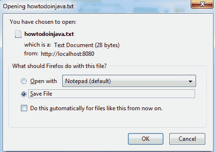
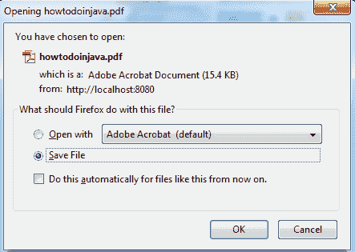

# RESTEasy - 文件下载示例

> 原文： [https://howtodoinjava.com/resteasy/resteasy-file-download-example/](https://howtodoinjava.com/resteasy/resteasy-file-download-example/)

[**RESTEasy**](http://resteasy.jboss.org/ "resteasy") 是 JBOSS 提供的 [**JAX-RS 规范**](https://jcp.org/en/jsr/detail?id=311 "jax-rs")的实现，用于构建 [**RESTful**](https://en.wikipedia.org/wiki/Representational_state_transfer "restful") Web 服务和 RESTful Java 应用。 RESTEasy 与 HTTP 媒体类型结合使用，以特定格式（例如图像，pdf 或文本）提供响应。

为响应而支持多种媒体类型的配置的核心组件是[**`@Produces`**](https://docs.oracle.com/javaee/6/api/javax/ws/rs/Produces.html "Produces annotation")注解。 可以在此[**链接**](https://en.wikipedia.org/wiki/Internet_media_type "media types")中找到此类媒体类型的完整列表。

出于演示目的，我将展示下载一个图像，一个文本和一个 pdf 文件的示例。 同样，您可以构建其他媒体类型（文件类型）。

## **1）创建一个 Maven 项目**

```java
mvn archetype:generate -DgroupId=com.howtodoinjava -DartifactId=RESTfulDemoApplication 
-DarchetypeArtifactId=maven-archetype-webapp -DinteractiveMode=false

mvn eclipse:eclipse -Dwtpversion=2.0
```

## **2）更新`pom.xml`文件中的 jax-rs 依赖关系**

```java
&lt;project xmlns=&quot;http://maven.apache.org/POM/4.0.0&quot; xmlns:xsi=&quot;http://www.w3.org/2001/XMLSchema-instance&quot;
  xsi:schemaLocation=&quot;http://maven.apache.org/POM/4.0.0 http://maven.apache.org/maven-v4_0_0.xsd&quot;&gt;
  &lt;modelVersion&gt;4.0.0&lt;/modelVersion&gt;
  &lt;groupId&gt;com.howtodoinjava&lt;/groupId&gt;
  &lt;artifactId&gt;RESTfulDemoApplication&lt;/artifactId&gt;
  &lt;packaging&gt;war&lt;/packaging&gt;
  &lt;version&gt;1.0-SNAPSHOT&lt;/version&gt;
  &lt;name&gt;RESTfulDemoApplication Maven Webapp&lt;/name&gt;
  &lt;url&gt;http://maven.apache.org&lt;/url&gt;
  &lt;repositories&gt;
   	&lt;repository&gt;
      &lt;id&gt;jboss&lt;/id&gt;
      &lt;url&gt;http://repository.jboss.org/maven2&lt;/url&gt;
   	&lt;/repository&gt;
  &lt;/repositories&gt;
  &lt;dependencies&gt;
    &lt;!-- core library --&gt;
	&lt;dependency&gt;
		&lt;groupId&gt;org.jboss.resteasy&lt;/groupId&gt;
		 &lt;artifactId&gt;resteasy-jaxrs&lt;/artifactId&gt;
		&lt;version&gt;2.3.1.GA&lt;/version&gt;
	&lt;/dependency&gt;
	&lt;dependency&gt;
		&lt;groupId&gt;net.sf.scannotation&lt;/groupId&gt;
		&lt;artifactId&gt;scannotation&lt;/artifactId&gt;
		&lt;version&gt;1.0.2&lt;/version&gt;
	&lt;/dependency&gt;
  &lt;/dependencies&gt;
  &lt;build&gt;
    &lt;finalName&gt;RESTfulDemoApplication&lt;/finalName&gt;
  &lt;/build&gt;
&lt;/project&gt;

```

## **3）在`@Produces`注解中创建具有相应媒体类型的服务类和 API**

```java
package com.howtodoinjava.service;

import java.io.File;

import javax.ws.rs.GET;
import javax.ws.rs.Path;
import javax.ws.rs.PathParam;
import javax.ws.rs.Produces;
import javax.ws.rs.core.Response;
import javax.ws.rs.core.Response.ResponseBuilder;
import javax.ws.rs.core.Response.Status;

@Path(&quot;/file-management&quot;)
public class FileServer
{
	@GET
	@Path(&quot;/{fileName}/text&quot;)
	@Produces(&quot;text/plain&quot;)
	public Response getFileInTextFormat(@PathParam(&quot;fileName&quot;) String fileName) 
	{
		System.out.println(&quot;File requested is : &quot; + fileName);

		//Put some validations here such as invalid file name or missing file name
		if(fileName == null || fileName.isEmpty())
		{
			ResponseBuilder response = Response.status(Status.BAD_REQUEST);
			return response.build();
		}

		//Prepare a file object with file to return
		File file = new File(&quot;c:/demoTxtFile.txt&quot;);

		ResponseBuilder response = Response.ok((Object) file);
		response.header(&quot;Content-Disposition&quot;, &quot;attachment; filename=&quot;howtodoinjava.txt&quot;&quot;);
		return response.build();
	}

	@GET
	@Path(&quot;/{fileName}/pdf&quot;)
	@Produces(&quot;application/pdf&quot;)
	public Response getFileInPDFFormat(@PathParam(&quot;fileName&quot;) String fileName) 
	{
		System.out.println(&quot;File requested is : &quot; + fileName);

		//Put some validations here such as invalid file name or missing file name
		if(fileName == null || fileName.isEmpty())
		{
			ResponseBuilder response = Response.status(Status.BAD_REQUEST);
			return response.build();
		}

		//Prepare a file object with file to return
		File file = new File(&quot;c:/demoPDFFile.pdf&quot;);

		ResponseBuilder response = Response.ok((Object) file);
		response.header(&quot;Content-Disposition&quot;, &quot;attachment; filename=&quot;howtodoinjava.pdf&quot;&quot;);
		return response.build();
	}

	@GET
	@Path(&quot;/{fileName}/image&quot;)
	@Produces(&quot;image/jpeg&quot;)
	public Response getFileInJPEGFormat(@PathParam(&quot;fileName&quot;) String fileName) 
	{
		System.out.println(&quot;File requested is : &quot; + fileName);

		//Put some validations here such as invalid file name or missing file name
		if(fileName == null || fileName.isEmpty())
		{
			ResponseBuilder response = Response.status(Status.BAD_REQUEST);
			return response.build();
		}

		//Prepare a file object with file to return
		File file = new File(&quot;c:/demoJpegFile.jpeg&quot;);

		ResponseBuilder response = Response.ok((Object) file);
		response.header(&quot;Content-Disposition&quot;, &quot;attachment; filename=&quot;howtodoinjava.jpeg&quot;&quot;);
		return response.build();
	}
}

```

## 4）将要下载的文件放在参考位置

我正在引用“`c:/<文件>`”中的文件。 在运行此示例之前，从下载链接中的分发文件夹复制文件，并将其粘贴到`c:`中。

## **5）测试应用**

以下是在浏览器中显示的用于请求 URL 的下载窗口的快照：

**`http://localhost:8080/RESTfulDemoApplication/file-management/demoTxtFile/text`**



**`http://localhost:8080/RESTfulDemoApplication/file-management/demoPDFFile/pdf`**



**`http://localhost:8080/RESTfulDemoApplication/file-management/demoJpegFile/image`**


如果要下载以上示例的源代码，请遵循以下给定的链接。


**祝您学习愉快！**