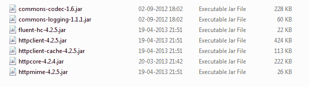

# RESTEasy 文件上传 - `HttpClient`示例

> 原文： [https://howtodoinjava.com/resteasy/jax-rs-resteasy-file-upload-httpclient-example/](https://howtodoinjava.com/resteasy/jax-rs-resteasy-file-upload-httpclient-example/)

在以前的文章中，我们了解了[**文件下载**](//howtodoinjava.com/resteasy/resteasy-file-download-example/ "RESTEasy + File download example")以及构建 [**RESTful 客户端**](//howtodoinjava.com/apache-commons/jax-rs-restful-client-using-apache-httpclient/ "JAX-RS RESTful client using apache httpclient")的知识。 现在，让我们继续前进。 在这篇文章中，我将提供使用 jax-rs resteasy 上传文件的示例代码。 要上传文件，将使用[**`httpclient`**](https://hc.apache.org/httpclient-3.x/ "http client")库代替 HTML 表单。

我正在使用[**`MultipartFormDataInput`**](http://docs.jboss.org/resteasy/docs/1.2.GA/javadocs/org/jboss/resteasy/plugins/providers/multipart/MultipartFormDataInput.html "MultipartFormDataInput")类，它是 **resteasy-multipart** 插件的一部分。

**1）更新项目的 Maven 依赖项**

在 maven 依赖项下添加/更新，以添加对项目中多部分文件上传的支持。

```java
<!-- core library -->
	<dependency>
		<groupId>org.jboss.resteasy</groupId>
		 <artifactId>resteasy-jaxrs</artifactId>
		<version>2.3.1.GA</version>
	</dependency>
	<dependency>
		<groupId>net.sf.scannotation</groupId>
		<artifactId>scannotation</artifactId>
		<version>1.0.2</version>
	</dependency>
	<!-- JAXB provider -->
   <dependency>
		<groupId>org.jboss.resteasy</groupId>
		<artifactId>resteasy-jaxb-provider</artifactId>
		<version>2.3.1.GA</version>
	</dependency>	
	<!-- Multipart support -->
	<dependency>
		<groupId>org.jboss.resteasy</groupId>
		<artifactId>resteasy-multipart-provider</artifactId>
		<version>2.3.1.GA</version>
	</dependency>
	<!-- For better I/O control -->
	<dependency>
		<groupId>commons-io</groupId>
		<artifactId>commons-io</artifactId>
		<version>2.0.1</version>
	</dependency>

```

还要添加下图给出的 jar 文件。 需要使用它们来构建用于文件上传示例的客户端代码。



HTTP 客户端 jar 文件


**2）准备将要在客户端上载文件的 http 客户端**

```java
package com.howtodoinjava.client.upload;

import java.io.File;

import org.apache.http.HttpResponse;
import org.apache.http.client.HttpClient;
import org.apache.http.client.methods.HttpPost;
import org.apache.http.entity.mime.MultipartEntity;
import org.apache.http.entity.mime.content.FileBody;
import org.apache.http.entity.mime.content.StringBody;
import org.apache.http.impl.client.DefaultHttpClient;

public class DemoFileUploader 
{
	public static void main(String args[]) throws Exception
    {
    	DemoFileUploader fileUpload = new DemoFileUploader () ;
    	File file = new File("C:/Lokesh/Setup/workspace/RESTfulDemoApplication/target/classes/Tulips.jpg") ;
    	//Upload the file
        fileUpload.executeMultiPartRequest("http://localhost:8080/RESTfulDemoApplication/user-management/image-upload", 
        		file, file.getName(), "File Uploaded :: Tulips.jpg") ;
    }  

    public void executeMultiPartRequest(String urlString, File file, String fileName, String fileDescription) throws Exception 
    {
    	HttpClient client = new DefaultHttpClient() ;
        HttpPost postRequest = new HttpPost (urlString) ;
        try
        {
        	//Set various attributes 
            MultipartEntity multiPartEntity = new MultipartEntity () ;
            multiPartEntity.addPart("fileDescription", new StringBody(fileDescription != null ? fileDescription : "")) ;
            multiPartEntity.addPart("fileName", new StringBody(fileName != null ? fileName : file.getName())) ;

            FileBody fileBody = new FileBody(file, "application/octect-stream") ;
            //Prepare payload
            multiPartEntity.addPart("attachment", fileBody) ;

            //Set to request body
            postRequest.setEntity(multiPartEntity) ;

            //Send request
            HttpResponse response = client.execute(postRequest) ;

            //Verify response if any
            if (response != null)
            {
                System.out.println(response.getStatusLine().getStatusCode());
            }
        }
        catch (Exception ex)
        {
            ex.printStackTrace() ;
        }
    }
}

```

**3）在应用程序中编写 RESTful API 以接受多部分请求**

```java
package com.howtodoinjava.client.upload;

import java.io.File;
import java.io.FileOutputStream;
import java.io.IOException;
import java.io.InputStream;
import java.util.List;
import java.util.Map;

import javax.ws.rs.Consumes;
import javax.ws.rs.POST;
import javax.ws.rs.Path;
import javax.ws.rs.core.MultivaluedMap;
import javax.ws.rs.core.Response;

import org.apache.commons.io.IOUtils;
import org.jboss.resteasy.plugins.providers.multipart.InputPart;
import org.jboss.resteasy.plugins.providers.multipart.MultipartFormDataInput;

@Path("/user-management")
public class DemoFileSaver_MultipartFormDataInput 
{
	private final String UPLOADED_FILE_PATH = "c:\temp\";

	@POST
	@Path("/image-upload")
	@Consumes("multipart/form-data")
	public Response uploadFile(MultipartFormDataInput input) throws IOException 
	{
		//Get API input data
		Map<String, List<InputPart>> uploadForm = input.getFormDataMap();

		//Get file name
		String fileName = uploadForm.get("fileName").get(0).getBodyAsString();

		//Get file data to save
		List<InputPart> inputParts = uploadForm.get("attachment");

		for (InputPart inputPart : inputParts)
		{
			try 
			{
				//Use this header for extra processing if required
				@SuppressWarnings("unused")
				MultivaluedMap<String, String> header = inputPart.getHeaders();

				// convert the uploaded file to inputstream
				InputStream inputStream = inputPart.getBody(InputStream.class, null);

				byte[] bytes = IOUtils.toByteArray(inputStream);
				// constructs upload file path
				fileName = UPLOADED_FILE_PATH + fileName;
				writeFile(bytes, fileName);
				System.out.println("Success !!!!!");
			} 
			catch (Exception e) 
			{
				e.printStackTrace();
			}
		}
		return Response.status(200)
				.entity("Uploaded file name : "+ fileName).build();
	}

	//Utility method
	private void writeFile(byte[] content, String filename) throws IOException 
	{
		File file = new File(filename);
		if (!file.exists()) {
			file.createNewFile();
		}
		FileOutputStream fop = new FileOutputStream(file);
		fop.write(content);
		fop.flush();
		fop.close();
	}
}

```

```java
[源码下载](https://docs.google.com/file/d/0B7yo2HclmjI4amhXRE5VMjBRSHM/edit?usp=sharing "multipart rest file upload")
```

**祝您学习愉快！**