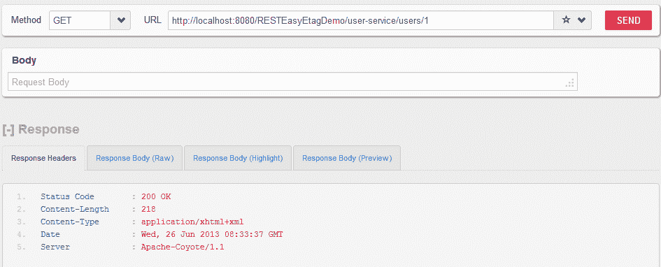
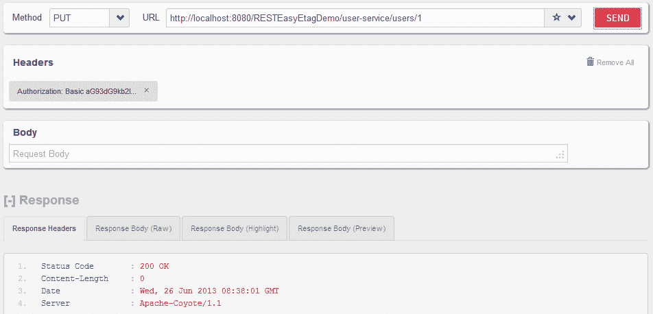

# RESTEasy `ContainerRequestFilter` - RESTEasy 安全过滤器示例

> 原文： [https://howtodoinjava.com/resteasy/resteasy-containerrequestfilter-example/](https://howtodoinjava.com/resteasy/resteasy-containerrequestfilter-example/)

了解如何使用 RESTEasy `ContainerRequestFilter`创建安全筛选器，该筛选器能够对基于 RESTEasy 的 Web 应用执行认证和授权。

## 1\. RESTEasy `ContainerRequestFilter`和`ContainerReponseFilter`

最近发布了新的 [**RESTEasy 版本 3.0.2.Final**](http://docs.jboss.org/resteasy/docs/3.0.2.Final/userguide/html_single/index.html "resteasy docs")，并使其与 **JAX-RS 2.0** 兼容。 如果您还记得以前的 JAX-RS 版本没有关于实现过滤器和拦截器的规范。 这就是所有 JAX-RS 实现都有自己独特风格的原因。 RESTEasy 的`PreProcessorInterceptor`和`PostProcessorInterceptor`现在已弃用。

现在，JAX-RS 在过滤器和拦截器方面有了自己的规范。 您可以阅读 Bill Burke 的[**帖子中的详细讨论。**](http://java.dzone.com/articles/whats-new-jax-rs-20 "new in jax-rs 2.0")

在 resteasy 中，过滤器在调用`resource`方法之前和之后运行。 这些过滤器实质上是`ContainerRequestFilter`和`ContainerReponseFilter`。 `ContainerRequestFilter`在调用 JAX-RS 资源方法之前运行。 `ContainerResponseFilter`在调用 JAX-RS 资源方法之后运行。 需要注意的是，`ContainerRequestFilter`有两种风格：匹配前和匹配后。 预先匹配的`ContainerRequestFilter`用`@PreMatching`注释指定，​​并且将在 JAX-RS 资源方法与传入的 HTTP 请求匹配之前执行。 在匹配 Java 资源方法之后，执行匹配后的`ContainerRequestFilters`。

过滤器修改请求或响应头时，拦截器处理消息正文。 它们可用于实现特定的内容编码。 它们可用于生成数字签名，或在编组 Java 对象模型之前或之后发布或预处理 Java 对象模型。

## 2\. RESTEasy `ContainerRequestFilter`示例

在本文中，我将修改 [**resteasy 认证和授权教程**](//howtodoinjava.com/resteasy/jax-rs-resteasy-basic-authentication-and-authorization-tutorial/ "JAX-RS RESTEasy basic authentication and authorization tutorial")，该教程最初是使用`PreProcessorInterceptor`在 RESTEasy  2.3.1.GA 中编写的。 我已将其更新为基于 JAX-RS 2.0 规范的 RESTEasy 版本 3.0.2.Final。

#### 2.1 更新 Maven 依赖项

在使用 Maven 时，我已经更新了`pom.xml`文件，如下所示。 如果您使用的是 ant 或 jar 文件，请相应地更新所需的 jar。

```java
<dependencies>
 <!-- core library -->
 <dependency>
	<groupId>org.jboss.resteasy</groupId>
	 <artifactId>resteasy-jaxrs</artifactId>
	<version>3.0.2.Final</version>
 </dependency>
<!-- JAXB support -->
<dependency>
  <groupId>org.jboss.resteasy</groupId>
	<artifactId>resteasy-jaxb-provider</artifactId>
  <version>3.0.2.Final</version>
</dependency>
<dependency>
	<groupId>org.jboss.resteasy</groupId>
	<artifactId>jaxrs-api</artifactId>
	<version>3.0.2.Final</version>
</dependency>
<dependency>
	<groupId>net.sf.scannotation</groupId>
	<artifactId>scannotation</artifactId>
	<version>1.0.3</version>
</dependency>
</dependencies>

```

#### 2.2 RESTEasy 安全拦截器

由于 JAX-RS 2.0 具有用于处理前后请求的过滤器，因此我们将使用`ContainerRequestFilter`接口。 记住`PreProcessorInterceptor`现在已弃用。

```java
@Provider
public class SecurityInterceptor implements javax.ws.rs.container.ContainerRequestFilter
{
    @Override
	public void filter(ContainerRequestContext requestContext)
	{
		//More code...
	}
}

```

现在，首先我们必须访问资源方法以检查安全性约束及其定义的属性。

```java
	ResourceMethodInvoker methodInvoker = (ResourceMethodInvoker) 
				requestContext.getProperty("org.jboss.resteasy.core.ResourceMethodInvoker");
	Method method = methodInvoker.getMethod();

```

现在我们可以访问资源方法了。 现在，一切将与我们之前所做的相同。 即

*   检查`PermitAll`注解（如果存在），则无需进一步检查任何内容
*   检查`DenyAll`注解（如果存在），然后返回拒绝访问
*   检查``RolesAllowed``注解，然后从注解中获取所需的角色。 从请求中获取授权信息，并根据应用逻辑进行匹配。 如果授权成功，则授予访问权限，否则返回拒绝访问权限。

#### 2.3 RESTEasy `SecurityInterceptor`源代码

`SecurityInterceptor`的完整代码如下。

```java
package com.howtodoinjava.demo.rest.security;

import java.io.IOException;
import java.lang.reflect.Method;
import java.util.Arrays;
import java.util.HashSet;
import java.util.List;
import java.util.Set;
import java.util.StringTokenizer;

import javax.annotation.security.DenyAll;
import javax.annotation.security.PermitAll;
import javax.annotation.security.RolesAllowed;
import javax.ws.rs.container.ContainerRequestContext;
import javax.ws.rs.core.MultivaluedMap;
import javax.ws.rs.ext.Provider;

import org.jboss.resteasy.core.Headers;
import org.jboss.resteasy.core.ResourceMethodInvoker;
import org.jboss.resteasy.core.ServerResponse;
import org.jboss.resteasy.util.Base64;

/**
 * This interceptor verify the access permissions for a user 
 * based on username and passowrd provided in request
 * */
@Provider
public class SecurityInterceptor implements javax.ws.rs.container.ContainerRequestFilter
{
	private static final String AUTHORIZATION_PROPERTY = "Authorization";
	private static final String AUTHENTICATION_SCHEME = "Basic";
	private static final ServerResponse ACCESS_DENIED = new ServerResponse("Access denied for this resource", 401, new Headers<Object>());;
	private static final ServerResponse ACCESS_FORBIDDEN = new ServerResponse("Nobody can access this resource", 403, new Headers<Object>());;
	private static final ServerResponse SERVER_ERROR = new ServerResponse("INTERNAL SERVER ERROR", 500, new Headers<Object>());;

	@Override
	public void filter(ContainerRequestContext requestContext)
	{
		ResourceMethodInvoker methodInvoker = (ResourceMethodInvoker) requestContext.getProperty("org.jboss.resteasy.core.ResourceMethodInvoker");
		Method method = methodInvoker.getMethod();
		//Access allowed for all 
		if( ! method.isAnnotationPresent(PermitAll.class))
		{
			//Access denied for all 
			if(method.isAnnotationPresent(DenyAll.class))
			{
				requestContext.abortWith(ACCESS_FORBIDDEN);
				return;
			}

			//Get request headers
			final MultivaluedMap<String, String> headers = requestContext.getHeaders();

			//Fetch authorization header
		    final List<String> authorization = headers.get(AUTHORIZATION_PROPERTY);

		    //If no authorization information present; block access
		    if(authorization == null || authorization.isEmpty())
		    {
		    	requestContext.abortWith(ACCESS_DENIED);
		    	return;
		    }

		    //Get encoded username and password
		    final String encodedUserPassword = authorization.get(0).replaceFirst(AUTHENTICATION_SCHEME + " ", "");

		    //Decode username and password
		    String usernameAndPassword = null;
			try {
				usernameAndPassword = new String(Base64.decode(encodedUserPassword));
			} catch (IOException e) {
				requestContext.abortWith(SERVER_ERROR);
				return;
			}

			//Split username and password tokens
		    final StringTokenizer tokenizer = new StringTokenizer(usernameAndPassword, ":");
		    final String username = tokenizer.nextToken();
		    final String password = tokenizer.nextToken();

		    //Verifying Username and password
		    System.out.println(username);
		    System.out.println(password);

		    //Verify user access
			if(method.isAnnotationPresent(RolesAllowed.class))
			{
				RolesAllowed rolesAnnotation = method.getAnnotation(RolesAllowed.class);
				Set<String> rolesSet = new HashSet<String>(Arrays.asList(rolesAnnotation.value()));

				//Is user valid?
				if( ! isUserAllowed(username, password, rolesSet))
				{
					requestContext.abortWith(ACCESS_DENIED);
					return;
				}
			}
		}
	}
	private boolean isUserAllowed(final String username, final String password,	final Set<String> rolesSet) 
	{
		boolean isAllowed = false;

		//Step 1\. Fetch password from database and match with password in argument
		//If both match then get the defined role for user from database and continue; else return isAllowed [false]
		//Access the database and do this part yourself
		//String userRole = userMgr.getUserRole(username);
		String userRole = "ADMIN";

		//Step 2\. Verify user role
		if(rolesSet.contains(userRole))
		{
			isAllowed = true;
		}
		return isAllowed;
	}

}

```

## 2.4 RESTEasy 安全过滤器演示

要测试安全代码，请将 Web 应用部署在任何应用服务器（例如 Tomcat）中。 现在，发送以下请求：

*   不带用户名和密码的 HTTP GET `http://localhost:8080/RESTEasyEtagDemo/user-service/users/1`

    用户能够成功访问 API。

    

*  不带用户名和密码的 HTTP PUT `http://localhost:8080/RESTEasyEtagDemo/user-service/users/1` 

    用户无法访问 API。

    

*   添加基本授权凭据

    

*   带有用户名和密码的 HTTP PUT `http://localhost:8080/RESTEasyEtagDemo/user-service/users/1`

    用户能够访问受保护的 API

    

以上就是 **resteasy 安全拦截器示例**。 如果您有任何疑问或建议，请给我评论。

[**下载面向 Jboss 的源码**](https://docs.google.com/file/d/0B7yo2HclmjI4Q09OVld2dnBaOEU/edit?usp=sharing "JAX-RS 2.0 RESTEasy 3.0.2.Final Security Tutorial")

更新：以下是在 tomcat 7 中运行此项目的步骤。

今天，我再次致力于在 tomcat 7 上运行的该项目。要成功运行，我执行了以下步骤：

+ 在 eclipse 中导入项目

+ 在项目根文件夹中运行提示符 `> mvn eclipse:eclipse -Dwtpversion=2.0`（[**参考**](//howtodoinjava.com/maven/ "Maven Tutorials")）

+ **更新**方法上的`@Produces`和`@Consumes`注解

+ 启动 tomcat 服务器并测试应用。 您将获得理想的结果。

[**下载面向 Tomcat 7 的源码**](https://drive.google.com/file/d/0B7yo2HclmjI4LTNiX0d6MUNTb2M/edit?usp=sharing "JAX-RS 2.0 RESTEasy 3.0.2.Final security tutorial on tomcat 7")

学习愉快！