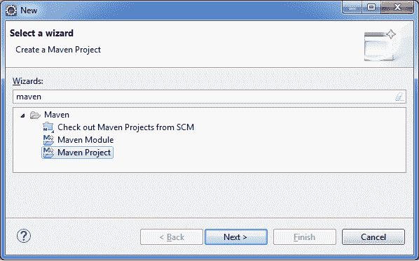
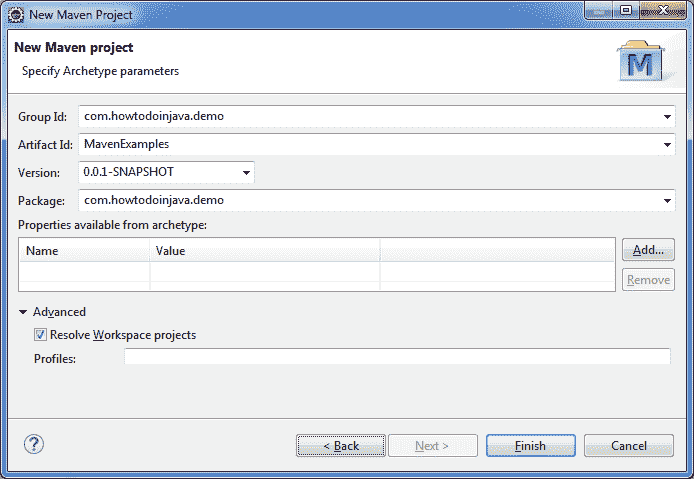

# Maven – 父子 POM 示例

> 原文： [https://howtodoinjava.com/maven/maven-parent-child-pom-example/](https://howtodoinjava.com/maven/maven-parent-child-pom-example/)

**Maven 父 POM** （或超级 POM）用于构造项目，以**避免重复或重复使用 pom 文件之间的*继承配置***。 它有助于长期轻松维护。

如果在父 POM 和子 POM 中都使用不同的值配置了任何依赖项或属性，则子 POM 值将具有优先级。

```java
Table of Contents

Parent POM Contents
Parent POM and Child POM
Parent POM Relative Path
Demo
```

## 父 POM 内容

可以使用包`pom`声明父 POM。 它不打算分发，因为仅从其他项目中引用了它。

Maven 父 pom 可以包含几乎所有内容，并且可以继承到子 pom 文件中，例如

*   通用数据 – 开发人员的姓名，SCM 地址，分发管理等
*   常数 – 例如版本号
*   共同的依赖关系 – 所有子项共同的。 与在单个 pom 文件中多次写入它们具有相同的效果。
*   属性 – 例如插件，声明，执行和 ID。
*   配置
*   资源

## 父 POM 和子 POM 示例

为了匹配父 POM，Maven 使用两个规则：

1.  在项目的根目录或给定的相对路径中有一个 pom 文件。
2.  子 POM 文件中的引用包含与父 POM 文件中所述相同的坐标。

#### 父 POM

此处，父 POM 为 JUnit 和 spring 框架配置了基本项目信息和两个[依赖项](//howtodoinjava.com/maven/maven-dependency-management/)。

```java
<project xmlns="http://maven.apache.org/POM/4.0.0" xmlns:xsi="http://www.w3.org/2001/XMLSchema-instance"
	xsi:schemaLocation="http://maven.apache.org/POM/4.0.0 http://maven.apache.org/xsd/maven-4.0.0.xsd;
	<modelVersion>4.0.0</modelVersion>

	<groupId>com.howtodoinjava.demo</groupId>
	<artifactId>MavenExamples</artifactId>
	<version>0.0.1-SNAPSHOT</version>
	<packaging>pom</packaging>

	<name>MavenExamples Parent</name>
	<url>http://maven.apache.org</url>

	<properties>
		<project.build.sourceEncoding>UTF-8</project.build.sourceEncoding>
		<junit.version>3.8.1</junit.version>
		<spring.version>4.3.5.RELEASE</spring.version>
	</properties>

	<dependencies>

		<dependency>
			<groupId>junit</groupId>
			<artifactId>junit</artifactId>
			<version>${junit.version}</version>
			<scope>test</scope>
		</dependency>

		<dependency>
			<groupId>org.springframework</groupId>
			<artifactId>spring-core</artifactId>
			<version>${spring.version}</version>
		</dependency>

	</dependencies>
</project>

```

#### 子 POM

现在，子 POM 需要使用`parent`标签并指定`groupId/artifactId/version`属性来引用父 POM。 这个 pom 文件将从父 POM 继承所有属性和依赖项，并且还可以包括子项目特定的依赖项。

```java
<project xmlns="http://maven.apache.org/POM/4.0.0"
xmlns:xsi="http://www.w3.org/2001/XMLSchema-instance"
xsi:schemaLocation="http://maven.apache.org/POM/4.0.0 http://maven.apache.org/maven-v4_0_0.xsd">

	<!--The identifier of the parent POM-->
	<parent>
		<groupId>com.howtodoinjava.demo</groupId>
		<artifactId>MavenExamples</artifactId>
		<version>0.0.1-SNAPSHOT</version>
	</parent>

	<modelVersion>4.0.0</modelVersion>
	<artifactId>MavenExamples</artifactId>
	<name>MavenExamples Child POM</name>
	<packaging>jar</packaging>

	<dependencies>		
		<dependency>
			<groupId>org.springframework</groupId>
			<artifactId>spring-security</artifactId>
			<version>${spring.version}</version>
		</dependency>
	</dependencies>

</project>

```

## 父 POM 相对路径

默认情况下，Maven 首先在项目的根目录下查找父 POM，然后在本地仓库中查找，最后在远程仓库中查找。 如果父 POM 文件不在任何其他位置，则可以使用代码标签。 该**相对路径应相对于项目根**。

如果未明确给出相对路径，则默认为`..`，即当前项目的父目录中的 pom。

```java
<project xmlns="http://maven.apache.org/POM/4.0.0"
xmlns:xsi="http://www.w3.org/2001/XMLSchema-instance"
xsi:schemaLocation="http://maven.apache.org/POM/4.0.0 http://maven.apache.org/maven-v4_0_0.xsd">

	<!--The identifier of the parent POM-->
	<parent>
		<groupId>com.howtodoinjava.demo</groupId>
		<artifactId>MavenExamples</artifactId>
		<version>0.0.1-SNAPSHOT</version>
		<relativePath>../baseapp/pom.xml</relativePath>
	</parent>

	<modelVersion>4.0.0</modelVersion>
	<artifactId>MavenExamples</artifactId>
	<name>MavenExamples Child POM</name>
	<packaging>jar</packaging>

</project>

```

## 演示

让我们学习创建具有父子关系的 Maven 项目。

#### 1）创建 Maven 父项目

项目创建向导。



Maven 项目创建向导


选择项目原型。


Maven 快速启动原型


填写详细信息并创建项目。



创建 Maven 父项目


现在**在`pom.xml`中将包从 jar 更改为 pom**。

```java
<packaging>jar</packaging> //previous

<packaging>pom</packaging> //New

```

此外，添加项目属性和依赖项。

```java
<properties>
	<project.build.sourceEncoding>UTF-8</project.build.sourceEncoding>
	<junit.version>3.8.1</junit.version>
	<spring.version>4.2.3.RELEASE</spring.version>
</properties>

<dependencies>
	<dependency>
		<groupId>junit</groupId>
		<artifactId>junit</artifactId>
		<version>${junit.version}</version>
		<scope>test</scope>
	</dependency>
	<dependency>
		<groupId>org.springframework</groupId>
		<artifactId>spring-core</artifactId>
		<version>${spring.version}</version>
	</dependency>
</dependencies>

```

#### 2）创建 Maven 子项目

就像创建父项目一样，创建一个新的 Maven 项目。 更改项目的特定详细信息，例如名称等。


创建 Maven 子项目


现在，使用父级参考更新子项目的`pom.xml`文件。

```java
<!--The identifier of the parent POM -->
<parent>
	<groupId>com.howtodoinjava.demo</groupId>
	<artifactId>MavenExamples</artifactId>
	<version>0.0.1-SNAPSHOT</version>
</parent>

```

现在，您可以自由使用父 pom 的元素（例如属性）。 您的子项目已继承了父项目。 要对此进行测试，只需从子项目的`pom.xml`中删除所有依赖项。

现在，在 Java 构建路径中检查它的库。 您将在那里看到所有父级的依赖项。


子项目的 Java 构建路径


将我的问题放在评论部分。

学习愉快！

参考： [Maven 继承](https://maven.apache.org/guides/introduction/introduction-to-the-pom.html#Project_Inheritance)