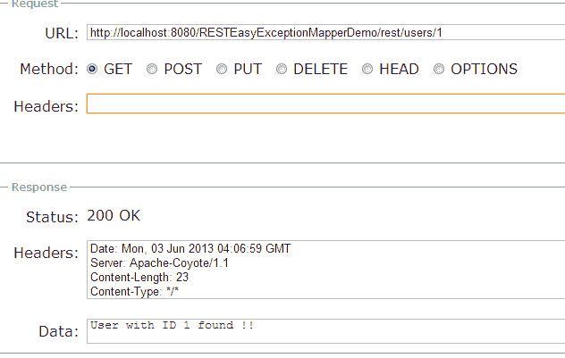

# RESTEasy ExceptionMapper –异常处理示例

> 原文： [https://howtodoinjava.com/resteasy/exception-handling-in-jax-rs-resteasy-with-exceptionmapper/](https://howtodoinjava.com/resteasy/exception-handling-in-jax-rs-resteasy-with-exceptionmapper/)

学习使用 **resteasy ExceptionMapper** 接口实现创建和处理[自定义异常](https://howtodoinjava.com/java/exception-handling/best-practices-for-for-exception-handling/)。 `ExceptionMapper`是提供者的合同，该提供商将 [Java 异常](https://howtodoinjava.com/java/exception-handling/checked-vs-unchecked-exceptions-in-java/)映射到`Response`对象。

> 必须使用`@Provider`注释`ExceptionMapper`接口的实现才能正常工作。

## 1\. Resteasy ExceptionMapper-自定义异常处理程序

`ExceptionMapper`的示例实现提供程序类如下所示：

```java
package com.howtodoinjava.exception;

import javax.ws.rs.core.Response;
import javax.ws.rs.core.Response.Status;
import javax.ws.rs.ext.ExceptionMapper;
import javax.ws.rs.ext.Provider;

@Provider
public class MyApplicationExceptionHandler implements ExceptionMapper<MyApplicationException> 
{
	@Override
	public Response toResponse(MyApplicationException exception) 
	{
		return Response.status(Status.BAD_REQUEST).entity(exception.getMessage()).build();	
	}
}

```

自定义异常类`MyApplicationException.java`的编写方式为：

```java
package com.howtodoinjava.exception;

import java.io.Serializable;

public class MyApplicationException extends Exception implements Serializable
{
	private static final long serialVersionUID = 1L;

	public MyApplicationException()	{
		super();
	}
	public MyApplicationException(String msg)	{
		super(msg);
	}
	public MyApplicationException(String msg, Exception e)	{
		super(msg, e);
	}
}

```

## 2\. Resteasy REST API

为了测试`ExceptionMapper`实现，我编写了以下 resteasy REST API。

```java
package com.howtodoinjava.rest;

import javax.ws.rs.GET;
import javax.ws.rs.Path;
import javax.ws.rs.PathParam;
import javax.ws.rs.core.Response;

import org.jboss.resteasy.spi.validation.ValidateRequest;

import com.howtodoinjava.exception.MyApplicationException;

@Path("/rest")
public class UserService 
{
	@Path("/users/{id}")
	@GET
	@ValidateRequest
	public Response getUserBId	( @PathParam("id") String id ) throws MyApplicationException
	{
		//validate mandatory field
		if(id == null)
		{
			throw new MyApplicationException("id is not present in request !!");
		}
		//Validate proper format
		try
		{
			Integer.parseInt(id);
		}
		catch(NumberFormatException e)
		{
			throw new MyApplicationException("id is not a number !!");
		}
		//Process the request
		return Response.ok().entity("User with ID " + id + " found !!").build();
	}
}

```

## 3\. RESTEasy ExceptionMapper 演示

上面的 API 接受`Integer`格式的用户`'id'`参数。 如果我们以无法解析为`Integer`的其他格式传递 id，则会抛出`MyApplicationException`。 我们的异常映射器应该能够处理这个问题。

#### 3.1 有效要求

在浏览器中访问`http://localhost:8080/RESTEasyExceptionMapperDemo/rest/users/1`。



Valid request to REST API


#### 3.2 无效的请求-引发异常

在浏览器中访问`http://localhost:8080/RESTEasyExceptionMapperDemo/rest/users/abc`。


Invalid request to REST API


要使用 ExceptionMapper inreface 下载此 **Resteasy 客户端异常处理示例的源代码，请遵循以下给定的链接。**

[Sourcecode Download](https://docs.google.com/file/d/0B7yo2HclmjI4V0ZBZ2xqWllHMnc/edit?usp=sharing "jax-rs exception handling demo source code")

学习愉快！