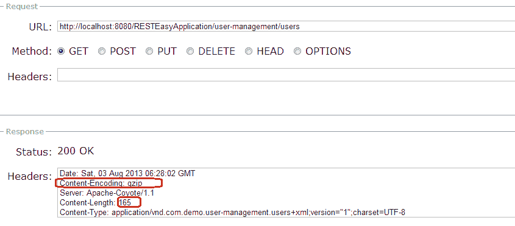

# RESTEasy –启用 Gzip 压缩内容编码

> 原文： [https://howtodoinjava.com/resteasy/enable-gzip-compression-content-encoding-in-resteasy/](https://howtodoinjava.com/resteasy/enable-gzip-compression-content-encoding-in-resteasy/)

**[JAX-RS Resteasy](//howtodoinjava.com/restful-web-service/ "RESTful Web services Tutorials")** 具有自动 **[GZIP](https://en.wikipedia.org/wiki/Gzip "gzip")** 减压支持。 如果 **[客户端框架](//howtodoinjava.com/resteasy/resteasy-client-for-consuming-rest-apis/ "RESTEasy client for consuming REST APIs")** 或 JAX-RS 服务接收到具有“ gzip”内容编码的消息正文，它将自动对其进行解压缩。 客户端框架自动将 Accept-Encoding 标头设置为“ gzip，deflate”。 因此，您不必自己设置此标头。

要使用 gzip 压缩，请按以下方式使用 **[@GZIP](http://docs.jboss.org/resteasy/docs/2.0.0.GA/userguide/html/gzip.html "gzip")** 批注。

```java
	//Output compression
	@GET
	@Path("/users")
	@GZIP
	@Produces("application/xml")
	public Users getAllUsers() 
	{
		//more code....
	}

	//OR

	//Input compression
	@POST
	@Path("/users")
	@Consumes("application/vnd.com.demo.user-management.user+xml;charset=UTF-8;version=1")
	public Response createUser(@GZIP User user,
			@DefaultValue("false") @QueryParam("allow-admin") boolean allowAdmin)
			throws URISyntaxException 
	{
		//More code...
	}

```

## 用法示例

在上面的 GET REST API 上调用时，没有 gzip 压缩的示例 API 输出**将如下所示：**

```java
	Date: Sat, 03 Aug 2013 06:18:41 GMT
	Server: Apache-Coyote/1.1
	Content-Length: 277
	Content-Type: application/vnd.com.demo.user-management.users+xml;version="1";charset=UTF-8

```


RESTEasy example without gzip compression


使用@GZIP 批注进行 gzip 压缩的示例 API 输出

```java
Date: Sat, 03 Aug 2013 06:31:21 GMT
Content-Encoding: gzip
Server: Apache-Coyote/1.1
Content-Length: 165
Content-Type: application/vnd.com.demo.user-management.users+xml;version="1";charset=UTF-8

```



RESTEasy example with gzip compression


给我留言，帖子中还不清楚。

**祝您学习愉快！**