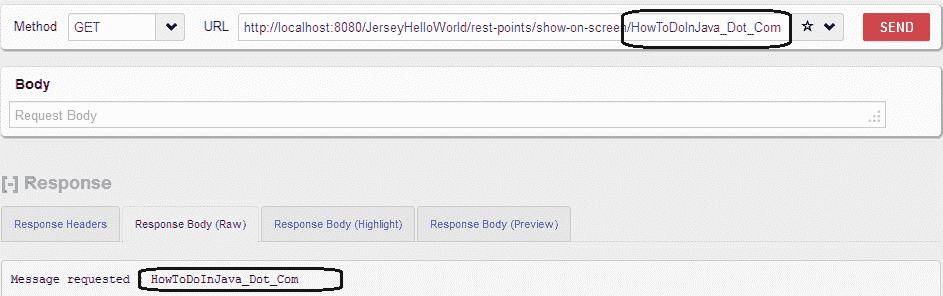

# 泽西世界你好例子

> 原文： [https://howtodoinjava.com/jersey/jax-rs-jersey-hello-world-example/](https://howtodoinjava.com/jersey/jax-rs-jersey-hello-world-example/)

我已经写了很多关于 [**JAX-RS RESTEasy 概念以及如何**](//howtodoinjava.com/restful-web-service/ "RESTful Web services Tutorials") 的文章。 现在，我开始探索 Jersey，这是另一个制作 RESTFul 应用程序的流行框架。 首先，我将在本文中编写我的 hello world 应用程序，在下一篇文章中将对其进行修改，以显示 Jersey 提供的其他功能的演示。

## **步骤 1）使用 Maven 创建一个 Eclipse Web 项目**

[在此处学习制作 Eclipse Maven 项目](//howtodoinjava.com/maven/how-to-create-a-eclipse-web-application-using-maven/ "How to create a eclipse web application using maven")

## **步骤 2）更新 pom.xml 文件**中的 Jersey 依赖项

```java
<project xmlns="http://maven.apache.org/POM/4.0.0" xmlns:xsi="http://www.w3.org/2001/XMLSchema-instance"
  xsi:schemaLocation="http://maven.apache.org/POM/4.0.0 http://maven.apache.org/maven-v4_0_0.xsd">
  <modelVersion>4.0.0</modelVersion>
  <groupId>com.howtodoinjava</groupId>
  <artifactId>JerseyHelloWorld</artifactId>
  <packaging>war</packaging>
  <version>1.0-SNAPSHOT</version>
  <name>JerseyHelloWorld Maven Webapp</name>
  <url>http://maven.apache.org</url>
  <repositories>
		<repository>
			<id>maven2-repository.java.net</id>
			<name>Java.net Repository for Maven</name>
			<url>http://download.java.net/maven/2/</url>
			<layout>default</layout>
		</repository>
	</repositories>
  <dependencies>
    <dependency>
      <groupId>junit</groupId>
      <artifactId>junit</artifactId>
      <version>4.11</version>
      <scope>test</scope>
    </dependency>
    <dependency>
		<groupId>com.sun.jersey</groupId>
		<artifactId>jersey-server</artifactId>
		<version>1.17.1</version>
	</dependency>
	<dependency>
		<groupId>com.sun.jersey</groupId>
		<artifactId>jersey-core</artifactId>
		<version>1.17.1</version>
	</dependency>
	<dependency>
		<groupId>com.sun.jersey</groupId>
		<artifactId>jersey-servlet</artifactId>
		<version>1.17.1</version>
	</dependency>
  </dependencies>

  <build>
    <finalName>JerseyHelloWorld</finalName>
	    <plugins>
		    <plugin>
		      <artifactId>maven-compiler-plugin</artifactId>
		        <configuration>
		          <source>1.6</source>
		          <target>1.6</target>
		        </configuration>
		    </plugin>
	  </plugins>
  </build>
</project>

```

## **步骤 3）使用 servlet 映射将 com.sun.jersey.spi.container.servlet.ServletContainer 映射到 web.xml 文件**

```java
<!DOCTYPE web-app PUBLIC
 "-//Sun Microsystems, Inc.//DTD Web Application 2.3//EN"
 "http://java.sun.com/dtd/web-app_2_3.dtd" >

<web-app>

  <display-name>Archetype Created Web Application</display-name>

  <servlet>
		<servlet-name>jersey-serlvet</servlet-name>
		<servlet-class>com.sun.jersey.spi.container.servlet.ServletContainer</servlet-class>
		<init-param>
		     <param-name>com.sun.jersey.config.property.packages</param-name>
		     <param-value>com.howtodoinjava.rest</param-value>
		</init-param>
		<load-on-startup>1</load-on-startup>
	</servlet>

	<servlet-mapping>
		<servlet-name>jersey-serlvet</servlet-name>
		<url-pattern>/rest-points/*</url-pattern>
	</servlet-mapping>

</web-app>

```

## **步骤 4）编写第一个 REST 服务类**

由于 JAX-RS 使用了通用注释，因此服务类看起来与 RESTEasy 完全一样。

```java
package com.howtodoinjava.rest;

import javax.ws.rs.GET;
import javax.ws.rs.Path;
import javax.ws.rs.PathParam;
import javax.ws.rs.core.Response;

@Path("/show-on-screen")
public class JerseyHelloWorldService
{
	@GET
	@Path("/{message}")
	public Response getMsg(@PathParam("message") String msg)
	{
		String output = "Message requested : " + msg;
		//Simply return the parameter passed as message
		return Response.status(200).entity(output).build();
	}
}

```

## **测试应用程序**

要在浏览器中的 URL 下面测试应用程序类型：http：// localhost：8080 / JerseyHelloWorld / rest-points / show-on-screen / **HowToDoInJava_Dot_Com**

这将在服务类中调用 REST API 方法，并打印作为路径参数传递的消息。



Jersey hello world message


要下载以上文章的来源，请单击下面的链接。

```java
**Sourcecode Download**
```

**祝您学习愉快！**