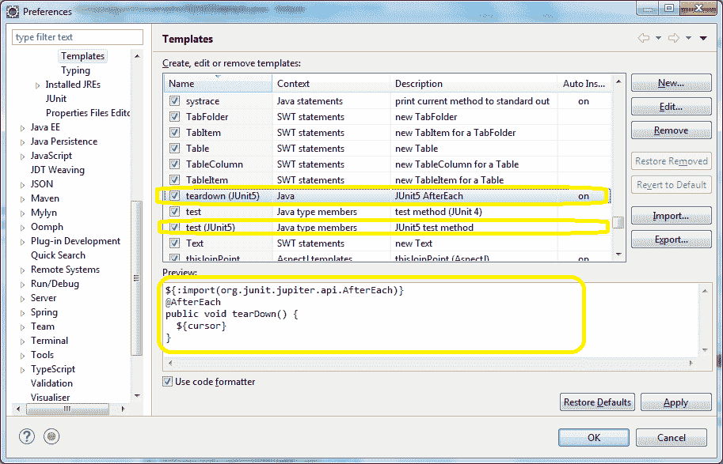
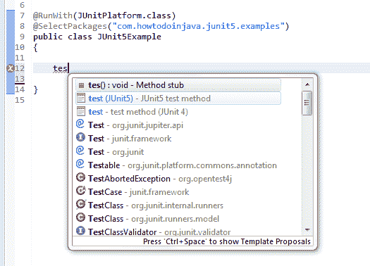

# Eclipse 的 JUnit 5 测试模板

> 原文： [https://howtodoinjava.com/junit5/code-test-templates-eclipse/](https://howtodoinjava.com/junit5/code-test-templates-eclipse/)

Eclipse 对 JUnit 测试用例提供了强大的工具支持。 在 Eclipse 中配置用于 JUnit 测试用例的[代码模板](//howtodoinjava.com/best-practices/create-eclipse-templates-for-faster-java-coding/)是加快测试开发速度的重要功能。 在 Eclipse 中学习**创建和导入 JUnit 5 测试模板。**

## JUnit 5 测试模板

在以下模板文件中给出的配置三个 JUnit 5 模板方法，即

1.  [`@BeforeEach`](//howtodoinjava.com/junit-5/before-each-annotation-example/)注解的`setUp()`
2.  [`@AfterEach`](//howtodoinjava.com/junit-5/after-each-annotation-example/)注解的`tearDown()`
3.  `@Test`注解的`testXXX()`

当您使用`test()`模板时，它将自动添加以下导入语句：

```java
import static org.junit.jupiter.api.Assertions.*;
```

它可以直接使用所有静态`assertXXX()`方法进行测试。

```java
<?xml version="1.0" encoding="UTF-8" standalone="no"?><templates><template autoinsert="true" context="java" deleted="false" description="JUnit5 BeforeEach" enabled="true" name="setup (JUnit5)">${:import(org.junit.jupiter.api.BeforeEach)}
@BeforeEach
public void setUp() {
  ${cursor}
}</template><template autoinsert="true" context="java" deleted="false" description="JUnit5 AfterEach" enabled="true" name="teardown (JUnit5)">${:import(org.junit.jupiter.api.AfterEach)}
@AfterEach
public void tearDown() {
  ${cursor}
}</template><template autoinsert="false" context="java-members" deleted="false" description="JUnit5 test method" enabled="true" id="org.eclipse.jdt.ui.templates.test" name="test (JUnit5)">${:import(org.junit.jupiter.api.Test)}
@Test
public void test${name}() {
	${staticImport:importStatic('org.junit.jupiter.api.Assertions.*')}
	${cursor} 
}</template></templates>

```

将此 XML 保存到您首选位置的文件中。 我们将在下一步中导入该文件。

## 将代码模板导入 Eclipse

1.  Eclipse:Window -> 首选项
2.  Java -> 编辑器 -> 模板
3.  导入…
4.  选择文件
5.  验证特定于 JUnit 5 的模板名称“`setup(JUnit5)`”，“`teardown(JUnit5)`”和“`test(JUnit5)`”



JUnit 5 Eclipse 的测试模板


## 如何使用测试模板

要使用模板，请将光标放在新行中，然后输入 2-3 个模板方法的缩写。 现在点击`CTRL+ENTER`。 它将以下面的方式打开一个弹出窗口。



使用 JUnit 5 Eclipse 的测试模板


使用向上或向下箭头键选择模板方法，然后按`Enter`。

它将生成放置光标的模板代码

将我的问题放在评论部分。

学习愉快！