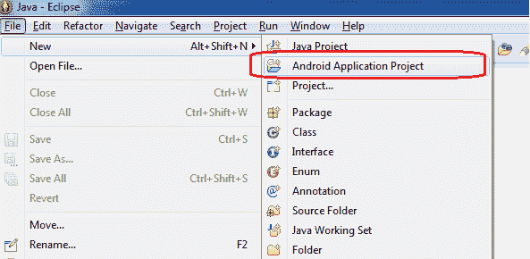
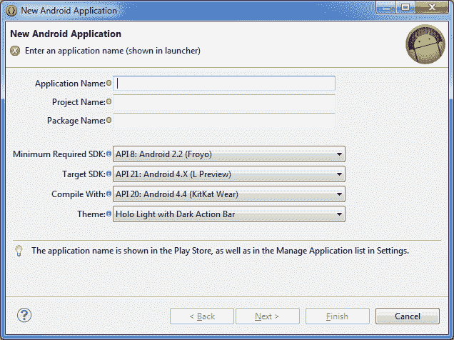
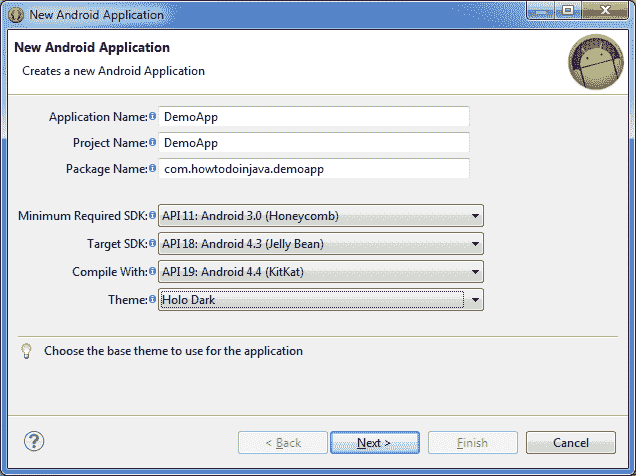
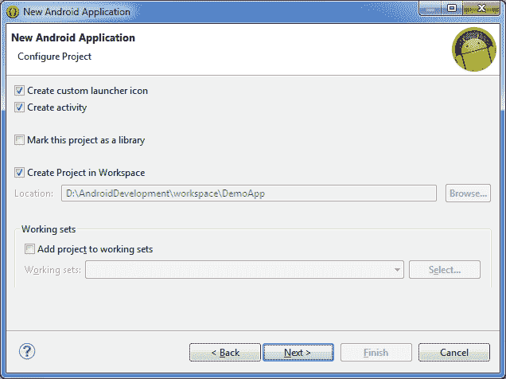
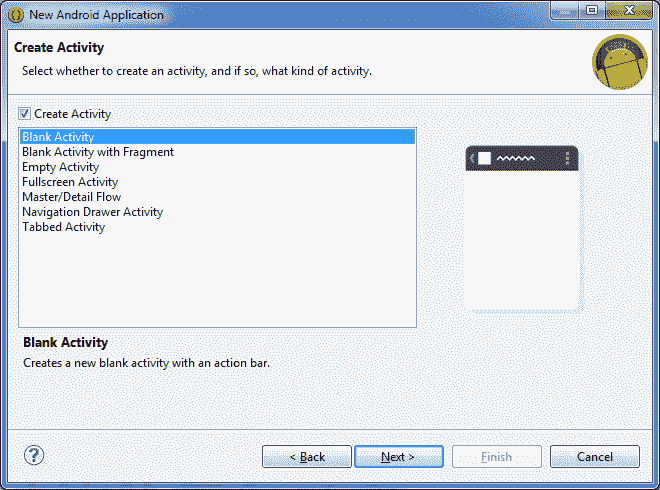
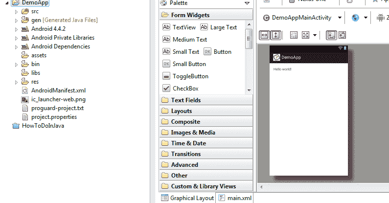
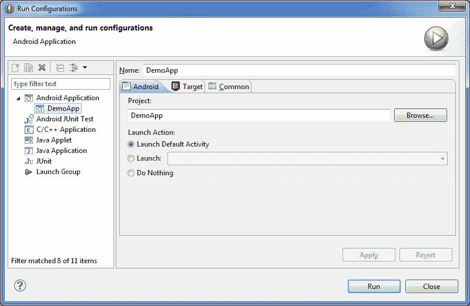

# Android 教程：如何创建 Android 应用/项目

> 原文： [https://howtodoinjava.com/android/android-tutorial-how-to-create-android-app-project/](https://howtodoinjava.com/android/android-tutorial-how-to-create-android-app-project/)

在我以前的 Android 教程中，我们首先学习[**设置 Android 开发环境**](//howtodoinjava.com/android/android-tutorial-install-android-on-windows/ "Android Tutorial : Install Android on Windows") ，然后学习[**提高虚拟设备**的性能](//howtodoinjava.com/android/how-to-speed-up-a-slow-android-avdemulator/ "How to speed up a slow android AVD/emulator")，以便我们可以更快地开发和测试代码。 在本教程中，我列出了每次**都会创建一个 Android 应用**的步骤。 在这两个步骤之间，我将详细说明细节和一些提示，以便您在有疑问时希望可以为您提供帮助。

以下连续步骤将使用我们在上一篇文章中创建的开发设置，**创建名为`DemoApp`的 android 应用**。 让我们开始乐趣吧。

## 步骤 1：创建 Android 项目

从 Eclipse 主菜单中，选择“文件 -> Android 应用项目”，然后单击“下一步”进入向导的下一页。

文件 – Android 应用项目

这将为您带来一个空白向导，用于创建新的 android 应用，如下所示：

空白的新 Android 应用屏幕

在此填写以下项目。

*   对于“应用名称”和“项目名称”，请填写`DemoApp`
*   对于“包名称”，填写`com.howtodoinjava.demoapp`
*   对于“最低要求的 SDK”，请选择“`API 11: Android 3.0 (Honeycomb)`”
*   对于“目标 SDK”和“编译方式”，请选择“`API 19: Android 4.4 (Kitkat)`”
*   选择主题“`Holo Dark`”

填写好的新 Android 应用屏幕 – 向导一

然后，单击“下一步”以转到向导的下一页：

空白的新 Android 应用屏幕 – 向导二

现在将所有选项保留为默认值，然后单击“下一步”。 在这一步，您将必须为您的应用选择启动器图标。 您只需要选择一个图像，向导就会完成剩下的工作，例如为不同的屏幕级别调整其大小并将其存储在项目中的适当位置。 酷！

我选择了如下图像。 您可以选择任何一个。

Android 创建加载器图标

现在单击下一步。 在这里，您选择要用作起点的模板项目。 保持“创建活动”复选框处于选中状态，然后从模板列表中选择“空白活动”。

Android 创建活动

然后，单击“下一步”移至向导的下一页，并填写以下详细信息：

*   对于“活动名称”，填写`DemoAppMainActivity`
*   对于“布局名称”，请填写`main`

Android 填写活动详细信息

此时，您可以单击“完成”按钮以完成向导。 您的新`DemoApp`项目应出现在 Eclipse 包浏览器视图中，如下所示。

项目浏览器视图

## 步骤 2：执行一些次要清理

Android 开发者工具插件将为您提供适合您的应用的启动文件。 有时是正确的，有时是错误的。 就我们而言，它可能已经添加了一个我们不需要直接使用的库，我们现在也可以摆脱它。

查看项目的`libs/`目录。 如果该目录存在，并且其中存在 JAR（可能名为`android-support-v4.jar`），请将其删除。 但是，将空`libs/`留在那里。

## 步骤 3：运行项目

现在，我们可以通过在设备或仿真器上运行项目来确认我们的项目已正确设置。

按下运行工具栏按钮（通常显示为绿色圆圈中的白色“播放”三角形）。 首次运行项目时，将看到“运行方式”对话框，提示您声明要如何运行应用：

项目作为 Android App 运行

单击“Android 应用”，然后单击“确定”继续。

此时，如果您有兼容的正在运行的仿真器或设备，则将安装该应用并在其上运行。 否则，Eclipse 将根据您在上一教程中创建的 AVD 启动合适的仿真器，然后在其上安装并运行该应用。

Android 正在运行的应用

请注意，您必须解锁设备或仿真器才能真正看到该应用在运行 - 它不会自动为您解锁。

在下一个教程中，我将详细讨论创建的项目中的内容。

**祝您学习愉快！**