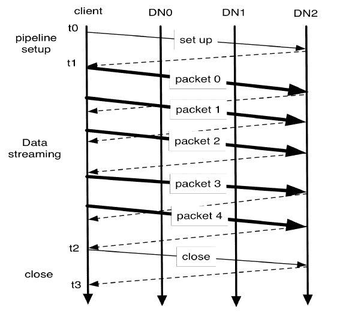

# HDFS – Hadoop 分布式文件系统架构教程

> 原文： [https://howtodoinjava.com/hadoop/hdfs-hadoop-distributed-file-system-architecture-tutorial/](https://howtodoinjava.com/hadoop/hdfs-hadoop-distributed-file-system-architecture-tutorial/)

HDFS（Hadoop 分布式文件系统）是[**大数据**](//howtodoinjava.com/big-data/hadoop/hadoop-big-data-tutorial/)的存储位置。 HDFS 的主要目标是即使在存在名称节点故障，数据节点故障和/或网络分区（[**CAP 定理**](//howtodoinjava.com/2015/07/13/brewers-cap-theorem-in-simple-words/)中的“P”）等故障的情况下，也能可靠地存储数据。 本教程旨在研究将 HDFS 实现到分布式集群环境中涉及的不同组件。

```java
Table of Contents

HDFS Architecture
	NameNode
	DataNodes
	CheckpointNode
	BackupNode
	File System Snapshots
File Operations
	Read/Write operation
	Block Placement
	Replication management
	Balancer
	Block Scanner
```

## HDFS 架构

HDFS 是 Hadoop 的文件系统组件。 您可以可视化普通文件系统（例如 FAT 和 NTFS），但可以处理非常大的数据集/文件。 默认块大小为 64 MB（HDFS 2 中为 128 MB）。 因此，当您在其中存储大文件时，HDFS 的性能最佳。 小文件实际上会导致内存浪费。

在 HDFS 中，数据存储为两种形式，即**实际数据**和**元数据**（文件大小，块位置，时间戳等）。 **元数据存储在名称节点中，应用数据存储在数据节点**中。 所有服务器均已完全连接，并使用基于 TCP 的协议相互通信。 通过在多个数据节点之间分布存储和计算，集群可以水平增长，同时保持成本有限，因为这些节点是简单的[商业硬件](https://en.wikipedia.org/wiki/Commodity_computing)。

#### 名称节点

**名称节点存储元数据。** 当您将大文件存储到 HDFS 中时，它会分成多个块（通常为 128 MB，但用户可以覆盖它）。 然后，将每个块分别存储到多个数据节点中（默认值为 3）。 名称节点是在称为 **inode** 的数据结构中存储文件块到数据节点的映射（文件数据的物理位置），文件权限，修改和访问时间戳，名称空间和磁盘空间配额的组件。

任何想要读取文件的客户端都将首先与名称节点联系以获取数据块的位置，然后再从距离该客户端最近的数据节点中读取块内容。 类似地，在写入数据时，客户端请求名称节点提名一组三个数据节点来写入块副本。 然后，客户端以管道方式（*我们将看到如何完成*）将数据写入数据节点。

任何群集一次只能具有一个**名称节点**。 HDFS **将整个名称空间保留在 RAM** 中，以便更快地访问客户端程序。 并定期将这些数据以映像，检查点和日志的形式同步到持久化文件系统中。

内存中**索引节点**数据和属于每个文件的块列表组成了命名空间的元数据，称为**映像**。 图像的持久记录（存储在本机文件系统中）称为**检查点**。 本地主机的本机文件系统中称为**日志**的映像的修改日志。 在重新启动期间，名称节点通过读取检查点并重播日志来还原名称空间。

#### 数据节点

**数据节点存储实际的应用数据。** 数据节点中的每个数据块在单独的文件中都有两部分，即数据本身及其元数据，包括块数据的校验和和块的生成标记。

在启动期间，每个数据节点都连接到名称节点并执行**握手**以验证名称空间 ID 和数据节点的软件版本。 如果其中一个与名称节点中存在的记录不匹配，则数据节点将自动关闭。 **命名空间 ID 是整个集群**的单个唯一 ID，当将节点格式化为包含在集群中时，命名空间 ID 将存储到所有节点中。 **软件版本是 HDFS** 的版本，其经过验证可防止由于新版本功能的更改而导致任何数据丢失。

允许新初始化的，没有任何名称空间 ID 的数据节点加入群集并接收群集的名称空间 ID。 也就是它拥有自己的唯一存储 ID。

握手后，数据节点**向名称节点注册**并发送其**块报告**。 块报告包含数据节点托管的每个块副本的块 ID，生成标记和长度。 第一个阻止报告在数据节点注册后立即发送。 随后的块报告每小时发送一次，并为数据节点提供有关块副本在群集上的位置的最新视图。

为了通知其实时状态，所有数据节点都会向名称节点发送**心跳**。 默认的心跳间隔为三秒。 如果名称节点在十分钟内未从数据节点接收到心跳，则名称节点会认为数据节点停止服务，并且该数据节点托管的块副本不可用。 然后，名称节点计划在其他数据节点上创建这些块的新副本。

来自数据节点的心跳还携带有关总存储容量，正在使用的存储部分以及当前正在进行的数据传输数量的信息。 这些统计信息用于名称节点的空间分配和负载平衡决策。

名称节点从不直接调用数据节点。 它使用对心跳的答复将指令发送到数据节点，例如，将块复制到其他节点，删除本地块副本，重新注册或关闭该节点或发送即时块报告。 这些命令对于维护整个系统的完整性非常重要，因此即使在大型集群上也要保持心跳频繁是至关重要的。 名称节点每秒可以处理数千个心跳，而不会影响其他名称节点操作。

#### 检查点节点

检查点节点通常是群集中的另一个名称节点（托管在另一台计算机中，并且不直接为客户端提供服务）。 **检查点节点从名称节点下载当前的检查点和日志文件，在本地合并它们，并将新的检查点返回给名称节点。** 此时，名称节点存储此新检查点并清空其拥有的现有日志。

创建定期检查点是保护文件系统元数据的一种方法。 如果名称空间映像或日志的所有其他持久化副本在名称节点中不可用，则系统可以从最近的检查点开始。

#### 备份节点

**备份节点能够创建定期检查点，但除此之外，它还维护文件系统名称空间的内存中最新映像，该映像始终与名称节点**的状态同步。 名称节点以更改流的形式通知备份节点所有事务。 由于名称节点和备份节点都将所有信息都存储在内存中，因此两者的内存要求相似。

如果名称节点发生故障，则备份节点在内存中的映像和磁盘上的检查点将记录最新的名称空间状态。 可以将备份节点视为**只读名称节点**。 它包含除块位置之外的所有文件系统元数据信息。 它可以执行常规名称节点的所有操作，这些操作不涉及名称空间的修改或块位置的知识。 这意味着当名称节点发生故障时，备份节点不会立即保留到目前为止尚未保留的所有最新更新。

请注意， **备份节点不是辅助名称节点**（如果活动名称节点失败，则是备用名称节点），它不会受理客户端对读/写文件的请求。 辅助节点是 HDFS 2.x（[Apache YARN](https://hadoop.apache.org/docs/current/hadoop-yarn/hadoop-yarn-site/YARN.html)）的功能，我们将在单独的教程中介绍。

#### 文件系统快照

**快照是整个群集的映像，将其保存以防止在系统升级时丢失任何数据**。 实际的数据文件不是该映像的一部分，因为它将导致整个群集的存储区域加倍。

当管理员请求快照时，名称节点选择退出的检查点文件并将所有日志日志合并到该文件中并存储到持久文件系统中。 同样，所有数据节点复制其**目录信息，并将硬链接链接到数据块**并存储到其中。 群集故障时将使用此信息。

## 文件操作

首先，所有组件将构建 HDFS 文件系统，并以连续的方式发挥其作用，以保持群集的健康。 现在，让我们尝试了解**在 HDFS 集群环境**中如何进行文件读/写操作。

#### 读/写操作

如果要将数据写入 HDFS，则只需**创建一个文件，然后将数据写入该文件**。 HDFS 为您管理了上述所有复杂性。 在读取数据时，给它一个文件名； 并开始从中读取数据。

要学习的重要一件事是**一旦在 HDFS** 中写入，就无法修改数据。 您只能向其附加新数据。 或者，只需删除该文件并写入一个新文件来代替它。

想要写入数据的客户端应用首先需要询问“**写租约**”（类似于写锁）。 客户端获得写租约后，其他客户端无法写入该文件，直到完成第一个程序或租约到期为止。 编写器客户端通过将心跳发送到名称节点来定期续订租约。 文件关闭后，租约将被撤销，其他程序可以请求对此文件进行写租约。

租约期限受软限制和硬限制的约束。 在软限制到期之前，编写者可以确定对该文件的独占访问权限。 如果软限制到期并且客户端无法关闭文件或续订租约，则另一个客户端可以抢占该租约。 如果硬限制到期后（一小时）并且客户端未能续订租约，则 HDFS 会假定客户端已退出，并将代表编写者自动关闭文件并恢复租约。

编写者的租约不会阻止其他客户读取文件； 一个文件可能有许多并发读取器。 将数据写入 HDFS 文件后，HDFS 不提供任何保证，除非关闭文件，否则新读取器可以看到该数据。 如果用户应用需要可见性保证，则可以显式调用“`hflush`”操作。

数据以管道方式写入，如下所示。



HDFS 中的编写管道


上图描绘了三个数据节点（DN）的流水线和五个数据包的块。 **客户端仅写入第一个数据节点，然后该数据节点将数据传递给第二个数据节点，依此类推。** 这样，所有节点都参与数据写入。

客户端打开要读取的文件时，它将从名称节点获取块列表和每个块副本的位置。 每个块的位置按它们与阅读器的距离排序。 当读取块的内容时，**客户端首先尝试最接近的副本**。 如果读取尝试失败，则客户端将依次尝试下一个副本。

#### 块放置

选择用于写入数据的节点时，名称节点遵循副本管理策略。 默认的 HDFS 副本放置策略如下：

1.  没有数据节点包含任何块的一个以上副本。
2.  如果集群上有足够的机架，则没有一个机架包含同一块的两个以上副本。

#### 复制管理

名称节点的一项主要职责是，确保所有数据块均具有适当数量的副本。 在汇总来自数据节点的块报告期间，名称节点会检测到某个块的复制不足或过度。 当块变得过度复制时，名称节点选择要删除的副本。

当块复制不足时，会将其放入复制优先级队列中，以创建该数据块的更多副本。 只有一个副本的块具有最高优先级。 后台线程定期扫描复制队列的头部，以根据上述块放置策略决定将新副本放置在何处。

#### 平衡器

HDFS 块放置策略未考虑数据节点磁盘空间利用率。 将新节点添加到群集时，也会发生不平衡。 平衡器是**平衡 HDFS 群集**上磁盘空间使用情况的工具。 该工具被部署为可以由集群管理员运行的应用。 它将副本从利用率较高的数据节点移到利用率较低的数据节点。

在选择要移动的副本并确定其目的地时，平衡器保证该决定不会减少副本数量或机架数量。

平衡器通过最小化机架间数据复制来优化平衡过程。 如果平衡器确定需要将副本 A 移动到其他机架，并且目标机架恰好具有相同块的副本 B，则将从副本 B 复制数据，而不是副本 A。

#### 区块扫描器

每个数据节点运行一个块扫描器，该扫描器定期**扫描其块副本并验证存储的校验和与块数据**相匹配。 另外，如果客户端读取了完整的块并且校验和验证成功，它将通知数据节点。 数据节点将其视为副本的验证。

每当读取客户端或块扫描器检测到损坏的块时，它都会通知名称节点。 名称节点将副本标记为已损坏，但不会立即计划删除副本。 相反，它开始复制该块的良好副本。 仅当良好的副本数达到块的复制因子时，才计划删除损坏的副本。

这就是 HDFS 非常复杂的介绍。 让我知道你的问题。

**祝您学习愉快！**