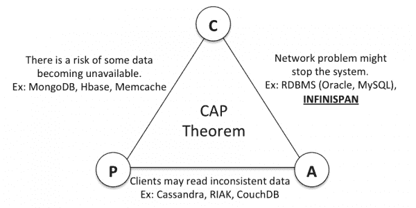

# Brewer 的 CAP 定理简述

> 原文： [https://howtodoinjava.com/hadoop/brewers-cap-theorem-in-simple-words/](https://howtodoinjava.com/hadoop/brewers-cap-theorem-in-simple-words/)

当您开始讨论分布式架构时，很可能会遇到 **CAP 理论**（或 Brewer 定理）。 CAP 代表一致性，可用性和分区容错性。 它希望系统设计师在最终设计中在以上三个竞争保证之间做出选择。 据说不可能在系统中实现全部三项，并且您必须在系统的三项保证中最多选择两项。

好。 定义似乎简单快捷。 可是等等 ！！ 您所说的一致性，可用性和分区容错性是什么意思？ 让我们在分布式计算环境中定义这些术语。

1.  #### 一致性

    一致的服务将完全运行或根本不运行。 一致性在非分布式系统中的 ACID 属性中为“C”，适用于数据库事务的理想属性，这意味着数据将永远不会持久保存（回滚），从而打破了某些预设约束。

    在分布式环境中，一致性意味着，正在从集群读取数据的所有客户端程序在任何给定时间点都会看到相同的数据。 从两个节点获取数据的两个客户端应该根本看不到不同的数据。

2.  #### 可用性

    可用性意味着，**无论群集**内部发生什么，您都应该能够检索存储在分布式系统中的数据。 如果发出请求，则必须从系统得到响应； 即使集群中的一个节点（或多个节点）发生故障。

3.  #### 分区容错性

    分区容错性意味着即使两个节点（两个节点都在上，但无法通信）之间存在“分区”（通信中断），群集（作为一个整体）仍可以继续运行。

    **不允许出现少于总网络故障的一组故障，从而导致系统无法正确响应。**

因此，CAP 定理使您可以选择想要添加到系统中的 3 个保证中的任意两个。 您不能保证单个分布式系统中的全部 3 个，例如，为了获得可用性和分区容错性，您必须放弃一致性。

## CAP 定理例子

不管您读过什么，大部分都是定义部分，对于初学者来说有点复杂。 让我们用更简单的英语来了解

您需要设计一个由 4 个数据节点组成的分布式集群。 复制因子为 2，即任何写入群集的数据都必须写入 2 个节点； 因此，当发生故障时，一秒钟即可提供数据。 现在，尝试对此要求应用 CAP 定理。 在分布式系统中，任何时候都可能发生两件事，即节点故障（硬盘崩溃）或网络故障（两个节点之间的连接断开）（[分布式计算的谬误](https://en.wikipedia.org/wiki/Fallacies_of_Distributed_Computing)）。

我们将尝试根据这些事实/假设来设计我们的系统。

#### CP（一致性/分区容错性）系统

在分布式系统中，在读取数据时，一致性是由一种投票机制决定的，在该机制中，所有拥有数据副本的节点都同意他们拥有所请求数据的“相同副本”。 现在，假设我们请求的数据存在于两个节点 N1 和 N2 中。 客户端尝试读取数据； 而且我们的 CP 系统也可以容忍分区，因此发生了预期的网络故障，并且将 N2 检测为宕机。 现在，系统无法确定 N1 的数据副本是否为最新； 它也可能是陈旧的。 因此，系统决定将错误事件发送给客户端。 在这里，系统选择了数据一致性而不是数据可用性。

同样，如果复制因子为 2，则在写入数据时，系统可能会拒绝写入请求，直到找到两个运行状况良好的节点以一致的方式完全写入数据为止。

#### AP（可用性/分区容错性）系统

如果在上述情况下系统而不是发送错误（如果 N2 处于关闭状态）怎么办？ 它发送从 N1 接收的数据。 客户端得到了数据，但是过去存储在系统中的是最新数据副本吗？ 你不能决定。 您选择可用性而不是一致性。 这些是 AP 系统。

#### CA（一致性/可用性）系统

在分布式环境中，我们无法避免 CAP 的“P”。 因此，我们必须在 CP 或 AP 系统之间进行选择。 如果我们希望拥有一个一致且可用的系统，那么我们就必须忽略分区容错性，只有在非分布式系统（例如 oracle 和 SQL Server）中才有可能。

CAP 理论示例

在当今世界中，我们可以在分布式系统中实现这三个目标（如果不是全部，则至少是部分）。 例如 [Cassandra 中的可调一致性](http://docs.datastax.com/en/cassandra/2.0/cassandra/dml/dml_config_consistency_c.html)。

*CAP 定理就像关于软件项目的古老玩笑一样：您可以在时间，预算或正确性中选择任意两个🙂*

**祝您学习愉快！**

**参考**：[http://www.julianbrowne.com/article/viewer/brewers-cap-theorem](http://www.julianbrowne.com/article/viewer/brewers-cap-theorem)