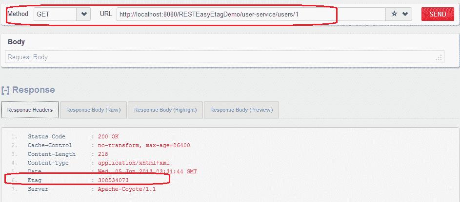
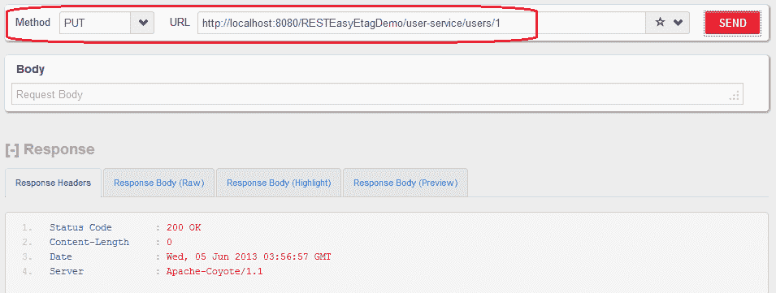

# 使用 ETag 的 RESTEasy 缓存控制示例

> 原文： [https://howtodoinjava.com/resteasy/jax-rs-resteasy-cache-control-with-etag-example/](https://howtodoinjava.com/resteasy/jax-rs-resteasy-cache-control-with-etag-example/)

[**ETags**](https://en.wikipedia.org/wiki/HTTP_ETag "etag") 或实体标签是很有用的 [**HTTP 标头**](https://en.wikipedia.org/wiki/List_of_HTTP_header_fields "HTTP header")，它们可以通过最小化系统上的服务器负载来帮助构建超快速的应用。 ETag 设置为对客户端的响应，因此客户端可以对条件请求使用各种控制请求标头，例如`If-Match`和`If-None-Match`。[`javax.ws.rs.core.Response.ResponseBuilder#tag()`](https://docs.oracle.com/javaee/6/api/javax/ws/rs/core/Response.ResponseBuilder.html#tag%28javax.ws.rs.core.EntityTag%29 "ResponseBuilder")和[`javax.ws.rs.core.EntityTag`](https://docs.oracle.com/javaee/6/api/javax/ws/rs/core/EntityTag.html "EntityTag")是用于 ETag 的实用类。

在服务器端，不变的 ETag（HTTP 请求附带的 ETag 与为请求的资源计算的 ETag 之间的匹配）只是意味着，资源与上次请求时间相比没有变化，因此只需发送 HTTP 304 标头[未修改]就足够了， 客户端可以使用本地可用的资源副本而不必担心。

为了演示该示例，我在服务类中有两个 REST API。

**a）GET `http://localhost:8080/RESTEasyEtagDemo/user-service/users/1`**

此 API 将获取用户资源，该资源将附加有 ETag。 服务器将使用此 ETag 来验证用户详细信息是否已在上次请求中更新。

**b）PUT `http://localhost:8080/RESTEasyEtagDemo/user-service/users/1`**

此 API 将对服务器上的用户资源进行一些更新，这将强制服务器再次返回新的资源副本。

让我们逐步构建示例。

## 步骤 1）使用 maven 创建一个新的 Java Web 项目并添加以下依赖项。

```java
<repositories>
	<repository>
	  <id>jboss</id>
	  <url>http://repository.jboss.org/maven2</url>
	</repository>
</repositories>
<dependencies>
	<!-- core library -->
	<dependency>
		<groupId>org.jboss.resteasy</groupId>
		<artifactId>resteasy-jaxrs</artifactId>
		<version>2.3.1.GA</version>
	</dependency>
	<!-- JAXB support -->
	<dependency>
		<groupId>org.jboss.resteasy</groupId>
		<artifactId>resteasy-jaxb-provider</artifactId>
		<version>2.3.1.GA</version>
	</dependency>
	<dependency>
		<groupId>net.sf.scannotation</groupId>
		<artifactId>scannotation</artifactId>
		<version>1.0.2</version>
	</dependency>
</dependencies>

```

## 步骤 2）制作一个类来表示用户资源

确保提供一些逻辑来验证修改此资源后的最后更新时间。 我添加了一个日期类型为`lastModied`的字段。

```java
package com.howtodoinjava.demo.rest.model;

import java.io.Serializable;
import java.util.Date;

import javax.xml.bind.annotation.XmlAccessType;
import javax.xml.bind.annotation.XmlAccessorType;
import javax.xml.bind.annotation.XmlAttribute;
import javax.xml.bind.annotation.XmlElement;
import javax.xml.bind.annotation.XmlRootElement;

@XmlAccessorType(XmlAccessType.NONE)
@XmlRootElement(name = "user")
public class User implements Serializable 
{
	@XmlAttribute(name = "id")
	private int id;

	@XmlAttribute(name="uri")
	private String uri;

	@XmlElement(name = "firstName")
	private String firstName;

	@XmlElement(name = "lastName")
	private String lastName;

	@XmlElement(name="last-modified")
	private Date lastModified;

	//Setters and Getters

```

## 步骤 3）DAO 层具有访问和修改资源的方法

我出于示例目的使用了静态`HashMap`。 在实时应用中，它将是一个数据库。 例如，我在映射中仅添加了一个用户。

```java
package com.howtodoinjava.demo.rest.data;

import java.util.Date;
import java.util.HashMap;

import com.howtodoinjava.demo.rest.model.User;

public class UserDatabase 
{
	public static HashMap<Integer, User> users = new HashMap<Integer, User>();
	static 
	{
		User user = new User();
		user.setId(1);
		user.setFirstName("demo");
		user.setLastName("user");
		user.setUri("/user-management/users/1");
		user.setLastModified(new Date());
		users.put(1, user);
	}

	public static User getUserById(Integer id)
	{
		return users.get(id);
	}

	public static void updateUser(Integer id)
	{
		User user = users.get(id);
		user.setLastModified(new Date());
	}

	public static Date getLastModifiedById(Integer id)
	{
		return users.get(id).getLastModified();
	}
}

```

## 步骤 4）编写 Restful API 以访问和修改资源

这是主要步骤。 我已经在上面描述了两个 API。 GET API 返回附加了 ETag 的用户资源。 此 ETag 是在用户资源的最后修改日期计算的。 这将确保每次用户更新时，都会生成一个新的 ETag。

```java
package com.howtodoinjava.demo.rest.service;

import javax.ws.rs.GET;
import javax.ws.rs.PUT;
import javax.ws.rs.Path;
import javax.ws.rs.PathParam;
import javax.ws.rs.core.CacheControl;
import javax.ws.rs.core.Context;
import javax.ws.rs.core.EntityTag;
import javax.ws.rs.core.Request;
import javax.ws.rs.core.Response;

import com.howtodoinjava.demo.rest.data.UserDatabase;

@Path("/user-service")
public class UserService 
{
	@GET
	@Path("/users/{id}")
	public Response getUserById(@PathParam("id") int id, @Context Request req) 
	{
		//Create cache control header
		 CacheControl cc = new CacheControl();
		 //Set max age to one day
	     cc.setMaxAge(86400);

		Response.ResponseBuilder rb = null;

		//Calculate the ETag on last modified date of user resource  
		EntityTag etag = new EntityTag(UserDatabase.getLastModifiedById(id).hashCode()+"");

		//Verify if it matched with etag available in http request
        rb = req.evaluatePreconditions(etag);

        //If ETag matches the rb will be non-null; 
        //Use the rb to return the response without any further processing
        if (rb != null) 
        {
            return rb.cacheControl(cc).tag(etag).build();
        }

        //If rb is null then either it is first time request; or resource is modified
        //Get the updated representation and return with Etag attached to it
        rb = Response.ok(UserDatabase.getUserById(id)).cacheControl(cc).tag(etag);
		return rb.build();
	}

	@PUT
	@Path("/users/{id}")
	public Response updateUserById(@PathParam("id") int id) 
	{
		//Update the User resource
		UserDatabase.updateUser(id);
		return Response.status(200).build();
	}
}

```

警告：HTTP 标头中使用的日期的粒度不如数据源中使用的某些日期那么精确。 例如，数据库行中日期的精度可以定义为毫秒。 但是，HTTP 标头字段中的日期仅精确到秒。 在求值 HTTP 前提条件时，如果将`java.util.Date`对象直接与 HTTP 标头中的日期进行比较，则精度差异可能会产生意外结果。

为避免此问题，请使用日期对象的哈希码或使用某些规范化形式。

## 测试示例代码

**1）首次请求：GET `http://localhost:8080/RESTEasyEtagDemo/user-service/users/1`**



用户资源的第一次请求


**2）后续请求：GET `http://localhost:8080/RESTEasyEtagDemo/user-service/users/1`**


用户资源的后续请求


**3）修改请求：PUT `http：//localhost:8080/RESTEasyEtagDemo/user-s:rvice/users/1`**



使用 PUT API 更新的用户资源


**4）更新资源：GET `http://localhost:8080/RESTEasyEtagDemo/user-service/users/1`**


检索更新的用户资源


要下载以上示例的源代码，请单击下面给出的链接。

**祝您学习愉快！**