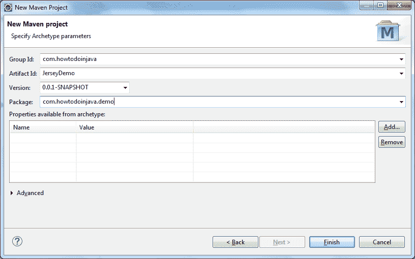
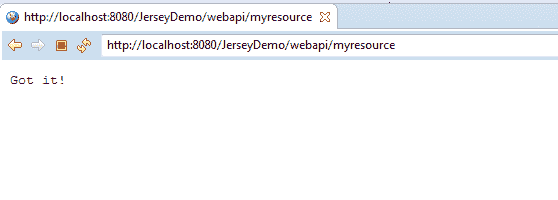

# `jersey-quickstart-webapp` HelloWorld 示例

> 原文： [https://howtodoinjava.com/jersey/jersey-quickstart-archetype-hello-world-application-example/](https://howtodoinjava.com/jersey/jersey-quickstart-archetype-hello-world-application-example/)

在此示例中，我们将使用 Eclipse 中的`jersey-quickstart-webapp` maven 原型创建一个 jersey RESTful API Web 应用。

```java
Table of Contents

Install remote archetypes in eclipse
Create new maven project using jersey-quickstart-webapp
Generated Files
Run The Application
```

## 在 Eclipse 中安装远程原型

在创建实际的 Maven 快速入门应用之前，第一步是**在 Eclipse 中安装快速入门定义**。 这是非常简单的过程，我已经在上一教程中介绍了此信息。

> **阅读更多：[如何在 Eclipse 中导入 Maven 远程原型目录](//howtodoinjava.com/tools/eclipse/how-to-import-maven-remote-archetype-catalogs-in-eclipse/)**

## 使用`jersey-quickstart-webapp`创建新的 Maven 项目

现在，我们创建一个新的 Maven 项目。


创建新的 maven 项目


选择默认/其他工作区。


选择工作区位置


选择`jersey-quickstart-webapp`版本。


选择`jersey-quickstart-webapp`版本


填写工件 ID 和组 ID。



填写工件 ID 和组 ID


点击“确定”以创建该项目。 项目将在工作区中创建。

## 生成的文件

让我们看一下生成的文件。

#### 文件夹结构


默认生成的文件


#### `web.xml`

```java
<?xml version="1.0" encoding="UTF-8"?>
<!-- This web.xml file is not required when using Servlet 3.0 container,
     see implementation details https://jax-rs-spec.java.net/ -->
<web-app xmlns:xsi="http://www.w3.org/2001/XMLSchema-instance" xmlns="http://java.sun.com/xml/ns/javaee" xsi:schemaLocation="http://java.sun.com/xml/ns/javaee http://www.oracle.com/technetwork/java/index.html; version="2.5">
  <servlet>
    <servlet-name>Jersey Web Application</servlet-name>
    <servlet-class>org.glassfish.jersey.servlet.ServletContainer</servlet-class>
    <init-param>
      <param-name>jersey.config.server.provider.packages</param-name>
      <param-value>com.howtodoinjava.demo</param-value>
    </init-param>
    <load-on-startup>1</load-on-startup>
  </servlet>
  <servlet-mapping>
    <servlet-name>Jersey Web Application</servlet-name>
    <url-pattern>/webapi/*</url-pattern>
  </servlet-mapping>
</web-app>
```

#### `pom.xml`

```java
<project xmlns="http://maven.apache.org/POM/4.0.0" xmlns:xsi="http://www.w3.org/2001/XMLSchema-instance"
         xsi:schemaLocation="http://maven.apache.org/POM/4.0.0 http://maven.apache.org/maven-v4_0_0.xsd">

    <modelVersion>4.0.0</modelVersion>

    <groupId>com.howtodoinjava.demo</groupId>
    <artifactId>JerseyDemo</artifactId>
    <packaging>war</packaging>
    <version>0.0.1-SNAPSHOT</version>
    <name>JerseyDemo</name>

    <build>
        <finalName>JerseyDemo</finalName>
        <plugins>
            <plugin>
                <groupId>org.apache.maven.plugins</groupId>
                <artifactId>maven-compiler-plugin</artifactId>
                <version>2.5.1</version>
                <inherited>true</inherited>
                <configuration>
                    <source>1.7</source>
                    <target>1.7</target>
                </configuration>
            </plugin>
        </plugins>
    </build>

    <dependencyManagement>
        <dependencies>
            <dependency>
                <groupId>org.glassfish.jersey</groupId>
                <artifactId>jersey-bom</artifactId>
                <version>${jersey.version}</version>
                <type>pom</type>
                <scope>import</scope>
            </dependency>
        </dependencies>
    </dependencyManagement>

    <dependencies>
        <dependency>
            <groupId>org.glassfish.jersey.containers</groupId>
            <artifactId>jersey-container-servlet-core</artifactId>
            <!-- use the following artifactId if you don't need servlet 2.x compatibility -->
            <!-- artifactId>jersey-container-servlet</artifactId -->
        </dependency>
        <!-- uncomment this to get JSON support
        <dependency>
            <groupId>org.glassfish.jersey.media</groupId>
            <artifactId>jersey-media-moxy</artifactId>
        </dependency>
        -->
    </dependencies>
    <properties>
        <jersey.version>2.20</jersey.version>
        <project.build.sourceEncoding>UTF-8</project.build.sourceEncoding>
    </properties>
</project>

```

#### `MyResource.java`

```java
package com.howtodoinjava.demo;

import javax.ws.rs.GET;
import javax.ws.rs.Path;
import javax.ws.rs.Produces;
import javax.ws.rs.core.MediaType;

/**
 * Root resource (exposed at "myresource" path)
 */
@Path("myresource")
public class MyResource {

    /**
     * Method handling HTTP GET requests. The returned object will be sent
     * to the client as "text/plain" media type.
     *
     * @return String that will be returned as a text/plain response.
     */
    @GET
    @Produces(MediaType.TEXT_PLAIN)
    public String getIt() {
        return "Got it!";
    }
}

```

## 运行应用

为了打招呼，您无需在此项目中做任何事情。 一切都已配置。 只需部署应用。

匹配网址：`http://localhost:8080/JerseyDemo/webapi/myresource`



应用输出


将我的问题放在评论部分。

**祝您学习愉快！**