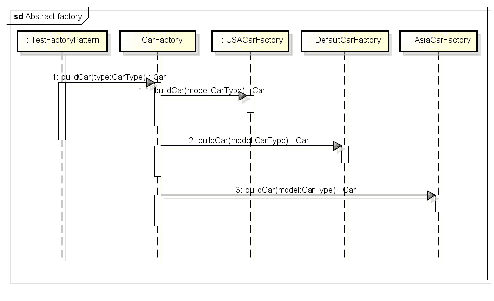

# 抽象工厂模式解释

> 原文： [https://howtodoinjava.com/design-patterns/creational/abstract-factory-pattern-in-java/](https://howtodoinjava.com/design-patterns/creational/abstract-factory-pattern-in-java/)

**抽象工厂模式**是又一个[创新设计模式](//howtodoinjava.com/category/design-patterns/creational/ "creational design patterns")，并且被视为[工厂模式](//howtodoinjava.com/design-patterns/creational/implementing-factory-design-pattern-in-java/ "Implementing factory design pattern in java")的另一抽象层。 在本教程中，我们将扩展[工厂模式](//howtodoinjava.com/design-patterns/creational/implementing-factory-design-pattern-in-java/ "Implementing factory design pattern in java")中讨论的汽车工厂问题的范围。 我们将通过扩大汽车工厂的范围来学习何时使用工厂模式，然后通过抽象工厂模式解决扩展的范围。

```java
Table of Contents

1\. Design global car factory using abstract factory pattern
2\. Abstract factory pattern based solution
3\. Abstract factory pattern implementation
4\. Summary
```

## 1.使用抽象工厂模式设计全球汽车工厂

在“ [工厂设计模式](//howtodoinjava.com/design-patterns/creational/implementing-factory-design-pattern-in-java/ "Implementing factory design pattern in java")”中，我们讨论了如何针对各种汽车模型类型以及其包含在汽车制造过程中的附加逻辑来抽象汽车制造过程。 现在，想象一下我们的汽车制造商是否决定走向全球。

为了支持**全球运营**，我们将需要增强系统以支持不同国家/地区的不同汽车制造风格。 例如，在某些国家/地区中，方向盘位于左侧，而在某些国家/地区中，其方向盘位于右侧。 在汽车的不同部分及其制造过程中可能还会存在更多此类差异。

为了描述抽象工厂模式，我们将考虑三种制造方式 - 所有其他国家/地区的*美国*，*亚洲*和*默认*。 支持多个位置将需要进行关键的设计更改。

首先，我们需要在问题说明中指定的每个**位置**中都有汽车制造厂。 即 *USACarFactory* ， *AsiaCarFactory* 和 *DefaultCarFactory* 。 现在，我们的应用程序应该足够智能，可以识别使用的位置，因此我们应该能够使用适当的汽车工厂，甚至不知道内部将使用哪个汽车工厂实现。 这也可以避免我们为某个特定位置称呼错误的工厂。

因此，基本上，我们需要另一层抽象，它将识别位置并在内部使用正确的汽车工厂实现方式，甚至不会向用户提供任何提示。 这正是使用抽象工厂模式来解决的问题。

## 2.基于抽象工厂模式的解决方案

#### 2.1 包装图

使用抽象工厂模式参与全球汽车工厂设计的课程的类图。

[](https://howtodoinjava.files.wordpress.com/2012/10/abstract_fctory_package_diagram.png)

#### 2.2 顺序图

此图显示了`CarFactory`工厂类背后的类与抽象之间的交互。

[](https://howtodoinjava.files.wordpress.com/2012/10/abstract_factory_sequence_diagram.png)

> 请注意，我已设计解决方案以完全隐藏最终用户的位置详细信息。 因此，我没有直接暴露任何特定于位置的工厂。
> 
> 在替代解决方案中，我们可以首先基于 location 参数获取特定于位置的工厂，然后在抽象引用上使用其`buildCar()`方法来构建实际的汽车实例。

## 3.抽象工厂模式实现

Java 类为全球汽车工厂实现抽象工厂模式。

首先，我们必须为不同的位置编写所有独立的汽车工厂。 为了支持特定于位置的功能，请首先使用另一个属性`location`修改`Car.java`类。

```java
public abstract class Car {

  public Car(CarType model, Location location){
    this.model = model;
    this.location = location;
  }

  protected abstract void construct();

  private CarType model = null;
  private Location location = null;

  //getters and setters

  @Override
  public String toString() {
    return "Model- "+model + " built in "+location;
  }
}

```

这增加了创建另一个用于存储不同位置的枚举的工作。

```java
public enum Location {
  DEFAULT, USA, ASIA
}

```

所有汽车类型还将具有附加的`location`属性。 我们只为豪华车而写。 小轿车和轿车也是如此。

```java

public class LuxuryCar extends Car
{
  public LuxuryCar(Location location)
  {
    super(CarType.LUXURY, location);
    construct();
  }

  @Override
  protected void construct() {
    System.out.println("Building luxury car");
    //add accessories
  }
}

```

到目前为止，我们已经创建了基本类。 现在让我们拥有不同的汽车工厂，这是抽象工厂模式背后的核心思想。

```java
public class AsiaCarFactory
{
  public static Car buildCar(CarType model)
  {
    Car car = null;
    switch (model)
    {
      case SMALL:
      car = new SmallCar(Location.ASIA);
      break;

      case SEDAN:
      car = new SedanCar(Location.ASIA);
      break;

      case LUXURY:
      car = new LuxuryCar(Location.ASIA);
      break;

      default:
      //throw some exception
      break;
    }
    return car;
  }
}

```

```java
public class DefaultCarFactory
{
  public static Car buildCar(CarType model)
  {
    Car car = null;
    switch (model)
    {
      case SMALL:
      car = new SmallCar(Location.DEFAULT);
      break;

      case SEDAN:
      car = new SedanCar(Location.DEFAULT);
      break;

      case LUXURY:
      car = new LuxuryCar(Location.DEFAULT);
      break;

      default:
      //throw some exception
      break;
    }
    return car;
  }
}

```

```java
public class USACarFactory
{
  public static Car buildCar(CarType model)
  {
    Car car = null;
    switch (model)
    {
      case SMALL:
      car = new SmallCar(Location.USA);
      break;

      case SEDAN:
      car = new SedanCar(Location.USA);
      break;

      case LUXURY:
      car = new LuxuryCar(Location.USA);
      break;

      default:
      //throw some exception
      break;
    }
  return car;
  }
}

```

好吧，现在我们所有 3 个不同的汽车制造厂。 现在，我们必须抽象化访问这些工厂的方式。

```java
public class CarFactory
{
  private CarFactory() {
    //Prevent instantiation
  }

  public static Car buildCar(CarType type)
  {
    Car car = null;
    Location location = Location.ASIA; //Read location property somewhere from configuration
    //Use location specific car factory
    switch(location)
    {
      case USA:
      	car = USACarFactory.buildCar(type);
      	break;
      case ASIA:
      	car = AsiaCarFactory.buildCar(type);
      	break;
      default:
      	car = DefaultCarFactory.buildCar(type);
    }
  return car;
  }
}

```

我们已经完成编写代码。 现在，让我们测试一下工厂和汽车。

```java
public class TestFactoryPattern
{
  public static void main(String[] args)
  {
    System.out.println(CarFactory.buildCar(CarType.SMALL));
    System.out.println(CarFactory.buildCar(CarType.SEDAN));
    System.out.println(CarFactory.buildCar(CarType.LUXURY));
  }
}

```

程序输出：

```java
Output: (Default location is Asia)

Building small car
Model- SMALL built in ASIA

Building sedan car
Model- SEDAN built in ASIA

Building luxury car
Model- LUXURY built in ASIA

```

## 4.总结

我们已经看到了[工厂模式](//howtodoinjava.com/design-patterns/creational/implementing-factory-design-pattern-in-java/ "Implementing factory design pattern in java")的用例场景，因此，每当需要**一组工厂**上的另一个抽象级别时，都应考虑使用*抽象工厂模式*。 工厂模式与抽象工厂模式之间可能只是**的区别。**

您已经可以更深入地研究 JDK 分发中的抽象工厂的不同*实时示例：*

*   [DocumentBuilderFactory＃newInstance（）](https://docs.oracle.com/javase/6/docs/api/javax/xml/parsers/DocumentBuilderFactory.html#newInstance%28%29 "DocumentBuilderFactory newinstance")
*   [TransformerFactory＃newInstance（）](https://docs.oracle.com/javase/6/docs/api/javax/xml/transform/TransformerFactory.html#newInstance%28%29 "TransformerFactory newInstance")

还有其他类似的示例，但是需要对**抽象工厂设计模式**有所了解，这是您到目前为止必须已经掌握的。

学习愉快！

参考文献：

[抽象工厂 – 维基百科](https://en.wikipedia.org/wiki/Abstract_factory_pattern)