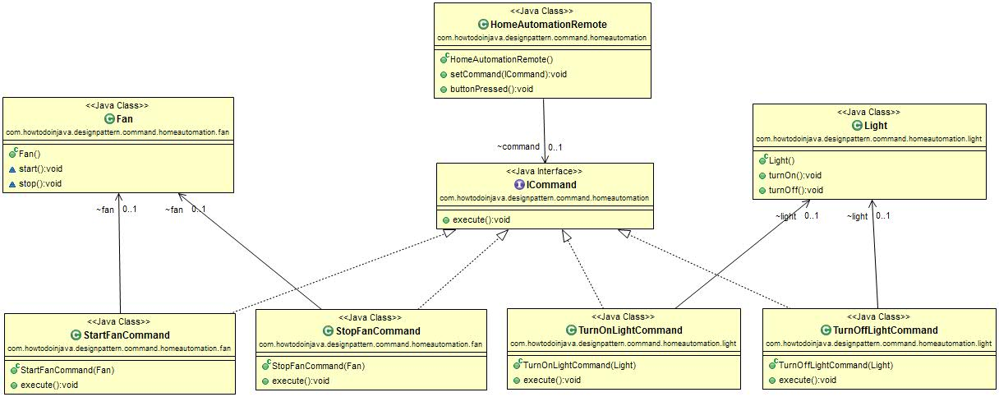

# 命令设计模式

> 原文： [https://howtodoinjava.com/design-patterns/behavioral/command-pattern/](https://howtodoinjava.com/design-patterns/behavioral/command-pattern/)

**命令模式**是一种行为[设计模式](//howtodoinjava.com/gang-of-four-java-design-patterns/)，可用于**将业务逻辑抽象为离散的动作**，我们将其称为*命令*。 此命令对象有助于松散耦合两个类之间的关系，其中一个类（调用者）应调用另一类（接收者）上的方法来执行业务操作。

让我们学习命令如何帮助将调用者与接收者解耦。

```java
Table of Contents
Introduction
Design Participants
Problem Statement
Command Pattern Implementation
Demo
When to Use Command Pattern
Popular Implementations
Summary

```

## 介绍

在面向对象的编程中，命令模式是一种行为设计模式，其中一个对象用于[封装](//howtodoinjava.com/object-oriented/encapsulation-in-java-and-its-relation-with-abstraction/)执行动作，业务操作或触发事件所需的所有信息。 方法名称，接收方对象引用和方法参数值（如果有）。 该对象称为*命令*。

类似的方法也适用于[责任链](//howtodoinjava.com/design-patterns/behavioral/chain-of-responsibility-design-pattern/)模式。 唯一的区别是命令中只有一个请求处理程序，而在责任链中单个请求对象可以有许多处理程序。

## 设计参加者

命令设计模式的参与者包括：

*   **命令界面** – 用于声明操作。
*   **具体命令类** – 扩展了`Command`接口，并具有用于在接收方上调用业务操作方法的执行方法。 它在内部具有命令接收者的参考。
*   **调用程序** – 被赋予执行操作的命令对象。
*   **接收器** – 执行操作。

在命令模式中，调用者与接收者执行的动作分离。 调用者不知道接收者。 调用程序调用一个命令，然后该命令执行接收方的相应操作。 因此，调用者可以在不知道要执行的动作的细节的情况下调用命令。 此外，这种脱钩意味着对接收者动作的更改不会直接影响动作的调用。

## 问题陈述

假设我们需要为家庭自动化系统构建一个遥控器，该遥控器应控制房屋的不同照明/电气单元。 遥控器中的单个按钮可能能够在类似设备上执行相同的操作，例如 电视开/关按钮可用于打开/关闭不同房间中的不同电视机。

在这里，此遥控器将是一个可编程的遥控器，它将用于打开和关闭各种灯/风扇等。

首先，让我们看看如何使用任何设计方法解决问题。 她的遥控器代码可能看起来像：

```java
If(buttonName.equals(“Light”))
{
	//Logic to turn on that light
}
else If(buttonName.equals(“Fan”))
{
	//Logic to turn on that Fan
}

```

但是上述解决方案显然存在许多明显的问题，例如：

*   任何新物品（例如 TubeLight）都需要更改遥控器的代码。 您将需要添加更多的 if-elses。
*   如果我们想为其他目的更改按钮，那么我们也需要更改代码。
*   最重要的是，如果家里有很多物品，代码的复杂性和可维护性将会增加。
*   最后，代码不干净且紧密耦合，我们未遵循将*编码为接口*等最佳实践。

## 命令模式实施

让我们用命令设计模式解决上述家庭自动化问题，并一次设计一个组件。

*   `ICommand`接口是**命令接口**
*   `Light`是**接收器**组件之一。 它可以接受与 Light 有关的多个命令，例如打开和关闭
*   `Fan`也是**接收器**组件的另一种类型。 它可以接受与风扇相关的多个命令，例如打开和关闭
*   `HomeAutomationRemote`是**调用程序**对象，它要求命令执行请求。 这里风扇开/关，灯开/关。
*   `StartFanCommand`，`StopFanCommand`，`TurnOffLightCommand`，`TurnOnLightCommand`等是**命令实现**的不同类型。

#### 类图

[](//howtodoinjava.com/wp-content/uploads/2017/06/CommandPatternClassDiagram.jpg)

Command Pattern Class Diagram


让我们看一下每个类和接口的 java 源代码。

`ICommand.java`

```java
package com.howtodoinjava.designpattern.command.homeautomation;

/**
 * Command Interface which will be implemented by the exact commands.
 *
 */
@FunctionalInterface
public interface ICommand {
	public void execute();
}

```

`Light.java`

```java
package com.howtodoinjava.designpattern.command.homeautomation.light;

/**
 * Light is a Receiver component in command pattern terminology.
 *
 */
public class Light {
	public  void turnOn() {
		System.out.println("Light is on");
	}

	public void turnOff() {
		System.out.println("Light is off");
	}
}

```

`Fan.java`

```java
package com.howtodoinjava.designpattern.command.homeautomation.fan;

/**
 * Fan class is a Receiver component in command pattern terminology.
 *
 */
public class Fan {
	void start() {
		System.out.println("Fan Started..");

	}

	 void stop() {
		System.out.println("Fan stopped..");

	}
}

```

`TurnOffLightCommand.java`

```java
package com.howtodoinjava.designpattern.command.homeautomation.light;

import com.howtodoinjava.designpattern.command.homeautomation.ICommand;
/**
 * Light Start Command where we are encapsulating both Object[light] and the
 * operation[turnOn] together as command. This is the essence of the command.
 *
 */
public class TurnOffLightCommand implements ICommand {

	Light light;

	public TurnOffLightCommand(Light light) {
		super();
		this.light = light;
	}

	public void execute() {
		System.out.println("Turning off light.");
		light.turnOff();
	}
}

```

`TurnOnLightCommand.java`

```java
package com.howtodoinjava.designpattern.command.homeautomation.light;

import com.howtodoinjava.designpattern.command.homeautomation.ICommand;

/**
 * Light stop Command where we are encapsulating both Object[light] and the
 * operation[turnOff] together as command. This is the essence of the command.
 *
 */
public class TurnOnLightCommand implements ICommand {

	Light light;

	public TurnOnLightCommand(Light light) {
		super();
		this.light = light;
	}

	public void execute() {
		System.out.println("Turning on light.");
		light.turnOn();
	}
}

```

`StartFanCommand.java`

```java
package com.howtodoinjava.designpattern.command.homeautomation.fan;

import com.howtodoinjava.designpattern.command.homeautomation.ICommand;

/**
 * Fan Start Command where we are encapsulating both Object[fan] and the
 * operation[start] together as command. This is the essence of the command.
 *
 */
public class StartFanCommand implements ICommand {

	Fan fan;

	public StartFanCommand(Fan fan) {
		super();
		this.fan = fan;
	}

	public void execute() {
		System.out.println("starting Fan.");
		fan.start();
	}
}

```

`StopFanCommand.java`

```java
package com.howtodoinjava.designpattern.command.homeautomation.fan;

import com.howtodoinjava.designpattern.command.homeautomation.ICommand;
/**
 * Fan stop Command where we are encapsulating both Object[fan] and the
 * operation[stop] together as command. This is the essence of the command.
 *
 */
public class StopFanCommand implements ICommand {

	Fan fan;

	public StopFanCommand(Fan fan) {
		super();
		this.fan = fan;
	}

	public void execute() {
		System.out.println("stopping Fan.");
		fan.stop();
	}
}

```

`HomeAutomationRemote.java`

```java
package com.howtodoinjava.designpattern.command.homeautomation;

/**
 * Remote Control for Home automation where it will accept the command and
 * execute. This is the invoker in terms of command pattern terminology
 */
public class HomeAutomationRemote {

	//Command Holder
	ICommand command;

	//Set the command in runtime to trigger.
	public void setCommand(ICommand command) {
		this.command = command;
	}

	//Will call the command interface method so that particular command can be invoked.
	public void buttonPressed() {
		command.execute();
	}
}

```

## 演示版

让我们编写代码并执行客户端代码，以查看命令的执行方式。

```java
package com.howtodoinjava.designpattern.command.homeautomation;

import com.howtodoinjava.designpattern.command.homeautomation.fan.Fan;
import com.howtodoinjava.designpattern.command.homeautomation.fan.StartFanCommand;
import com.howtodoinjava.designpattern.command.homeautomation.fan.StopFanCommand;
import com.howtodoinjava.designpattern.command.homeautomation.light.Light;
import com.howtodoinjava.designpattern.command.homeautomation.light.TurnOnLightCommand;

/**
 * Demo class for HomeAutomation
 *
 */
public class Demo 	//client
{
	public static void main(String[] args) 
	{
		Light livingRoomLight = new Light();	//receiver 1

		Fan livingRoomFan = new Fan();	//receiver 2

		Light bedRoomLight = new Light();	//receiver 3

		Fan bedRoomFan = new Fan();		//receiver 4

		HomeAutomationRemote remote = new HomeAutomationRemote();	//Invoker

		remote.setCommand(new TurnOnLightCommand( livingRoomLight ));
		remote.buttonPressed();

		remote.setCommand(new TurnOnLightCommand( bedRoomLight ));
		remote.buttonPressed();

		remote.setCommand(new StartFanCommand( livingRoomFan ));
		remote.buttonPressed();

		remote.setCommand(new StopFanCommand( livingRoomFan ));
		remote.buttonPressed();

		remote.setCommand(new StartFanCommand( bedRoomFan ));
		remote.buttonPressed();

		remote.setCommand(new StopFanCommand( bedRoomFan ));
		remote.buttonPressed();
	}
}

```

输出：

```java
Turning on light.
Light is on

Turning on light.
Light is on

starting Fan.
Fan Started..

stopping Fan.
Fan stopped..

starting Fan.
Fan Started..

stopping Fan.
Fan stopped..

```

## 何时使用命令模式

您可以使用命令模式来解决许多设计问题，例如

*   处理 Java 菜单项和按钮的动作。
*   提供对宏的支持（宏的记录和播放）。
*   提供“撤消”支持。
*   进度条实现。
*   创建多步骤向导。

## 流行的命令模式实现

这些是命令模式实现的一些实际示例：

*   可运行接口（java.lang.Runnable）
*   Swing Action（javax.swing.Action）使用命令模式
*   Action Servlet 调用 Struts Action 类在内部使用命令模式。

## 摘要

1.  命令模式是一种行为设计模式。
2.  在命令模式中，对象用于封装在任何时间执行操作或触发事件所需的所有信息，从而使开发人员能够分散业务逻辑。 它称为命令。
3.  客户端与调用程序对话并传递命令对象。
4.  每个命令对象都有对其接收者的引用。
5.  Command 的 execute（）方法调用接收器中定义的实际业务操作。
6.  接收者执行业务操作。

这是此模式的一些利弊。 它可以帮助您就使用命令模式做出正确的决定。

#### 优点

*   使我们的代码具有可伸缩性，因为我们可以添加新命令而无需更改现有代码。
*   使用命令对象增加调用者和接收者之间的松散耦合。

#### 缺点

*   在不同的视图中，增加每个单独命令的类数。 在某些特定情况下，它可能不是首选。

这就是*命令设计模式*的全部。 将我的问题放在评论部分。

[Download Source Code](//howtodoinjava.com/wp-content/downloads/Command-Design-Pattern.zip)

学习愉快！