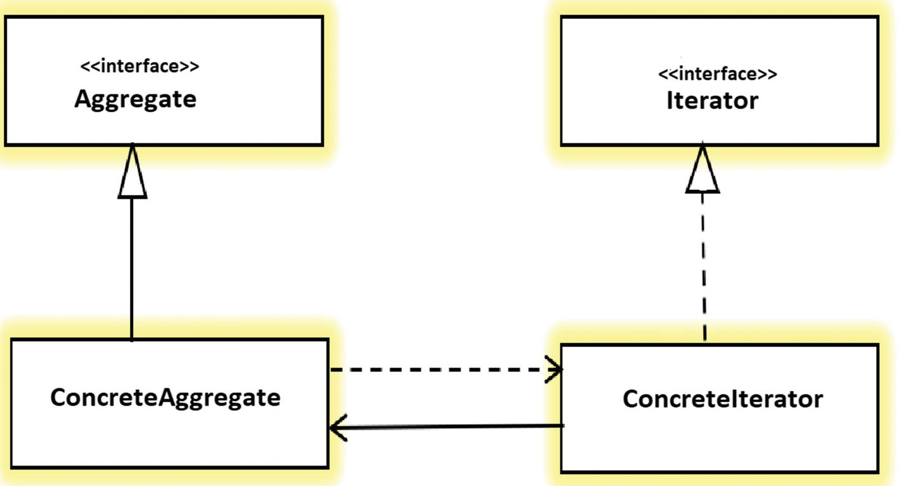

# 迭代器设计模式

> 原文： [https://howtodoinjava.com/design-patterns/behavioral/iterator-design-pattern/](https://howtodoinjava.com/design-patterns/behavioral/iterator-design-pattern/)

根据 GoF 定义，**迭代器模式**提供了一种顺序访问聚合对象元素的方法，而无需暴露其基础表示。 这是行为[设计模式](https://howtodoinjava.com/gang-of-four-java-design-patterns/)。

顾名思义，迭代器有助于**以定义的方式**遍历对象的集合，这对客户端应用很有用。 在迭代期间，客户端程序可以根据需要对元素执行各种其他操作。

## 1.何时使用迭代器设计模式

每种编程语言都支持一些数据结构，例如列表或映射，用于存储一组相关对象。 在 Java 中，我们具有`List`，`Map`和`Set`接口及其实现，例如[`ArrayList`](https://howtodoinjava.com/java-arraylist/)和`HashMap`。

集合仅在提供一种在不暴露其内部结构的情况下访问其元素的方式时才有用。 迭代器承担此责任。

因此，任何时候，我们都有对象集合，并且客户端需要一种以某种适当顺序迭代每个集合元素的方法，我们必须使用迭代器模式来设计解决方案。

迭代器模式使我们能够以以下方式设计集合迭代器：

*   我们能够访问集合的元素而无需暴露元素的内部结构或集合本身。
*   迭代器支持从开始到结束以向前，向后或双向双向遍历一个集合。
*   迭代器提供了一个统一的接口，用于透明地遍历不同的集合类型。

> 关键思想是从聚合对象中承担访问和遍历的责任，并将其放入定义标准遍历协议的`Iterator`对象中。

## 2.迭代器模式的真实示例

*   在 Java 中，我们具有`java.util.Iterator`接口及其特定的实现，例如[`ListIterator`](https://howtodoinjava.com/java/collections/java-listiterator/)。 所有 Java 集合都提供`Iterator`接口的一些内部实现，这些接口用于遍历集合元素。

    ```java
    	List<String> names = Arrays.asList("alex", "brian", "charles");

    	Iterator<String> namesIterator = names.iterator();

    	while (namesIterator.hasNext()) 
    	{
    		String currentName = namesIterator.next();

    		System.out.println(currentName);
    }

    ```

*   在媒体播放器中，我们列出了歌曲列表，我们可以通过遍历歌曲列表并选择所需的歌曲来播放歌曲。 这也是一个迭代器示例。

## 3.迭代器设计模式

#### 3.1 架构



迭代器模式类图


#### 3.2 设计参与者

迭代器模式的参与者如下：

*   **`Iterator`**：访问或遍历元素集合的接口。 提供具体的迭代器必须实现的方法。
*   **`ConcreteIterator`**：实现`Iterator`接口方法。 它还可以在遍历聚合集合时跟踪当前位置。
*   **`Aggregate`**：通常是一个集合接口，它定义可以创建`Iterator`对象的方法。
*   **`ConcreteAggregate`**：它实现`Aggregate`接口，其特定方法返回`ConcreteIterator`的实例。

## 4.迭代器设计模式示例

在此迭代器模式示例中，我们正在创建一个集合，该集合可以保存`Token`类的实例，并将提供一个迭代器来迭代序列中的标记集合。

```java
public class Topic 
{
	private String name;

	public Topic(String name) {
		super();
		this.name = name;
	}

	public String getName() {
		return name;
	}

	public void setName(String name) {
		this.name = name;
	}
}

```

```java
public interface Iterator<E> 
{
	void reset();	// reset to the first element

	E next();	// To get the next element

	E currentItem();	// To retrieve the current element

	boolean hasNext();	// To check whether there is any next element or not.
}

```

```java
public class TopicIterator implements Iterator<Topic> {

	private Topic[] topics;
    private int position;

    public TopicIterator(Topic[] topics)
    {
        this.topics = topics;
        position = 0;
    }

	@Override
	public void reset() {
		position = 0;
	}

	@Override
	public Topic next() { 
		return topics[position++];
	}

	@Override
	public Topic currentItem() {
		return topics[position];
	}

	@Override
	public boolean hasNext() {
		if(position >= topics.length)
            return false;
        return true;
	}
}

```

```java
public interface List<E>
{
	Iterator<E> iterator();
}

```

```java
public class TopicList implements List<Topic>
{
	private Topic[] topics;

    public TopicList(Topic[] topics)
    {
        this.topics = topics;
    }

	@Override
	public Iterator<Topic> iterator() {
		return new TopicIterator(topics);
	}
}

```

使用迭代器的客户端代码将像这样。

```java
public class Main 
{
	public static void main(String[] args) 
	{
		Topic[] topics = new Topic[5];
		topics[0] = new Topic("topic1");
		topics[1] = new Topic("topic2");
		topics[2] = new Topic("topic3");
		topics[3] = new Topic("topic4");
		topics[4] = new Topic("topic5");

		List<Topic> list = new TopicList(topics);

		Iterator<Topic> iterator = list.iterator();

		while(iterator.hasNext()) {
			Topic currentTopic = iterator.next();
			System.out.println(currentTopic.getName());
		}
	}
}

```

程序输出。

```java
topic1
topic2
topic3
topic4
topic5

```

在评论中向我发送有关**迭代器模式**的问题。

学习愉快！

参考：[维基百科](https://en.wikipedia.org/wiki/Iterator_pattern)