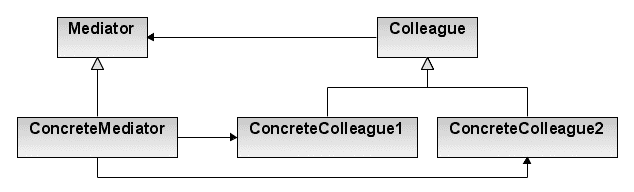

# 中介者设计模式

> 原文： [https://howtodoinjava.com/design-patterns/behavioral/mediator-pattern/](https://howtodoinjava.com/design-patterns/behavioral/mediator-pattern/)

根据 GoF 定义，**中介者模式**定义了一个对象，[封装了](https://howtodoinjava.com/oops/encapsulation-in-java-and-its-relation-with-abstraction/)一组对象如何交互。 中介者通过防止对象之间显式地相互引用来促进松散耦合，并且它使我们可以独立地更改其交互。

中介者是**行为型设计模式**，也是 GoF 讨论的[其他 23 个模式](https://howtodoinjava.com/gang-of-four-java-design-patterns/)之一。

## 1.何时使用中介者设计模式

中介者有助于在对象之间建立**松耦合通信**，并有助于减少彼此之间的直接引用。 这有助于最大程度地减少依赖管理和参与对象之间的通信的复杂性。

中介者以**对象不知道其他对象**存在的方式帮助促进对象之间的交互。 对象仅依赖于单个中介者类，而不耦合到许多其他对象。

在设计问题的解决方案期间，如果遇到多个对象需要相互交互以处理请求，但直接通信可能会创建复杂系统的情况，则可以考虑使用中介者模式。

该模式使您可以将类之间的所有关系提取到单独的类中，从而将对特定组件的任何更改与其余组件隔离。

## 2.中介者模式的真实示例

*   现实世界中很好的中介者模式示例是机场的“交通管制室”。 如果所有航班都必须进行交互以查找下一个要降落的航班，则会造成很大的混乱。

    相反，航班只会将其状态发送给塔楼。 这些塔依次发送信号，以确认哪架飞机可以起飞或着陆。 我们必须注意，这些塔无法控制整个飞行。 它们仅在终端区域实现约束。

*   中介者模式的另一个很好的例子是**聊天应用**。 在聊天应用中，我们可以有多个参与者。 将每个参与者连接到所有其他参与者不是一个好主意，因为连接数量确实很高。 最好的解决方案是建立一个所有参与者都可以连接的集线器。 该中心只是中介者类。
*   在 Java 编程中，[`java.util.concurrent.Executor`](https://howtodoinjava.com/java/multi-threading/executor-framework-tutorial/)接口内部的`execute()`方法遵循此模式。 `java.util.Timer`类的各种`schedule()`方法的不同重载版本也可以视为遵循此模式。

## 3.中介者设计模式

此模式定义了一个单独的（中介）对象，该对象封装了一组对象之间的交互，并且这些对象将其交互委托给中介对象，而不是直接彼此交互。

#### 3.1 架构



中介者设计模式


图片来源 – [Wikipedia](https://en.wikipedia.org/wiki/Mediator_pattern)

#### 3.2 设计参与者

*   **`Mediator`** – 定义`Colleague`对象之间的通信接口
*   **`ConcreteMediator`** – 实现`Mediator`接口并协调`Colleague`对象之间的通信。 **它了解所有同事及其在互通方面的目的**。
*   **`Colleague`** – 定义了通过`Mediator`与其他同事进行交流的接口
*   **`ConcreteColleague`** – 实现`Colleague`接口并通过其`Mediator`与其他同事进行通信

## 4.中介者设计模式示例

在此 **Java 中介者模式示例**中，我们模拟了聊天应用，用户可以在其中以一对一的方式向其他用户发送消息。 必须向所有聊天应用注册所有用户才能发送或接收消息。

**中介者接口**

```java
public interface IChatRoom 
{
    public void sendMessage(String msg, String userId);

    void addUser(User user);
}

```

**具体中介者**

```java
import java.util.HashMap;
import java.util.Map;

public class ChatRoom implements IChatRoom {

    private Map<String, User> usersMap = new HashMap<>();

    @Override
    public void sendMessage(String msg, String userId) 
    {
        User u = usersMap.get(userId);
        u.receive(msg);
    }

    @Override
    public void addUser(User user) {
        this.usersMap.put(user.getId(), user);
    }
}

```

**同事类**

```java
public abstract class User
{
    private IChatRoom mediator;

    private String id;
    private String name;

    public User(IChatRoom room, String id, String name){
        this.mediator = room;
        this.name = name;
        this.id = id;
    }

    public abstract void send(String msg, String userId);
    public abstract void receive(String msg);

    public IChatRoom getMediator() {
        return mediator;
    }

    public String getId() {
        return id;
    }

    public String getName() {
        return name;
    }
}

```

**具体同事**

```java
public class ChatUser extends User {

    public ChatUser(IChatRoom room, String id, String name) {
        super(room, id, name);
    }

    @Override
    public void send(String msg, String userId) {
        System.out.println(this.getName() + " :: Sending Message : " + msg);
        getMediator().sendMessage(msg, userId);
    }

    @Override
    public void receive(String msg) {
        System.out.println(this.getName() + " :: Received Message : " + msg);
    }

}

```

测试中介者模式。

```java
public class Main 
{
    public static void main(String[] args) 
    {
        IChatRoom chatroom = new ChatRoom();

        User user1 = new ChatUser(chatroom,"1", "Alex");
        User user2 = new ChatUser(chatroom,"2", "Brian");
        User user3 = new ChatUser(chatroom,"3", "Charles");
        User user4 = new ChatUser(chatroom,"4", "David");

        chatroom.addUser(user1);
        chatroom.addUser(user2);
        chatroom.addUser(user3);
        chatroom.addUser(user4);

        user1.send("Hello brian", "2");
        user2.send("Hey buddy", "1");
    }
}

```

程序输出。

```java
Alex :: Sending Message : Hello brian
Brian :: Received Message : Hello brian

Brian :: Sending Message : Hey buddy
Alex :: Received Message : Hey buddy

```

## 5.常见问题

*   **中介者模式的优势**

    使用中介者模式，我们可以减少系统中对象之间的通信复杂性。 它促进了松耦合，并减少了系统中子类的数量。

    中介者帮助将“多对多”关系替换为“一对多”关系，因此更易于阅读和理解。 而且由于通信的集中控制，维护变得容易。

*   **中介者模式的缺陷**

    如果您在中介对象中添加太多逻辑，其架构可能会变得复杂。 不适当使用中介者模式可能会导致“[上帝类](https://en.wikipedia.org/wiki/God_object)”反模式。

*   **中介者模式 VS 外观模式**

    中介者模式可以看作是复用的[外观模式](https://howtodoinjava.com/design-patterns/structural/facade-design-pattern/)。 在中介者中，不是在单个对象的接口上工作，而是在多个对象之间创建多路复用的接口以提供平滑的过渡。

学习愉快！