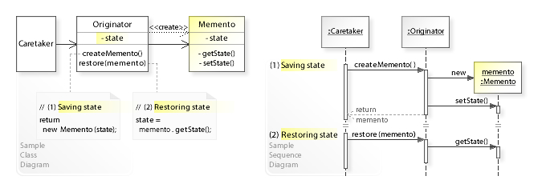

# 备忘录设计模式

> 原文： [https://howtodoinjava.com/design-patterns/behavioral/memento-design-pattern/](https://howtodoinjava.com/design-patterns/behavioral/memento-design-pattern/)

Memento 设计模式是行为型模式，是 Gang of Four 讨论的 23 种[设计模式](https://howtodoinjava.com/gang-of-four-java-design-patterns/)之一。 **纪念图案**用于将对象的状态恢复到先前的状态。 也称为**快照模式**。

备忘录就像对象生命周期中的还原点，客户端应用可使用该还原点将对象状态还原为其状态。 从概念上讲，这很像我们为操作系统创建还原点，并在发生故障或系统崩溃时用于还原系统。

> 记忆模式的目的是在不破坏封装的情况下捕获对象的内部状态，从而提供一种在需要时将对象恢复为初始状态的手段。

## 1.何时使用备忘录设计模式

在对象状态不断变化的任何应用中都应使用 Memento 模式，并且该应用的用户可以在任何时候决定**回滚或撤消**所做的更改。

备忘录也可用于必须从其上一个已知工作状态或**草稿**重新启动的应用中。 这样的一个示例可以是 IDE，它可以在关闭 IDE 之前由用户更改后重新启动。

## 2.备忘录模式的真实示例

*   在 GUI 编辑器（例如 MS Paint）中，我们可以继续对图形进行更改，并且可以使用`CTRL + Z`之类的简单命令来回滚更改。
*   在代码编辑器中，我们可以使用简单的命令将**撤消和重做**还原或应用任何代码更改。
*   在计算器应用中，我们只需按一下按钮就可以重新访问内存中的所有计算。
*   在编程中，可以使用 memento 在数据库事务期间创建检查点。 如果任何操作失败，我们只需将所有内容回滚到最后一个已知的稳定数据库状态。
*   `javax.swing.text.JTextComponent`类提供了撤消支持机制。 `javax.swing.undo.UndoManager`可以充当看守，`javax.swing.undo.UndoableEdit`的实现可以像备忘录，而`javax.swing.text.Document`的实现可以像发起者。

## 3.备忘录设计模式

#### 3.1 建筑



备忘录设计模式


图片提供 -[维基百科](https://en.wikipedia.org/wiki/File:W3sDesign_Memento_Design_Pattern_UML.jpg)

#### 3.2 设计参加者

备忘录模式有三个参与者。

1.  **发起者** – 是知道如何创建和保存其状态以备将来使用的对象。 它提供了方法`createMemento()`和`restore(memento)`。
2.  **看守者** – 在发起者上执行操作，同时可能回滚。 它跟踪多种备忘录。 看守者类是指发起者类，用于保存（HTG0）和恢复（HTG1）发起者的内部状态。
3.  **Memento** – 由发起者编写和读取，并由看守者管理的锁盒。 原则上，备忘录必须在[不可变的](https://howtodoinjava.com/java/basics/how-to-make-a-java-class-immutable/)对象中，这样一旦创建便没有人可以更改其状态。

## 4\. Memento 设计模式示例

在此示例中，我们为`Article`对象创建备忘录，该对象具有三个基本属性 – id，title 和 content。 `ArticleMemento`类用作`Article`对象的备忘录。

```java
public class Article 
{
	private long id;
	private String title;
	private String content;

	public Article(long id, String title) {
		super();
		this.id = id;
		this.title = title;
	}

	//Setters and getters

	public ArticleMemento createMemento() 
	{
		ArticleMemento m = new ArticleMemento(id, title, content);
		return m;
	}

	public void restore(ArticleMemento m) {
		this.id = m.getId();
		this.title = m.getTitle();
		this.content = m.getContent();
	}

	@Override
	public String toString() {
		return "Article [id=" + id + ", title=" + title + ", content=" + content + "]";
	}
}

```

```java
public final class ArticleMemento 
{
	private final long id;
	private final String title;
	private final String content;

	public ArticleMemento(long id, String title, String content) {
		super();
		this.id = id;
		this.title = title;
		this.content = content;
	}

	public long getId() {
		return id;
	}

	public String getTitle() {
		return title;
	}

	public String getContent() {
		return content;
	}
}

```

Main 类充当 Caretaker，它创建并恢复 memento 对象。

```java
public class Main 
{
	public static void main(String[] args) 
	{
		Article article = new Article(1, "My Article");
		article.setContent("ABC");		//original content
		System.out.println(article);

		ArticleMemento memento = article.createMemento();	//created immutable memento

		article.setContent("123");		//changed content
		System.out.println(article);

		article.restore(memento);		//UNDO change
		System.out.println(article);	//original content
	}
}

```

程序输出。

```java
Article [id=1, title=My Article, content=ABC]
Article [id=1, title=My Article, content=123]
Article [id=1, title=My Article, content=ABC]

```

## 5.常见问题

#### 5.1 备忘录是内部阶级吗？

可以用许多不同的方式来实现 memento 设计模式，例如内部类，程序包专用可见性或[序列化](https://howtodoinjava.com/java/serialization/a-mini-guide-for-implementing-serializable-interface-in-java/)等。实现 memento 模式没有固定的准则。

#### 5.2 备忘录模式的好处

*   最大的优点是，您始终可以丢弃不需要的更改，并将其还原到预期或稳定的状态。
*   您不会破坏与参与此模型的关键对象关联的[封装](https://howtodoinjava.com/oops/encapsulation-in-java-and-its-relation-with-abstraction/)。
*   保持高凝聚力。
*   提供一种简单的恢复技术。

#### 5.3 备忘录模式的挑战

*   大量备忘录需要更多存储空间。 同时，他们给看守人增加了负担。
*   同时还增加了维护成本，因为还需要付出代码努力来管理 memento 类。
*   保存状态的额外时间降低了系统的整体性能。

在评论中向我发送有关**记忆模式**的问题。

学习愉快！