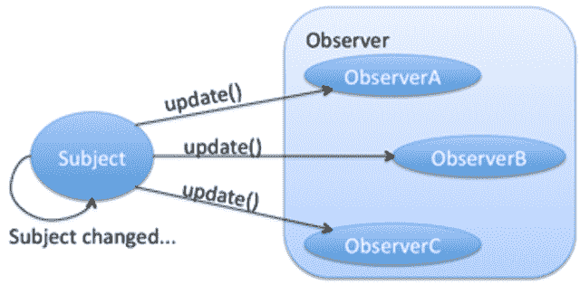
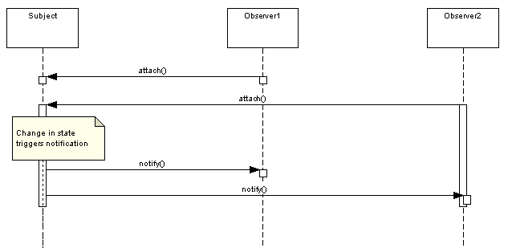
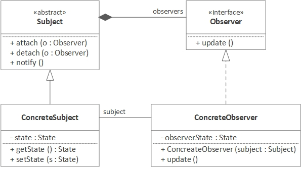

# 观察者设计模式

> 原文： [https://howtodoinjava.com/design-patterns/behavioral/observer-design-pattern/](https://howtodoinjava.com/design-patterns/behavioral/observer-design-pattern/)

根据 GoF 定义，**观察者模式**定义了对象之间的一对多依赖关系，因此当一个对象更改状态时，将自动通知并更新其所有依赖关系。 它也称为**发布 - 订阅模式**。

在观察者模式中，有许多观察者（订阅者对象）正在观察特定的主题（发布者对象）。 观察者将自己注册到某个主题时，可以在该主题内部进行更改时得到通知。

观察者对象可以在任何时间点从主体注册或注销。 它有助于使对象**与对象**松散耦合。

## 1.何时使用观察者设计模式

如上所述，当您设计一个系统时，多个实体对某个特定的第二个实体对象的任何可能更新感兴趣，我们可以使用观察者模式。



观察者模式


该流程非常简单易懂。 应用创建具体的主题对象。 所有具体的观察者都会进行注册，以便随时了解主题状态的任何更新。

一旦主题状态改变，主题就会通知所有注册的观察者，并且观察者可以访问更新后的状态并采取相应的行动。



观察者模式时序图


## 2.观察者模式的真实示例

*   观察者模式的真实示例可以是任何社交媒体平台，例如 Facebook 或 Twitter。 当某人更新其状态时，所有关注者都会收到通知。

    关注者可以在任何时间跟随或取消关注另一个人。 一旦取消关注，该人将来就不会收到该主题的通知。

*   在编程中，观察者模式是面向消息的应用的基础。 应用更新后，其状态会通知订阅者有关更新的信息。 像 [HornetQ](https://howtodoinjava.com/hornetq/basic-jms-messaging-example-using-hornetq-stand-alone-server/) ， [JMS](https://howtodoinjava.com/jms/jms-java-message-service-tutorial/) 之类的框架都在此模式下工作。
*   同样，基于 Java UI 的编程，所有键盘和鼠标事件均由其监听器对象和指定的函数处理。 当用户单击鼠标时，预订鼠标单击事件的函数将作为方法参数传递给它的所有上下文数据被调用。

## 3.观察者设计模式

#### 3.1 架构



观察者模式架构


#### 3.2 设计参与者

观察者模式有四个参与者。

*   **`Subject`** – [接口或抽象类](https://howtodoinjava.com/oops/exploring-interfaces-and-abstract-classes-in-java/)定义了将观察者附加到主题或从主题上拆下的操作。
*   **`ConcreteSubject`** - 具体的`Subject`类。 它维护对象的状态，并在状态发生变化时通知附加的观察者。
*   **`Observer`** – 定义用于通知此对象的操作的接口或抽象类。
*   **`ConcreteObserver`** – 具体的`Observer`实现。

## 4.观察者设计模式示例

在下面的示例中，我将创建类型为`Subject`的消息发布者和类型为`Observer`的三个订阅者。 发布者将定期将消息发布给所有订阅或附加的观察者，他们会将更新后的消息打印到控制台。

**主题和具体主题**

```java
public interface Subject 
{
    public void attach(Observer o);
    public void detach(Observer o);
    public void notifyUpdate(Message m);
}

```

```java
import java.util.ArrayList;
import java.util.List;

public class MessagePublisher implements Subject {

    private List<Observer> observers = new ArrayList<>();

    @Override
    public void attach(Observer o) {
        observers.add(o);
    }

    @Override
    public void detach(Observer o) {
        observers.remove(o);
    }

    @Override
    public void notifyUpdate(Message m) {
        for(Observer o: observers) {
            o.update(m);
        }
    }
}

```

**观察者和具体观察者**

```java
public interface Observer 
{
    public void update(Message m);
}

```

```java
public class MessageSubscriberOne implements Observer 
{
    @Override
    public void update(Message m) {
        System.out.println("MessageSubscriberOne :: " + m.getMessageContent());
    }
}

```

```java
public class MessageSubscriberTwo implements Observer 
{
    @Override
    public void update(Message m) {
        System.out.println("MessageSubscriberTwo :: " + m.getMessageContent());
    }
}

```

```java
public class MessageSubscriberThree implements Observer 
{
    @Override
    public void update(Message m) {
        System.out.println("MessageSubscriberThree :: " + m.getMessageContent());
    }
}

```

**状态对象**

该对象必须是[不变的](https://howtodoinjava.com/java/basics/how-to-make-a-java-class-immutable/)对象，这样任何类都不能错误地修改其内容。

```java
public class Message 
{
    final String messageContent;

    public Message (String m) {
        this.messageContent = m;
    }

    public String getMessageContent() {
        return messageContent;
    }
}

```

现在测试发布者和订阅者之间的通信。

```java
public class Main 
{
    public static void main(String[] args) 
    {
        MessageSubscriberOne s1 = new MessageSubscriberOne();
        MessageSubscriberTwo s2 = new MessageSubscriberTwo();
        MessageSubscriberThree s3 = new MessageSubscriberThree();

        MessagePublisher p = new MessagePublisher();

        p.attach(s1);
        p.attach(s2);

        p.notifyUpdate(new Message("First Message"));   //s1 and s2 will receive the update

        p.detach(s1);
        p.attach(s3);

        p.notifyUpdate(new Message("Second Message")); //s2 and s3 will receive the update
    }
}

```

程序输出。

```java
MessageSubscriberOne :: First Message
MessageSubscriberTwo :: First Message

MessageSubscriberTwo :: Second Message
MessageSubscriberThree :: Second Message

```

## 5.常见问题

*   **不同类型的观察者可以注册一个主题吗？**

    观察者的性质和功能可以有所不同，但它们都必须实现一个通用的`Observer`接口，主题支持该接口注册和注销。

*   **我可以在运行时添加或删除观察者吗？**

    是。 我们可以在任何时间添加或删除观察者。

*   **观察者模式和责任链模式之间的区别？**

    在观察者模式中，所有已注册的处理器对象都同时获得通知，并且它们同时处理更新。

    但是在责任链模式中，链中的处理器对象是一个接一个地通知的，此过程一直持续到一个对象完全处理了通知为止。

*   **观察者模式的好处？**

    主题和观察者构成一个松散耦合的系统。 他们不需要明确地彼此了解。 我们可以随时独立添加或删除观察者。

相关的 Java 类：

[`Observer` Java Doc](https://docs.oracle.com/javase/10/docs/api/java/util/Observer.html)

[`Observable` Java Doc](https://docs.oracle.com/javase/10/docs/api/java/util/Observable.html)