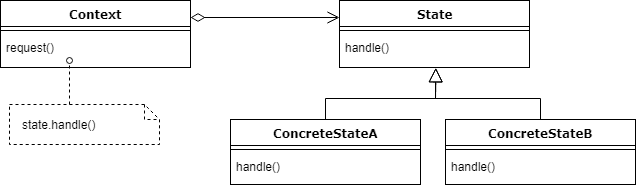

# 状态设计模式

> 原文： [https://howtodoinjava.com/design-patterns/behavioral/state-design-pattern/](https://howtodoinjava.com/design-patterns/behavioral/state-design-pattern/)

**状态模式**是**行为型**设计模式。 根据 GoF 定义，状态**允许对象在其内部状态更改时更改其行为**。 该对象似乎将更改其类。

从上面的定义可以得出，对象的每个可能状态应有一个**单独的具体类**。 每个具体的状态对象都有逻辑，可以根据其当前状态和作为方法参数传递给它的上下文信息来接受或拒绝状态转换请求。

## 1.何时使用状态模式

在任何应用中，当我们处理对象时，该对象在其生命周期期间可能处于不同的状态，以及如何根据其当前状态处理传入的请求（或进行状态转换）– 我们可以使用状态模式。

如果在这种情况下不使用状态模式，则最终将有很多[`if-else`](https://howtodoinjava.com/java/basics/if-else-statement-in-java/)语句，这些语句会使代码库变得丑陋，不必要地复杂且难以维护。 状态模式允许对象根据当前状态表现不同，并且我们可以在不同类中定义特定于状态的行为。

> 状态模式解决了对象在其内部状态更改时应更改其行为的问题。 同样，添加新状态不应影响现有状态的行为。

## 2.状态模式的真实例子

*   为简单起见，让我们想象一下通过遥控器操作的“电视盒”。 我们可以通过按遥控器上的按钮来更改电视的状态。 但是电视的状态是否会改变，取决于电视的当前状态。 如果电视已打开，我们可以将其关闭，静音或更改显示方式和来源。 但是，如果电视关闭，当我们按遥控器按钮时将什么也不会发生。

    对于关闭的电视。 只有可能的下一个状态才能打开。

*   状态模式用于在复杂的应用中实现状态机的实现。
*   另一个示例可以是 [**Java 线程**状态](https://howtodoinjava.com/java/multi-threading/java-thread-life-cycle-and-thread-states/)。 线程可以是其生命周期中的五个状态之一。 只有在获得当前状态后才能确定其下一个状态。 例如，我们无法启动已停止的线程，也无法让线程等待，直到线程开始运行。

## 3.状态设计模式的实现

定义单独的（状态）对象，这些对象封装每个状态的特定于状态的行为。 即，定义用于执行特定于状态的行为的接口（状态），并定义实现每个状态的接口的类。

状态模式未指定状态转换的定义位置。 选择有两个：“上下文”对象，或每个单独的状态派生类。

#### 3.1 架构



状态设计模式


#### 3.2 设计参与者

*   **`State`** – 接口定义每个状态必须处理的操作。
*   **`ConcreteState`** – 包含状态特定行为的类。
*   **`Context`** – 定义与客户端进行交互的接口。 它维护对具体状态对象的引用，这些引用可用于定义对象的当前状态。 它将特定于状态的行为委派给不同的`State`对象。

## 4.状态模式示例

在此示例中，我们模拟了快递递送系统，其中包裹在转换过程中可能处于不同状态。

```java
public interface PackageState 
{
    public void updateState(DeliveryContext ctx);
}

```

```java
public class Acknowledged implements PackageState 
{
    //Singleton
    private static Acknowledged instance = new Acknowledged();

    private Acknowledged() {}

    public static Acknowledged instance() {
        return instance;
    }

    //Business logic and state transition
    @Override
    public void updateState(DeliveryContext ctx) 
    {
        System.out.println("Package is acknowledged !!");
        ctx.setCurrentState(Shipped.instance());
    }
}

```

```java
public class Shipped implements PackageState 
{
    //Singleton
    private static Shipped instance = new Shipped();

    private Shipped() {}

    public static Shipped instance() {
        return instance;
    }

    //Business logic and state transition
    @Override
    public void updateState(DeliveryContext ctx) 
    {
        System.out.println("Package is shipped !!");
        ctx.setCurrentState(InTransition.instance());
    }
}

```

```java
public class InTransition implements PackageState 
{
    //Singleton
    private static InTransition instance = new InTransition();

    private InTransition() {}

    public static InTransition instance() {
        return instance;
    }

    //Business logic and state transition
    @Override
    public void updateState(DeliveryContext ctx) 
    {
        System.out.println("Package is in transition !!");
        ctx.setCurrentState(OutForDelivery.instance());
    }
}

```

```java
public class OutForDelivery implements PackageState 
{
    //Singleton
    private static OutForDelivery instance = new OutForDelivery();

    private OutForDelivery() {}

    public static OutForDelivery instance() {
        return instance;
    }

    //Business logic and state transition
    @Override
    public void updateState(DeliveryContext ctx) 
    {
        System.out.println("Package is out of delivery !!");
        ctx.setCurrentState(Delivered.instance());
    }
}

```

```java
public class Delivered implements PackageState 
{
    //Singleton
    private static Deliveredinstance = new Delivered();

    private Delivered() {}

    public static Deliveredinstance() {
        return instance;
    }

    //Business logic
    @Override
    public void updateState(DeliveryContext ctx) 
    {
        System.out.println("Package is delivered!!");
    }
}

```

**上下文**

```java
public class DeliveryContext {

    private PackageState currentState;
    private String packageId;

    public DeliveryContext(PackageState currentState, String packageId) 
    {
        super();
        this.currentState = currentState;
        this.packageId = packageId;

        if(currentState == null) {
            this.currentState = Acknowledged.instance();
        }
    }

    public PackageState getCurrentState() {
        return currentState;
    }

    public void setCurrentState(PackageState currentState) {
        this.currentState = currentState;
    }

    public String getPackageId() {
        return packageId;
    }

    public void setPackageId(String packageId) {
        this.packageId = packageId;
    }

    public void update() {
        currentState.updateState(this);
    }
}

```

现在测试代码。

```java
public class Main 
{
    public static void main(String[] args) 
    {
        DeliveryContext ctx = new DeliveryContext(null, "Test123");

        ctx.update();
        ctx.update();
        ctx.update();
        ctx.update();
        ctx.update();
    }
}

```

程序输出。

```java
Package is acknowledged !!
Package is shipped !!
Package is in transition !!
Package is out of delivery !!
Package is delivered !!

```

## 5.常见问题

#### 5.1 状态模式与策略模式

两种模式的结构相似，但目的不同。 [策略模式](https://howtodoinjava.com/design-patterns/behavioral/strategy-design-pattern/)为子类提供了更好的选择，而在状态模式下 – 行为封装在单独的类中。

然而，两者都促进了继承的组合和委托。

#### 5.2 状态对象应该是单例吗？

是。 始终尝试使状态对象[单例](https://howtodoinjava.com/design-patterns/creational/singleton-design-pattern-in-java/)。

#### 5.3 状态设计模式的优势？

我们可以轻松地在应用中添加新状态和新行为，而不会影响其他组件。

它还通过减少对`if-else`语句或[`switch/case`](https://howtodoinjava.com/java/basics/switch-statement-in-java/)条件逻辑的使用来帮助降低复杂度。

#### 5.4 状态设计模式的缺点？

状态模式也称为状态的**对象**。 因此，我们可以假设更多的状态需要更多的代码，并且明显的副作用对我们来说很难维护。

学习愉快！

阅读更多：

[维基百科](https://en.wikipedia.org/wiki/State_pattern)