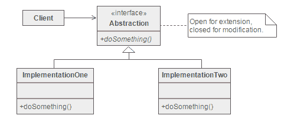
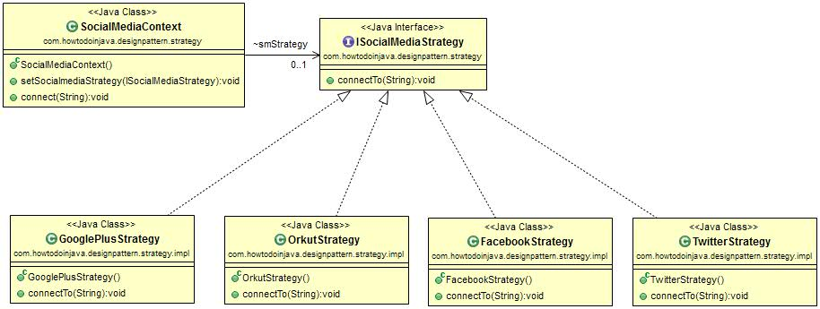

# 策略设计模式

> 原文： [https://howtodoinjava.com/design-patterns/behavioral/strategy-design-pattern/](https://howtodoinjava.com/design-patterns/behavioral/strategy-design-pattern/)

**策略设计模式**是行为设计​​模式，在该行为设计模式中，我们选择[算法](//howtodoinjava.com/java-algorithms-implementations/)或任务在运行时的特定实现 - 从同一任务的多个其他实现中选择。

重要的一点是，这些实现是可互换的 – 根据任务可以选择一种实现而不会干扰应用程序工作流程。

```java
Table of Contents
Introduction
Design Participants
Problem Statement
Solution with strategy design pattern
Code Implementation
Demo
Popular Implementations
Summary

```

## 介绍

策略模式涉及从其宿主类中删除算法并将其放在单独的类中，以便在同一编程上下文中可能存在不同的算法（即策略），可以在运行时选择它们。

**策略模式**使客户端代码可以从一系列相关但不同的算法中进行选择，并提供了一种简单的方法来根据客户端上下文在运行时选择任何算法。

#### 由开/关原理驱动

该模式基于**打开/关闭原理**。 我们不需要修改上下文[已关闭以进行修改]，但是可以选择并添加任何实现[可扩展用于开放]。

例如，在`Collections.sort()`中 - 我们无需更改排序方法即可获得不同的排序结果。 我们可以在运行时提供不同的比较器。

> 阅读更多：[比较器示例](//howtodoinjava.com/java/collections/when-to-use-comparable-and-comparator-interfaces-in-java/)

## 设计参加者

在策略模式中，我们首先创建算法的[抽象](//howtodoinjava.com/object-oriented/understanding-abstraction-in-java/)。 这是具有抽象操作的接口。 然后，我们创建此抽象的实现，这些实现称为策略。

客户端将始终调用抽象，并将传递上下文对象。 该上下文对象将决定使用哪种策略。



Strategy Pattern Participants


## 问题陈述

让我们解决一个设计问题，以更详细地了解策略模式。

我想设计一个社交媒体应用程序，使我可以在四个社交平台（例如，Facebook，Google Plus，Twitter 和 Orkut）上与朋友联系。 现在，我希望该客户端能够告诉朋友的名称和所需的平台 - 然后我的应用程序应该透明地连接到他。

更重要的是，如果我想在应用程序中添加更多社交平台，则应用程序代码应在不破坏设计的情况下容纳它。

## 具有策略设计模式的解决方案

在上述问题中，我们有一个可以以多种方式（连接到朋友）完成的操作，用户可以在运行时选择所需的方式。 因此，它非常适合用于策略设计模式。

为了实施该解决方案，让我们一次设计一个参与者。

*   **ISocialMediaStrategy** - 抽象操作的接口。
*   **SocialMediaContext** – 确定实现的上下文。
*   **实现** – `ISocialMediaStrategy`的各种实现。 例如。 `FacebookStrategy`，`GooglePlusStrategy`，`TwitterStrategy`和`OrkutStrategy`。

#### 类图



Strategy Pattern Class Diagram


## 代码实施

现在，让我们在设计参与者之上进行编码。

**ISocialMediaStrategy.java**

```java
package com.howtodoinjava.designpattern.strategy;

public interface ISocialMediaStrategy 
{
	public void connectTo(String friendName);
}

```

**SocialMediaContext.java**

```java
package com.howtodoinjava.designpattern.strategy;

public class SocialMediaContext 
{
	ISocialMediaStrategy smStrategy;

	public void setSocialmediaStrategy(ISocialMediaStrategy smStrategy) 
	{
		this.smStrategy = smStrategy;
	}

	public void connect(String name) 
	{
		smStrategy.connectTo(name);
	}
}

```

**FacebookStrategy.java**

```java
package com.howtodoinjava.designpattern.strategy.impl;

import com.howtodoinjava.designpattern.strategy.ISocialMediaStrategy;

public class FacebookStrategy implements ISocialMediaStrategy {

	public void connectTo(String friendName) 
	{
		System.out.println("Connecting with " + friendName + " through Facebook");
	}
}

```

**GooglePlusStrategy.java**

```java
package com.howtodoinjava.designpattern.strategy.impl;

import com.howtodoinjava.designpattern.strategy.ISocialMediaStrategy;

public class GooglePlusStrategy implements ISocialMediaStrategy {

	public void connectTo(String friendName) 
	{
		System.out.println("Connecting with " + friendName + " through GooglePlus");
	}
}

```

**TwitterStrategy.java**

```java
package com.howtodoinjava.designpattern.strategy.impl;

import com.howtodoinjava.designpattern.strategy.ISocialMediaStrategy;

public class TwitterStrategy implements ISocialMediaStrategy {

	public void connectTo(String friendName) 
	{
		System.out.println("Connecting with " + friendName + " through Twitter");
	}
}

```

**OrkutStrategy.java**

```java
package com.howtodoinjava.designpattern.strategy.impl;

import com.howtodoinjava.designpattern.strategy.ISocialMediaStrategy;

public class OrkutStrategy implements ISocialMediaStrategy {

	public void connectTo(String friendName) 
	{
		System.out.println("Connecting with " + friendName + " through Orkut [not possible though :)]");
	}
}

```

## 演示版

现在看看如何在运行时中使用这些策略。

```java
package com.howtodoinjava.designpattern.strategy.demo;

import com.howtodoinjava.designpattern.strategy.SocialMediaContext;
import com.howtodoinjava.designpattern.strategy.impl.FacebookStrategy;
import com.howtodoinjava.designpattern.strategy.impl.GooglePlusStrategy;
import com.howtodoinjava.designpattern.strategy.impl.OrkutStrategy;
import com.howtodoinjava.designpattern.strategy.impl.TwitterStrategy;

public class Demo {
	public static void main(String[] args) {

		// Creating social Media Connect Object for connecting with friend by
		// any social media strategy.
		SocialMediaContext context = new SocialMediaContext();

		// Setting Facebook strategy.
		context.setSocialmediaStrategy(new FacebookStrategy());
		context.connect("Lokesh");

		System.out.println("====================");

		// Setting Twitter strategy.
		context.setSocialmediaStrategy(new TwitterStrategy());
		context.connect("Lokesh");

		System.out.println("====================");

		// Setting GooglePlus strategy.
		context.setSocialmediaStrategy(new GooglePlusStrategy());
		context.connect("Lokesh");

		System.out.println("====================");

		// Setting Orkut strategy.
		context.setSocialmediaStrategy(new OrkutStrategy());
		context.connect("Lokesh");
	}
}

```

输出：

```java
Connecting with Lokesh through Facebook
====================
Connecting with Lokesh through Twitter
====================
Connecting with Lokesh through GooglePlus
====================
Connecting with Lokesh through Orkut [not possible though :)]
```

## 热门实现

1.  Java `Collections.sort(list, comparator)`方法，客户端根据运行时的要求实际将适当的比较器传递给该方法，并且该方法通用以接受任何比较器类型。 根据传递的比较器，可以对同一集合进行不同的排序。
2.  [Log4j](//howtodoinjava.com/log4j2/) 中的追加者，布局和过滤器。
3.  UI 工具箱中的布局管理器。

## 摘要

*   此模式定义了一组相关算法，并将它们封装在单独的类中，并允许客户端在运行时选择任何算法。
*   它允许添加新算法而无需修改使用算法或策略的现有算法或上下文类
*   策略是“四个设计的帮派”列表中的一种行为模式。
*   策略模式基于 SOLID 主体的开放式封闭设计原则。
*   Collections.sort（）和 Comparator 接口的组合是 Strategy 模式的可靠示例。

这就是有关策略设计模式的全部内容。 将我的问题放在评论部分。

[Download Source Code](//howtodoinjava.com/wp-content/downloads/strategyDesignPattern.zip)

学习愉快！