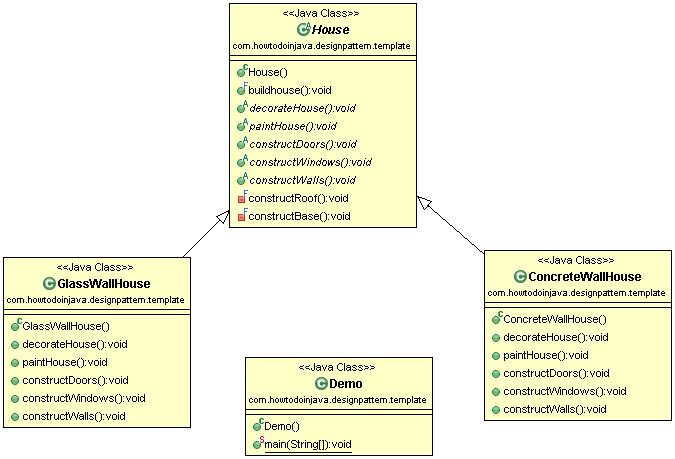

# 模板方法设计模式

> 原文： [https://howtodoinjava.com/design-patterns/behavioral/template-method-pattern/](https://howtodoinjava.com/design-patterns/behavioral/template-method-pattern/)

**模板方法设计模式**是广泛接受的行为设计模式，用于在编程的上下文中实施某种[算法](//howtodoinjava.com/java-algorithms-implementations/)（固定的步骤集）。

它定义了执行多步算法的顺序步骤，并且还可以选择提供默认实现（根据要求）。

```java
Table of Contents

Introduction
Problem Statement
Solution
Code Implementation
Key Design Points
Popular implementations of template method pattern
Summary
```

## 介绍

您是否在编程中遇到过任何情况，每次都需要以固定顺序定义一组特定步骤，以便可以由实现类强制执行？ 如果是这样，那么**模板方法模式**是适合您的解决方案，可用于有序执行这些步骤（算法）。

#### 模板方法模式的适用性

*   当我们有预定义的步骤来实现一些算法时。
*   当我们要避免重复代码时，请在基类中移动通用实现和步骤。

现在，让我们解决一个设计问题以详细了解它。

## 问题陈述

可以说，我们需要建造通常有某些步骤的任何房屋。 有些步骤具有默认实现，而某些步骤是针对没有默认实现的实现者的。

**默认实现的步骤**

*   基础基础建设
*   屋顶施工

**默认实现为“否”的步骤**

*   墙的构造
*   门窗施工
*   绘画
*   室内装修

我们希望**通过应用中的所有实现类依次执行这些步骤**。

## 解

在上述问题中，我们按照**固定顺序**采取了某些步骤，所有建筑类别都必须遵循这些步骤。 因此，我们可以使用模板方法设计模式来解决此问题。

让我们定义一个将所有步骤作为方法的基类`House`，将一个将依次调用中间步骤的*模板方法* `buildhouse()`定义为基类。

我们还将根据房屋的类型（例如`GlassWallHouse`和`ConcreteWallHouse`）创建派生类。

#### 类图



Class Diagram using Template Method Design pattern


## 代码实施

首先，我们需要创建一个名为`House`的抽象类，它将定义名为`buildHouse()`的模板方法。

**House.java**

```java
package com.howtodoinjava.designpattern.template;

/**
 * abstract class House containing template method buildHouse and implementation
 * of steps which is same for all types of houses. Those implementations have
 * been marked as final.
 */

public abstract class House {
	/**
	 * This is the template method we are discussing. This method should be
	 * final so that other class can't re-implement and change the order of the
	 * steps.
	 */
	public final void buildhouse() {
		constructBase();
		constructRoof();
		constructWalls();
		constructWindows();
		constructDoors();
		paintHouse();
		decorateHouse();
	}

	public abstract void decorateHouse();

	public abstract void paintHouse();

	public abstract void constructDoors();

	public abstract void constructWindows();

	public abstract void constructWalls();

	/**
	 * final implementation of constructing roof - final as all type of house
	 * Should build roof in same manner.
	 */
	private final void constructRoof() {
		System.out.println("Roof has been constructed.");
	}

	/**
	 * final implementation of constructing base - final as all type of house
	 * Should build base/foundation in same manner.
	 */
	private final void constructBase() {
		System.out.println("Base has been constructed.");
	}
}

```

现在，我们将创建该类的两个实现，可用于建造混凝土房屋和玻璃房屋。

**ConcreteWallHouse.java**

```java
package com.howtodoinjava.designpattern.template;

public class ConcreteWallHouse extends House {
      @Override
      public void decorateHouse() {
            System.out.println(“Decorating Concrete Wall House”);
      }
      @Override
      public void paintHouse() {
            System.out.println(“Painting Concrete Wall House”);
      }
      @Override
      public void constructDoors() {
            System.out.println(“Constructing Doors for Concrete Wall House”);
      }
      @Override
      public void constructWindows() {
            System.out.println(“Constructing Windows for Concrete Wall House”);
      }
      @Override
      public void constructWalls() {
            System.out.println(“Constructing Concrete Wall for my House”);
      }
}

```

**GlassWallHouse.java**

```java
package com.howtodoinjava.designpattern.template;

public class GlassWallHouse extends House {
	@Override
	public void decorateHouse() {
		System.out.println("Decorating Glass Wall House");
	}

	@Override
	public void paintHouse() {
		System.out.println("Painting Glass Wall House");
	}

	@Override
	public void constructDoors() {
		System.out.println("Constructing Doors for Glass Wall House");
	}

	@Override
	public void constructWindows() {
		System.out.println("Constructing Windows for Glass Wall House");
	}

	@Override
	public void constructWalls() {
		System.out.println("Constructing Glass Wall for my House");
	}
}

```

## 演示版

让我们尝试建造两种房屋。

```java
package com.howtodoinjava.designpattern.template;

public class Demo {
      public static void main(String[] args) {

            System.out.println(“Going to build Concrete Wall House”);

            House house = new ConcreteWallHouse();
            house.buildhouse();

            System.out.println(“Concrete Wall House constructed successfully”);

            System.out.println(“********************”);

            System.out.println(“Going to build Glass Wall House”);

            house = new GlassWallHouse();
            house.buildhouse();

            System.out.println(“Glass Wall House constructed successfully”);
      }
}

```

输出：

```java
Going to build Concrete Wall House
Base has been constructed.
Roof has been constructed.
Constructing Concrete Wall for my House
Constructing Windows for Concrete Wall House
Constructing Doors for Concrete Wall House
Painting Concrete Wall House
Decorating Concrete Wall House
Concrete Wall House constructed successfully

********************

Going to build Glass Wall House
Base has been constructed.
Roof has been constructed.
Constructing Glass Wall for my House
Constructing Windows for Glass Wall House
Constructing Doors for Glass Wall House
Painting Glass Wall House
Decorating Glass Wall House
Glass Wall House constructed successfully
```

## 关键设计要点

1.  **将模板方法标记为最终的**，以便实现类无法覆盖和更改步骤的顺序。
2.  **在基类中，使用默认实现**实现所有方法，因此派生类无需定义它们。
3.  **标记所有必须抽象实现派生类的方法**。

## 模板方法模式的流行实现

这些是模板方法设计模式的几种流行的现有实现。

*   [Java IO](//howtodoinjava.com/java-io-tutorial/) 中`InputStream`，`OutputStream`，`Reader`和`Writer`的非抽象方法。
*   一些抽象集合类的非抽象方法，例如`AbstractList`，`AbstractSet`和`AbstractMap`等。

## 摘要

**模板模式**是一种非常简单的设计模式，用于定义和实施编程范例中的某些顺序算法步骤。 它有助于定义算法的框架，该框架不得在子类中被覆盖。

因此，展望未来，当您需要实现上述业务场景时，请考虑一下模板模式 – 它非常易于实现并且也非常易于维护。

学习愉快！

[Download Source Code](//howtodoinjava.com/wp-content/downloads/TemplateDesignPattern.zip)