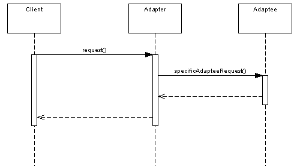

# Java 中的适配器设计模式

> 原文： [https://howtodoinjava.com/design-patterns/structural/adapter-design-pattern-in-java/](https://howtodoinjava.com/design-patterns/structural/adapter-design-pattern-in-java/)

曾经尝试在笔记本电脑中使用*相机存储卡*。 您不能直接使用它，因为笔记本电脑中没有接受它的端口。 您必须使用兼容的读卡器。 您将存储卡放入读卡器，然后将读卡器注入笔记本电脑。 该读卡器可以称为适配器。

类似的示例是*移动充电器*或*笔记本电脑充电器*，它们可以与任何电源一起使用，而不必担心不同位置的电源变化。 这也称为电源“适配器”。

同样在编程中，适配器模式也用于类似目的。 它使两个不兼容的接口能够彼此平滑地工作。 按照定义：

Adapter design pattern is one of the [**structural design pattern**](//howtodoinjava.com/category/design-patterns/structural/ "structural design pattern") and its used so that two unrelated interfaces can work together. The object, that joins these unrelated interfaces, is called an Adapter.

关于[Design Patterns]的四本原始 **Gang 中提供的 Adapter 的定义指出：**

> “将类的接口转换为客户期望的另一个接口。 适配器使类可以协同工作，因为接口不兼容，否则无法一起工作。”

适配器模式也称为**包装模式**。 当某些其他现有组件必须在不修改源代码的情况下被现有系统采用时，适配器设计对于系统集成非常有用。

典型的交互是这样的：



## 在哪里使用适配器设计模式？

这种模式的主要用途是当您需要使用的类不符合接口的要求时。 例如 如果要通过 java 中的命令提示符读取系统输入，则下面的代码是执行此操作的常用方法：

```java
BufferedReader br = new BufferedReader(new InputStreamReader(System.in));
System.out.print("Enter String");
String s = br.readLine();
System.out.print("Enter input: " + s);

```

现在，请仔细观察上面的代码。

**1）`System.in`是`InputStream`的`static`实例，声明为：**

```java
	public final static InputStream in = null;

```

此输入流以字节流的形式从控制台本地读取数据。

**2）如 Java 文档所定义的 BufferedReader，读取字符流。**

```java
//Reads text from a character-input stream, buffering characters so as to 
//provide for the efficient reading of characters, arrays, and lines. 

public class BufferedReader extends Reader{..}

```

现在这是问题所在。 `System.in`提供字节流，其中`BufferedReader`需要字符流。 他们将如何一起工作？

这是在两个不兼容的接口之间放置适配器的**理想情况。 **`InputStreamReader`正是这样做并且在`System.in`和`BufferedReader`之间工作适配器。****

```java
/** An InputStreamReader is a bridge from byte streams to character streams: 
  * It reads bytes and decodes them into characters using a specified charset. 
  * The charset that it uses may be specified by name or may be given explicitly, 
  * or the platform's default charset may be accepted. 
  */

public class InputStreamReader extends Reader {...}

```

我希望上述用例对大家都有意义。 现在，下一个问题是适配器应该做多少工作才能使两个不兼容的接口一起工作？

## 适配器模式应该执行多少工作？

答案真的很简单，它应该做很多工作，以便两个不兼容的界面都能相互适应。 例如 在我们上面的案例研究中，A `InputStreamReader`只是包装了`InputStream`而没有其他内容。 然后，`BufferedReader`能够使用基础的`Reader`读取流中的字符。

```java
/**
 * Creates an InputStreamReader that uses the default charset.
 * @param  in   An InputStream
 */
public InputStreamReader(InputStream in) {
	super(in);
	try {
		sd = StreamDecoder.forInputStreamReader(in, this, (String)null); // ## check lock object
	} catch (UnsupportedEncodingException e) {
		// The default encoding should always be available
		throw new Error(e);
	}
}

```

Also note that if the Target and Adaptee are similar then the adapter has just to delegate the requests from the Target to the Adaptee. If Target and Adaptee are not similar, then the adapter might have to convert the data structures between those and to implement the operations required by the Target but not implemented by the Adaptee.

现在，当我们对适配器的外观有了很好的了解后，让我们确定适配器设计模式中使用的参与者：

## 适配器设计模式的参与者

下表列出了参与此模式的类和/或对象：

*   **目标**（BufferedReader）：它定义客户端直接使用的特定于应用程序的接口。
*   **适配器**（InputStreamReader）：它将接口 Adaptee 适配到 Target 接口。 是中间人
*   **Adaptee** （System.in）：它定义了现有的不兼容接口，需要在应用程序中使用之前进行修改。
*   **客户端**：它是与 Target 接口一起使用的应用程序。

## 适配器设计模式的其他示例实现

其他值得注意的例子如下：

1） [java.util.Arrays＃asList（）](https://docs.oracle.com/javase/6/docs/api/java/util/Arrays.html#asList%28T...%29 "Arrays.asList")

此方法接受多个字符串并返回输入字符串的列表。 虽然这是非常基本的用法，但是它是适配器的功能，对不对？

2） [java.io.OutputStreamWriter（OutputStream）](https://docs.oracle.com/javase/6/docs/api/java/io/OutputStreamWriter.html#OutputStreamWriter%28java.io.OutputStream%29 "OutputStreamWriter")

这类似于我们在本文中讨论的上述用例：

```java
Writer writer = new OutputStreamWriter(new FileOutputStream("c:\\data\\output.txt"));
writer.write("Hello World");

```

3） [javax.xml.bind.annotation.adapters.XmlAdapter＃marshal（）和#unmarshal（）](https://docs.oracle.com/javaee/5/api/javax/xml/bind/annotation/adapters/XmlAdapter.html "XmlAdapter")

使 Java 类型适应自定义封送处理。 将绑定类型转换为值类型。

这就是这个简单主题的全部内容。

学习愉快！