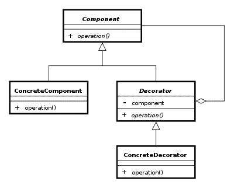
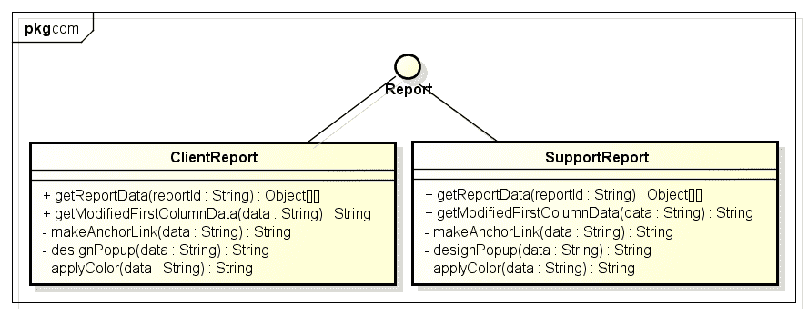
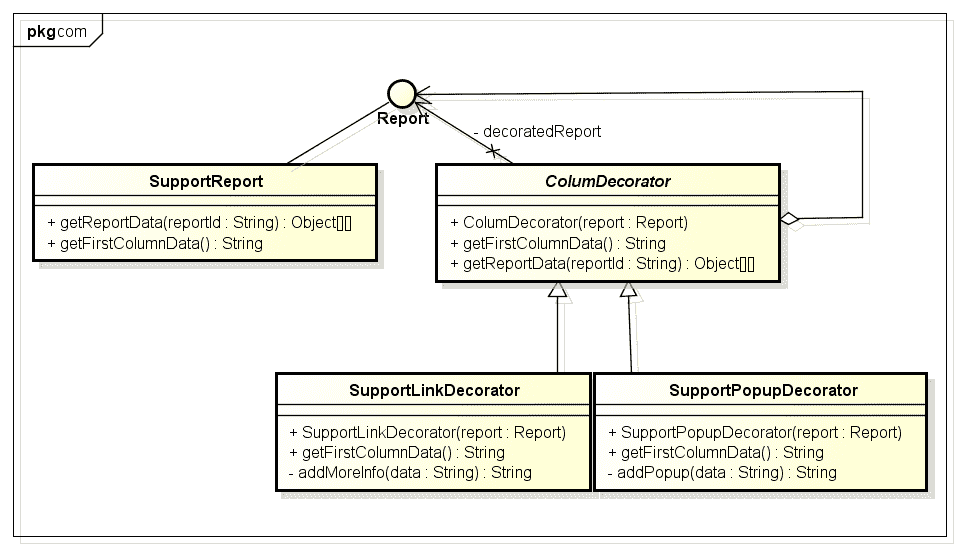

# Java 中的装饰器设计模式

> 原文： [https://howtodoinjava.com/design-patterns/structural/decorator-design-pattern/](https://howtodoinjava.com/design-patterns/structural/decorator-design-pattern/)

在软件工程中，**装饰器设计模式**用于向类的特定实例添加其他功能或行为，而不会修改同一类的其他实例。 装饰器提供了子类别的灵活替代方案，以扩展功能。 请注意，以上描述暗示装饰对象会更改其行为，但不会更改其界面。

理解这种模式非常重要，因为一旦您了解了装饰技术，就可以赋予您（或其他人）对象新的职责，而无需对基础类进行任何代码更改。 有趣，不是吗？ 这种模式也非常有用，并且经常会遇到 [**Java 面试问题**](//howtodoinjava.com/java/interviews-questions/core-java-interview-questions-series-part-1/ "Core java interview questions series : Part 1")关于[**设计模式**](//howtodoinjava.com/category/design-patterns/ "design patterns")的问题。

在这篇文章中，我们将讨论以下几点：

*   设计参与者
*   问题陈述
*   使用装饰器设计模式的建议解决方案
*   常见面试问题
*   一些实际用法

## 设计参与者

装饰器模式的典型示意图如下所示。



装饰设计模式参与者


以下是“装饰器设计”模式的参与者：

*   **`Component`** – 这是包装器，在运行时可以具有与其相关的其他职责。
*   **`ConcreteComponent`** – 是在程序中添加了其他职责的原始对象。
*   **`Decorator`** - 这是一个抽象类，其中包含对组件对象的引用，并且还实现了组件接口。
*   **`ConcreteDecorator`** - 它们扩展了装饰器，并在`Component`类的顶部构建了附加功能。

如果您仔细阅读这两行内容，那么您将了解它的工作方式如下：

您有一个实例，并将另一个实例放入其中。 它们都支持相同（或相似）的接口。 外面的一个是“装饰器”。 您在外面用一个。 它可以掩盖，更改或通过其内部实例的方法。

我总是喜欢以身作则。 因此，让我们解决一个问题。

## 问题陈述

让我们有一个常见的用例，我们必须将所有用户创建的报告显示给管理员。 现在，这些报告可以属于这些类别。

*   客户报告
*   支持报告

这两个报告**都必须具有第一列作为到原始报告的链接**，并且它们应具有**不同的颜色**。 可能应在**不同弹出窗口大小**中打开它们。 这些只是很少的事情，现实中可以实现很多。

一种**可能的方法是扩展`Report`对象**，然后具有两个单独的类`ClientReport`和`SupportReport`。 在这两种方法中，定义私有方法，例如`makeAnchorLink()`，`designPopup()`，`applyColor()`等。 现在，在第一列数据单元格的某些获取器方法中调用这些方法。



如果您在此处停止并且不再修改系统，则它将起作用。 但是，假设几天后，**您被告知为两种报告应用不同的背景色**。 现在，您只有一种方法可以在两个类中定义方法`colorBackground()`，并进行适当的调用。 将来系统中有更多报告时，问题将变得更加严重。

上面的解决方案明显违反了 [**SMART 类别设计**](//howtodoinjava.com/best-practices/5-class-design-principles-solid-in-java/ "SMART principles for class design")中提到的**开闭原则**。

## 使用装饰器设计模式的建议解决方案

上面的问题是装饰图案的理想选择。 请记住，当我们有一个需要扩展但设计不当的对象时，请进行装饰。

通过下面的类图可以轻松解决以上问题。 在这里，我仅用于支持报告。 也可以为客户报告构建类似的类层次结构。



装饰器模式解决方案


如果我们已经实现了这样的解决方案，那么将来任何时候我们都可以添加其他修饰，而无需修改现有的类层次结构。 那是我们开始这篇文章的最终目标，对吧？

## 源代码列表

让我们看一看类的源代码，以了解其实际外观。

**`Report.java`**

```java
public interface Report {
	public Object[][] getReportData(final String reportId);
	public String getFirstColumnData();
}

```

**`SupportReport.java`**

```java
public class SupportReport implements Report {

	@Override
	public Object[][] getReportData(String reportId) {
		return null;
	}

	@Override
	public String getFirstColumnData() {
		return "Support data";
	}

}

```

**`ColumDecorator.java`**

```java
public abstract class ColumDecorator implements Report 
{
	private Report decoratedReport;

	public ColumDecorator(Report report){
		this.decoratedReport = report;
	}

	public String getFirstColumnData() {
        return decoratedReport.getFirstColumnData(); 
    }

	@Override
	public Object[][] getReportData(String reportId) {
		return decoratedReport.getReportData(reportId);
	}
}

```

**`SupportLinkDecorator.java`**

```java
public class SupportLinkDecorator extends ColumDecorator{

	public SupportLinkDecorator(Report report) {
		super(report);
	}

	public String getFirstColumnData() {
		return addMoreInfo (super.getFirstColumnData()) ;
	}

	private String addMoreInfo(String data){
		return data  + " - support link - ";
	}
}

```

**`SupportPopupDecorator.java`**

```java
public class SupportPopupDecorator extends ColumDecorator{

	public SupportPopupDecorator(Report report) {
		super(report);
	}

	public String getFirstColumnData() {
		return addPopup (super.getFirstColumnData()) ;
	}

	private String addPopup(String data){
		return data  + " - support popup - ";
	}
}

```

**`DecoratorPatternTest.java`**

```java
public class DecoratorPatternTest {
	public static void main(String[] args) {

		//ClientPopupDecorator popupDecoratored = new ClientPopupDecorator(new ClientLinkDecorator(new ClientReport()));
		//System.out.println(popupDecoratored.getFirstColumnData());

		SupportPopupDecorator supportPopupDecoratored = new SupportPopupDecorator(new SupportLinkDecorator(new SupportReport()));
		System.out.println(supportPopupDecoratored.getFirstColumnData());
	}
}

Output:

Support data - support link -  - support popup - 

```

要下载完整的源代码和 UML 图，请遵循文章结尾处的下载链接。

## 关于装饰图案的面试问题

**A）如何确定何时使用装饰器模式？**

如果我们深入了解该概念，则会发现装饰器设计模式具有多个需求指标以表明这是潜在的解决方案，例如：

*   我们有一个需要扩展的对象。 例如一个需要其他“可选”功能（例如滚动条，标题栏和状态栏）的窗口控件。
*   几个通过“装饰”支持扩展的对象。 通常，这些对象共享一个公共接口，特征或超类，有时还具有其他中间超类。
*   装饰的对象（类或原型实例化）和装饰器对象具有一个或几个共同的特征。 为了确保该功能，装饰器&的装饰器具有公共接口，特征或类继承。

**B）装饰器模式和适配器模式之间的区别**

不可以。适配器模式用于将对象的界面转换为其他内容。 装饰器模式用于扩展对象的功能，同时保持其接口。 由于它们都“包裹”了一个对象，因此两者有时有时也被称为“包装模式”。

**C）装饰器模式与子类别之间的差异**

装饰器模式和子类之间的区别在于，在子类中，您可以“使用单个类”修饰实现接口的任何类。 假设我想给自己一个`java.util.Map`，每当我添加或删除键时，它都会打印一条消息。 如果我只实际使用过`java.util.HashMap`，那么我可以创建`PrintingMap`吗？ 作为`HashMap`的子类并重写&删除。 但是，如果要创建`TreeMap`的打印版本，则可以创建`PrintingTreeMap`？ （哪些代码与`PrintingMap`具有几乎相同的代码？

## 装饰器模式的常用用法：

1）Java IO 库类，例如`BufferedInputStream bs = new BufferedInputStream(new FileInputStream(new File("File1.txt")))`;

2）在显示标签 jsp 库中的装饰器列中，例如：

```java
<display:table name="reportsViewResultTable" class="demoClass" id="reportsQueryViewResultTable">
	<display:column title="Report Id" sortable="true" property="reportDisplayId" decorator="com.comp.FirstColumnDataDecorator"></display:column>
</display:table>

```

3）在 **sitemesh** 中使用装饰器，以提供一致的 UI 体验。

[**源码下载**](https://docs.google.com/file/d/0B7yo2HclmjI4RTREbG9ReDc5V2M/edit?usp=sharing)

**祝您学习愉快！**