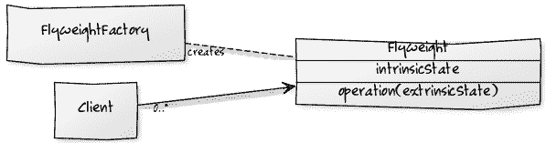

# 轻量化设计模式

> 原文： [https://howtodoinjava.com/design-patterns/structural/flyweight-design-pattern/](https://howtodoinjava.com/design-patterns/structural/flyweight-design-pattern/)

根据 GoF 定义，**轻量级设计模式**可以使用对象共享来有效地支持大量细粒度对象。 权重是**共享对象**，可以同时在多个上下文中使用。 享元在每种情况下都充当独立对象。

## 1.何时使用轻量化设计模式

我们可以在以下情况下使用 flyweight 模式：

*   当我们需要大量类似的对象时，这些对象只有几个参数是唯一的，而大多数东西通常都是通用的。
*   我们需要通过创建更少的对象并将它们共享来控制大量对象的内存消耗。

## 2.外在和内在属性

轻量级物体本质上具有两种属性 - 内部属性和外部属性。

**固有**状态属性存储/共享在 flyweight 对象中，并且与 flyweight 的上下文无关。 作为最佳实践，我们应该使固有状态 [**不可变**](https://howtodoinjava.com/java/basics/how-to-make-a-java-class-immutable/) 。

**外在**状态会随着重量级环境的变化而变化，这就是为什么它们无法共享的原因。 客户端对象保持外部状态，它们需要在对象创建过程中将其传递给 flyweight 对象。



Flyweight Pattern


## 3.轻量化模式的真实示例

*   Suppose we have a **pen** which can exist with/without **refill**. A refill can be of any color thus a pen can be used to create drawings having N number of colors.

    这里`Pen`可以是具有`refill`作为外部属性的轻量级对象。 所有其他属性（例如笔身，指针等）可以是所有笔所共有的固有属性。 一支笔只能通过其笔芯颜色来区分，没有别的。

    所有需要访问红笔的应用模块 - 都可以使用红笔的同一实例（共享对象）。 仅当需要使用不同颜色的笔时，应用模块才会从 flyweight 工厂要求另一只笔。

*   在编程中，我们可以将 **java.lang.String** 常量视为 flyweight 对象。 所有字符串都存储在字符串池中，如果我们需要带有某些内容的字符串，那么运行时将返回对该池中已存在的字符串常量的引用（如果有）。
*   在浏览器中，我们可以在网页的多个位置使用图片。 浏览器将仅加载一次图像，而其他浏览器将重用缓存中的图像。 现在图像是相同的，但已在多个地方使用。 URL 是固有属性，因为它是固定且可共享的。 图像的位置坐标，高度和宽度是外部属性，它们根据必须渲染的位置（上下文）而变化。

## 4.举重设计模式示例

在给定的示例中，我们正在构建一个 Paint Brush 应用，客户可以在这三种类型上使用画笔 -THICK，THIN 和 MEDIUM。 所有粗（细或中等）画笔将以完全相似的方式绘制内容 - 仅内容颜色会有所不同。

```java
public interface Pen 
{	
	public void setColor(String color);
	public void draw(String content); 
}

```

```java
public enum BrushSize {
	THIN, MEDIUM, THICK
}

```

```java
public class ThickPen implements Pen {

	final BrushSize brushSize = BrushSize.THICK;	//intrinsic state - shareable
	private String color = null; 					//extrinsic state - supplied by client

	public void setColor(String color) {
		this.color = color;
	}

	@Override
	public void draw(String content) {
		System.out.println("Drawing THICK content in color : " + color);
	}
}

```

```java
public class ThinPen implements Pen {

	final BrushSize brushSize = BrushSize.THIN;
	private String color = null; 

	public void setColor(String color) {
		this.color = color;
	}

	@Override
	public void draw(String content) {
		System.out.println("Drawing THIN content in color : " + color);
	}
}

```

```java
public class MediumPen implements Pen {

	final BrushSize brushSize = BrushSize.MEDIUM;
	private String color = null; 

	public void setColor(String color) {
		this.color = color;
	}

	@Override
	public void draw(String content) {
		System.out.println("Drawing MEDIUM content in color : " + color);
	}
}

```

这里笔刷`color`是外部属性，将由客户端提供，否则`Pen`的所有内容都将保持不变。 因此，从本质上讲，仅当颜色不同时，我们才会创建一定大小的笔。 一旦其他客户或环境需要该笔的大小和颜色，我们将重新使用它。

```java
import java.util.HashMap;

public class PenFactory 
{
	private static final HashMap<String, Pen> pensMap = new HashMap<>();

	public static Pen getThickPen(String color) 
	{
		String key = color + "-THICK";

		Pen pen = pensMap.get(key);

		if(pen != null) {
			return pen;
		} else {
			pen = new ThickPen();
			pen.setColor(color);
			pensMap.put(key, pen);
		}

		return pen;
	}

	public static Pen getThinPen(String color) 
	{
		String key = color + "-THIN";

		Pen pen = pensMap.get(key);

		if(pen != null) {
			return pen;
		} else {
			pen = new ThinPen();
			pen.setColor(color);
			pensMap.put(key, pen);
		}

		return pen;
	}

	public static Pen getMediumPen(String color) 
	{
		String key = color + "-MEDIUM";

		Pen pen = pensMap.get(key);

		if(pen != null) {
			return pen;
		} else {
			pen = new MediumPen();
			pen.setColor(color);
			pensMap.put(key, pen);
		}

		return pen;
	}
}

```

让我们使用客户端来测试重量轻的笔对象。 客户端在这里创建了三支 THIN 笔，但在运行时它们只是一个瘦型的笔对象，并且与所有三个调用共享。

```java
public class PaintBrushClient 
{
	public static void main(String[] args) 
	{
		Pen yellowThinPen1 = PenFactory.getThickPen("YELLOW");	//created new pen
		yellowThinPen1.draw("Hello World !!");

		Pen yellowThinPen2 = PenFactory.getThickPen("YELLOW");	//pen is shared
		yellowThinPen2.draw("Hello World !!");

		Pen blueThinPen = PenFactory.getThickPen("BLUE");		//created new pen
		blueThinPen.draw("Hello World !!");

		System.out.println(yellowThinPen1.hashCode());
		System.out.println(yellowThinPen2.hashCode());

		System.out.println(blueThinPen.hashCode());
	}
}

```

程序输出。

```java
Drawing THICK content in color : YELLOW
Drawing THICK content in color : YELLOW
Drawing THICK content in color : BLUE

2018699554		//same object
2018699554		//same object
1311053135

```

## 5.常见问题

#### 5.1 单身模式和轻量模式之间的区别

单例模式有助于我们仅在系统中维护一个对象。 换句话说，一旦创建了所需的对象，我们就无法创建更多对象。 我们需要在应用的所有部分中重用现有对象。

当我们必须根据客户端提供的外部属性创建大量不同的相似对象时，将使用 flyweight 模式。

#### 5.2 并发对举重的影响

类似于单例模式，如果我们在并发环境中创建 flyweight 对象，则最终可能会遇到同一个 flyweight 对象的多个实例，这是不希望的。

要解决此问题，我们需要在创建飞配重时使用[单例模式](https://howtodoinjava.com/design-patterns/creational/singleton-design-pattern-in-java/)中使用的**双检锁**。

#### 5.3 轻量化设计模式的好处

使用举重装置，我们可以：

*   减少可以相同控制的重物的内存消耗。
*   减少系统中“完整但相似的对象”的总数。
*   提供了集中机制来控制许多“虚拟”对象的状态。

#### 5.4 内在和外在数据可以共享吗？

内在数据是可共享的，因为它是所有上下文通用的。 不共享外部数据。 客户需要将信息（状态）传递给飞锤，这是其上下文所特有的。

#### 5.5 轻量化模式的挑战

*   我们需要花一些时间来配置这些 flyweight。 最初，设计时间和技能可能是开销。
*   为了创建重量级，我们从现有对象中提取一个通用的模板类。 附加的编程层可能很棘手，有时很难调试和维护。
*   轻量化模式通常与单例工厂实现结合使用，并且为了保护奇点，需要额外的成本。

在评论中向我发送有关**轻量化模式**的问题。

学习愉快！