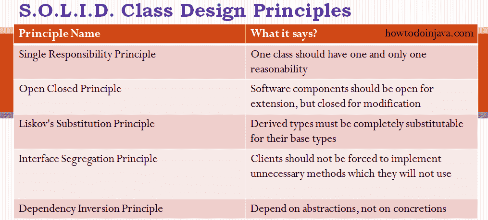

# Java 中的 SOLID 原理[含示例]

> 原文： [https://howtodoinjava.com/best-practices/5-class-design-principles-solid-in-java/](https://howtodoinjava.com/best-practices/5-class-design-principles-solid-in-java/)

类是任何 Java 应用的构建块。 如果这些块不牢固，则建筑物（即应用）将来将面临艰难时期。 这实质上意味着，当应用范围扩大或应用在生产或维护中面临某些设计问题时，编写得不够好会导致非常困难的情况。

另一方面，精心设计和编写的类集可以极大地加快编码过程，同时减少比较中的错误数量。

在本教程中，我们将通过示例讨论 Java 中的 **SOLID 原则，这是 5 种最推荐的设计原则，在编写类时应牢记。 它们还构成设计应用类时要遵循的 [**最佳做法**](//howtodoinjava.com/category/best-practices/ "java best practices") 。**

```java
Table Of Contents

1\. Single Responsibility Principle
2\. Open Closed Principle
3\. Liskov's Substitution Principle
4\. Interface Segregation Principle
5\. Dependency Inversion Principle
```



5 java class design principles


让我们一一向下钻取所有对象。

## 1.单一责任原则

原则的名称说明了一切：

> “一堂课应该只有一个责任”

换句话说，我们应该仅出于一个目的编写，更改和维护类。 如果是模型类，则它应严格只代表一个参与者/实体。 这将使我们能够灵活地在将来进行更改，而不必担心更改对另一个实体的影响。

同样，如果我们正在编写服务/管理器类，则它应该只包含方法调用的那一部分，而不包含其他任何内容。 甚至没有与模块相关的实用程序全局功能。 最好将它们分开在另一个可全局访问的类文件中。 这将有助于维护用于该特定目的的类，并且我们可以决定该类仅对特定模块的可见性。

#### 1.1 单一责任原则示例

在所有流行的 Java 库中，我们都可以找到很多遵循单一职责原则的类。 例如，在 log4j 中，我们具有使用日志记录方法的不同类，不同的类是日志记录级别，依此类推。

在我们的应用级代码中，我们定义了模型类来表示实时实体，例如人，雇员，帐户等。这些类中的大多数是 SRP 原理的示例，因为当我们需要更改人的状态时，才需要修改 一个人的阶级。 等等。

在给定的示例中，我们有两个类`Person`和`Account`。 两者都负有存储其特定信息的单一责任。 如果要更改 Person 的状态，则无需修改类`Account`，反之亦然。

```java
public class Person 
{
	private Long personId;
	private String firstName;
	private String lastName;
	private String age;
	private List<Account> accounts;
}

```

```java
public class Account 
{
	private Long guid;
	private String accountNumber;
	private String accountName;
	private String status;
	private String type;
}

```

## 2.开闭原则

这是设计应用时应牢记的第二个重要规则。 **开闭原理**指出：

> “软件组件应打开以进行扩展，但应关闭以进行修改”

这是什么意思？？ 这意味着我们的类应该这样设计：每当开发人员想要改变应用中特定条件下的控制流时，他们都需要扩展我们的类并覆盖某些功能，仅此而已。

如果其他开发人员由于类的约束而无法设计所需的行为，则应重新考虑更改类。 在这里我并不是说任何人都可以改变我们班级的整体逻辑，但是他/她应该能够以软件允许的无害方式覆盖软件提供的选项。

#### 2.1 开闭原理示例

如果我们研究诸如 struts 或 spring 之类的任何良好框架，我们将看到我们无法更改其核心逻辑和请求处理，但仅通过扩展某些类并将其插入配置文件中即可修改所需的应用流。

例如，spring 框架具有类`DispatcherServlet`。 此类充当基于 String 的 Web 应用的**前端控制器**。 要使用此类，我们不需要修改此类。 我们所需要做的就是传递初始化参数，然后我们可以按需要扩展其功能。

请注意，除了在应用启动期间传递初始化参数之外，我们还可以重写方法，以通过扩展类来修改目标类的行为。 例如，struts Action 类被扩展以覆盖请求处理逻辑。

```java
public class HelloWorldAction extends Action 
{
	@Override
	public ActionForward execute(ActionMapping mapping, 
								ActionForm form, 
								HttpServletRequest request, 
								HttpServletResponse response) 
								throws Exception 
	{

	    //Process the request

    }
}

```

## 3\. Liskov 的替代原则

该原理是先前讨论的打开 - 闭合原理的变体。 它说：

> “派生类型必须完全可以替代其基本类型”

这意味着通过扩展我们的类而创建的同级开发人员应该能够适合应用而不会失败。 这要求子类的对象的行为与父类的对象相同。 这通常在我们进行运行时类型识别然后将其转换为适当的引用类型的地方看到。

#### 3.1 Liskov 替代原理示例

LSP 的一个示例可以是 Spring 框架中的[自定义属性编辑器](https://howtodoinjava.com/spring-boot/custom-property-editor-example/)。 Spring 提供了属性编辑器以与对象本身不同的方式表示属性，例如，从 HTTP 请求参数解析人类可读的输入或在视图层中显示纯 Java 对象的人类可读的值，例如 `Currency`或`URL`。

Spring 可以为一种数据类型注册一个属性编辑器，并且需要遵循**基类** `PropertyEditorSupport`强制的约束。 所以是任何扩展`PropertyEditorSupport`类的类，那么它可以被需要基类的任何地方替换。

例如，每本书都有一个 ISBN 号，它始终是固定的显示格式。 您可以在数据库和 UI 中使用独立的 ISBN 表示形式。 为此，我们可以用以下方式编写属性编辑器：

```java
import java.beans.PropertyEditorSupport;
import org.springframework.util.StringUtils;
import com.howtodoinjava.app.model.Isbn;

public class IsbnEditor extends PropertyEditorSupport {
    @Override
    public void setAsText(String text) throws IllegalArgumentException {
        if (StringUtils.hasText(text)) {
            setValue(new Isbn(text.trim()));
        } else {
            setValue(null);
        }
    }

    @Override
    public String getAsText() {
        Isbn isbn = (Isbn) getValue();
        if (isbn != null) {
            return isbn.getIsbn();
        } else {
            return "";
        }
    }
}

```

## 4.接口隔离原理

这是我最喜欢的原则。 它适用于接口，因为单一职责原则适用于类。 ISP 说：

> “不应强迫客户实施不必要的不​​必要的方法”

举个例子。 开发人员 Alex 创建了一个接口`Reportable`并添加了两种方法`generateExcel()`和`generatedPdf()`。 现在，客户“ A”希望使用此界面，但他打算仅使用 PDF 格式的报告，而不使用 excel。 他将能够轻松使用该功能吗？

没有。 他将必须实现这两种方法，其中一种是软件设计人员要给他增加的负担。 他要么实现另一种方法，要么将其留空。 这不是一个好的设计。

那么解决方案是什么？ 解决方案是通过破坏现有接口来创建两个接口。 它们应该像`PdfReportable`和`ExcelReportable`。 这将为用户提供灵活性，使其仅使用必需的功能。

#### 4.1 接口隔离原理示例

查找 IPS 示例的最佳地方是 Java AWT 事件处理程序，用于处理从键盘和鼠标触发的 GUI 事件。 对于每种事件，它都有不同的监听器类。 我们只需要编写希望处理的事件处理程序即可。 没有什么是强制性的。

一些听众是：

*   FocusListener
*   监听器
*   MouseMotionListener
*   MouseWheelListener
*   文字监听器
*   WindowFocusListener

任何时候，我们希望处理任何事件，只需找出相应的监听器并实现它即可。

```java
public class MouseMotionListenerImpl implements MouseMotionListener 
{
	@Override
	public void mouseDragged(MouseEvent e) {
		//handler code
	}

	@Override
	public void mouseMoved(MouseEvent e) {
		//handler code
	}
}

```

## 5.依赖倒置原则

我们大多数人已经熟悉原则名称中使用的词语。 DI 原理说：

> “取决于抽象而不是具体”

换一种说法。 我们应该以这样一种方式设计我们的软件，即可以使用抽象层将各个模块彼此绑定在一起，从而将各个模块彼此分离。

#### 5.1 依赖倒置原理示例

Spring 框架中`bean configuration`原理的经典用法。

在 spring 框架中，所有模块都作为单独的组件提供，可以通过简单地将依赖注入到其他模块中来一起工作。 此依赖关系在 XML 文件中从外部进行管理。

这些独立的组件在边界上封闭得非常好，以至于我们可以轻松地在 Spring 之外的其他软件模块中使用它们。 这已经通过依赖倒置和开放封闭原则来实现。 所有模块仅公开抽象，这对于扩展功能或另一个模块中的插件很有用。

这些是**五类设计原则**，也称为 **SOLID 原则**，这是设计应用类别时应遵循的最佳实践。

学习愉快！