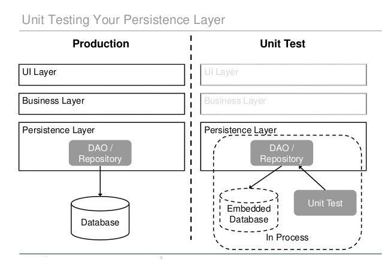
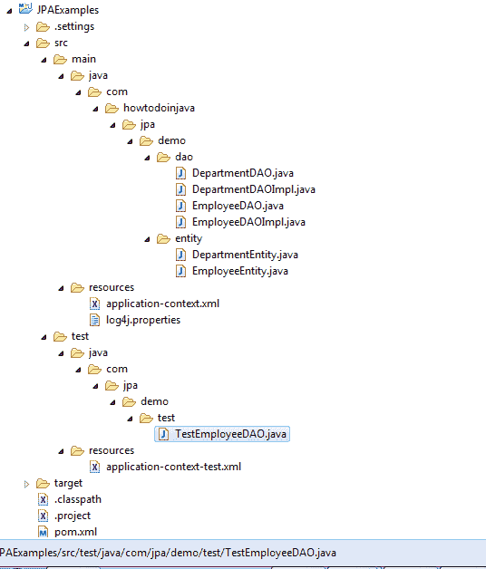

# 您应该如何对 DAO 层进行单元测试

> 原文： [https://howtodoinjava.com/best-practices/how-you-should-unit-test-dao-layer/](https://howtodoinjava.com/best-practices/how-you-should-unit-test-dao-layer/)

如果您正在基于 [**Spring**](//howtodoinjava.com/java-spring-framework-tutorials/ "Spring Tutorials") ， [**休眠**](//howtodoinjava.com/hibernate-tutorials/ "Hibernate Tutorials") 或 [**JPA**](//howtodoinjava.com/category/frameworks/jpa/ "JPA") 构建的项目中 ，并且您想对其数据访问层（DAO）进行单元测试，那么本教程中提供的信息可能会对您有所帮助。 当我们要测试 DAO 层时，我们也需要访问数据库。 但是由于某些原因，可能会损坏测试数据（主要是为集成测试准备的），或者由于某些其他团队成员也需要访问该数据，所以可能由于某些原因而不允许您使用任何现有数据库。 为了解决此问题，我正在使用 [**内存数据库**](//howtodoinjava.com/hibernate/hibernate-4-using-in-memory-database-with-hibernate/ "Hibernate 4 : Using In-memory Database With Hibernate") 。 IM（内存中）数据库是个不错的选择，因为它不会留下任何回溯，并且您可以确保在每次测试之前都会得到空表（通常是一个好习惯）。



> 一个好的单元测试应该保持数据库状态与测试用例执行之前的状态相同。 它应该删除所有添加的数据； 并回滚所有更新。

```java
Table of Contents

1) Always create unit test specific configuration file
2) Writing unit tests for DAO layer
3) Package Structure
```

## 1）始终创建单元测试特定的配置文件

这可能是为 DAO 层创建单元测试的第一步。 理想情况下，测试应使用与应用相同的配置。 但是可能会有一些更改，这些更改仅针对单元测试。 要解决此问题，您应该**创建另一个测试特定的配置文件，并添加/覆盖测试特定的配置更改**。

例如。 在主应用中，如果配置文件为`application-context.xml`，则应创建另一个文件`application-context-test.xml`，然后将原始配置导入到该文件的顶部。 然后覆盖您可能需要的 Bean 定义（例如，使用内存数据库而不是常规数据库）。

**application-context-test.xml**

```java

<beans xmlns="http://www.springframework.org/schema/beans"
    xmlns:xsi="http://www.w3.org/2001/XMLSchema-instance"
    xmlns:context="http://www.springframework.org/schema/context"
    xmlns:tx="http://www.springframework.org/schema/tx"
    xmlns:mvc="http://www.springframework.org/schema/mvc"
    xsi:schemaLocation="http://www.springframework.org/schema/beans http://www.springframework.org/schema/beans/spring-beans-3.0.xsd
    http://www.springframework.org/schema/context/ http://www.springframework.org/schema/context/spring-context-3.0.xsd
    http://www.springframework.org/schema/tx/ http://www.springframework.org/schema/tx/spring-tx-3.2.xsd
    http://www.springframework.org/schema/mvc http://www.springframework.org/schema/mvc/spring-mvc-3.2.xsd">

   <import resource="application-context.xml"/>

   <bean id="dataSource" class="org.apache.commons.dbcp.BasicDataSource" destroy-method="close">
      <property name="driverClassName" value="org.hsqldb.jdbcDriver" />
      <property name="url" value="jdbc:hsqldb:mem:howtodoinjava" />
      <property name="username" value="sa" />
      <property name="password" value="" />
   </bean>

</beans>

```

**application-context.xml**

```java
<beans xmlns="http://www.springframework.org/schema/beans"
    xmlns:xsi="http://www.w3.org/2001/XMLSchema-instance"
    xmlns:context="http://www.springframework.org/schema/context"
    xmlns:tx="http://www.springframework.org/schema/tx"
    xmlns:mvc="http://www.springframework.org/schema/mvc"
    xsi:schemaLocation="http://www.springframework.org/schema/beans http://www.springframework.org/schema/beans/spring-beans-3.0.xsd
    http://www.springframework.org/schema/context/ http://www.springframework.org/schema/context/spring-context-3.0.xsd
    http://www.springframework.org/schema/tx/ http://www.springframework.org/schema/tx/spring-tx-3.2.xsd
    http://www.springframework.org/schema/mvc http://www.springframework.org/schema/mvc/spring-mvc-3.2.xsd">

    <context:component-scan base-package="com.howtodoinjava.jpa.demo" />

    <bean id="entityManagerFactoryBean" class="org.springframework.orm.jpa.LocalContainerEntityManagerFactoryBean">
      <property name="dataSource" ref="dataSource" />

      <property name="packagesToScan" value="com.howtodoinjava.jpa.demo.entity" />

      <property name="jpaVendorAdapter">
         <bean class="org.springframework.orm.jpa.vendor.HibernateJpaVendorAdapter" />
      </property>
      <property name="jpaProperties">
         <props>
            <prop key="hibernate.archive.autodetection">class,hbm</prop>
            <prop key="hibernate.hbm2ddl.auto">create</prop>
            <prop key="hibernate.show_sql">true</prop>
            <prop key="hibernate.dialect">org.hibernate.dialect.HSQLDialect</prop>
         </props>
      </property>
   </bean>

  <bean id="dataSource" class="org.springframework.jdbc.datasource.DriverManagerDataSource">
      <property name="driverClassName" value="com.mysql.jdbc.Driver" />
      <property name="url" value="jdbc:mysql://localhost:3306/test" />
      <property name="username" value="root" />
      <property name="password" value="password" />
   </bean>

    <bean id="transactionManager" class="org.springframework.orm.jpa.JpaTransactionManager">
      <property name="entityManagerFactory" ref="entityManagerFactoryBean" />
   </bean>

   <tx:annotation-driven />

</beans>

```

在上面的示例中，我使用内存中数据源实现覆盖了常规数据源。

## 2）编写 DAO 层的单元测试

下一部分将编写 [**junit**](//howtodoinjava.com/junit/ "JUnit Tutorials") （或任何其他框架）测试用例。 我正在使用[Spring 测试](https://docs.spring.io/spring/docs/current/spring-framework-reference/html/testing.html "spring test")模块。 您可以按照以下方式编写测试用例。

```java
package com.jpa.demo.test;

import java.util.List;

import org.junit.Assert;
import org.junit.Test;
import org.junit.runner.RunWith;
import org.springframework.beans.factory.annotation.Autowired;
import org.springframework.test.annotation.Rollback;
import org.springframework.test.context.ContextConfiguration;
import org.springframework.test.context.junit4.SpringJUnit4ClassRunner;
import org.springframework.transaction.annotation.Transactional;

import com.howtodoinjava.jpa.demo.dao.DepartmentDAO;
import com.howtodoinjava.jpa.demo.dao.EmployeeDAO;
import com.howtodoinjava.jpa.demo.entity.DepartmentEntity;
import com.howtodoinjava.jpa.demo.entity.EmployeeEntity;

@ContextConfiguration(locations = "classpath:application-context-test.xml")
@RunWith(SpringJUnit4ClassRunner.class)
public class TestEmployeeDAO 
{

	@Autowired
	private EmployeeDAO employeeDAO;

	@Autowired
	private DepartmentDAO departmentDAO;

	@Test
	@Transactional
	@Rollback(true)
	public void testAddDepartment()
	{
		DepartmentEntity department = new DepartmentEntity("Information Technology");
		departmentDAO.addDepartment(department);

		List<DepartmentEntity> departments = departmentDAO.getAllDepartments();
		Assert.assertEquals(department.getName(), departments.get(0).getName());
	}

	@Test
	@Transactional
	@Rollback(true)
	public void testAddEmployee()
	{
		DepartmentEntity department = new DepartmentEntity("Human Resource");
		departmentDAO.addDepartment(department);

		EmployeeEntity employee = new EmployeeEntity();
		employee.setFirstName("Lokesh");
		employee.setLastName("Gupta");
		employee.setEmail("howtodoinjava@gmail.com");
		employee.setDepartment(department);

		employeeDAO.addEmployee(employee);

		List<DepartmentEntity> departments = departmentDAO.getAllDepartments();
		List<EmployeeEntity> employees = employeeDAO.getAllEmployees();

		Assert.assertEquals(1, departments.size());
		Assert.assertEquals(1, employees.size());

		Assert.assertEquals(department.getName(), departments.get(0).getName());
		Assert.assertEquals(employee.getEmail(), employees.get(0).getEmail());
	}
}

```

现在注意这里的几件事。

1.  在启动测试套件之前，请加载测试配置文件。

    ```java
    @ContextConfiguration(locations = "classpath:application-context-test.xml");
    ```

2.  加载完主要配置后，您将可以轻松地将 DAO 引用直接注入到测试用例中。

    ```java
    @Autowired
    private EmployeeDAO employeeDAO;

    @Autowired
    private DepartmentDAO departmentDAO;

    ```

3.  使用@Rollback（true）注解可恢复原始数据库状态。

    ```java
    @Test
    @Transactional
    @Rollback(true)
    public void testAddDepartment()
    {
    	//other code
    }

    ```

4.  Always create some data in a testcase, and verify that data in same testcase. Never make one testcase depedent on other testcase. You may want to read some unit testing best practices and guidelines in below posts.

    > **阅读更多：[单元测试最佳做法](//howtodoinjava.com/best-practices/unit-testing-best-practices-junit-reference-guide/ "Unit testing best practices : Junit Reference guide")**

## 3）包装结构

最后，看一下此示例中使用的项目结构。 注意，`application-context-test.xml`位于`test/resources`文件夹中。



Package Structure


现在查看我为本教程编写的其他文件。

**log4j.properties**

```java
log4j.logger.org.hibernate=INFO, hb
log4j.logger.org.hibernate.type=TRACE
log4j.appender.hb=org.apache.log4j.ConsoleAppender
log4j.appender.hb.layout=org.apache.log4j.PatternLayout

```

**DepartmentEntity.java**

```java
package com.howtodoinjava.jpa.demo.entity;

import java.io.Serializable;
import java.util.ArrayList;
import java.util.List;
import javax.persistence.CascadeType;
import javax.persistence.Entity;
import javax.persistence.GeneratedValue;
import javax.persistence.Id;
import javax.persistence.OneToMany;
import javax.persistence.Table;

@Entity(name="DepartmentEntity")
@Table (name="department")
public class DepartmentEntity implements Serializable {

    private static final long serialVersionUID = 1L;

    @Id
    @GeneratedValue
    private Integer id;
    private String name;

    public DepartmentEntity(){
    }

    public DepartmentEntity(String name) {
        super();
        this.name = name;
    }

    @OneToMany(mappedBy="department",cascade=CascadeType.PERSIST)
    private List<EmployeeEntity> employees = new ArrayList<EmployeeEntity>();

    //Setters and Getters

	@Override
	public String toString() {
		return "DepartmentVO [id=" + id + ", name=" + name + "]";
	}
}

```

**EmployeeEntity.java**

```java
package com.howtodoinjava.jpa.demo.entity;

import java.io.Serializable;
import javax.persistence.Entity;
import javax.persistence.GeneratedValue;
import javax.persistence.Id;
import javax.persistence.ManyToOne;
import javax.persistence.Table;

@Entity(name="EmployeeEntity")
@Table (name="employee")
public class EmployeeEntity implements Serializable
{
    private static final long serialVersionUID = 1L;

    @Id
    @GeneratedValue
    private Integer id;

    private String firstName;
    private String lastName;
    private String email;

    @ManyToOne
    private DepartmentEntity department;

    public EmployeeEntity() {}

    public EmployeeEntity(String name, DepartmentEntity department) {
        this.firstName = name;
        this.department = department;
    }

    public EmployeeEntity(String name) {
        this.firstName = name;
    }

    //Setters and Getters

    @Override
    public String toString() {
        return "EmployeeVO [id=" + id + ", firstName=" + firstName
                + ", lastName=" + lastName + ", email=" + email
                + ", department=" + department + "]";
    }
}

```

**DepartmentDAO.java**

```java
package com.howtodoinjava.jpa.demo.dao;

import java.util.List;
import com.howtodoinjava.jpa.demo.entity.DepartmentEntity;

public interface DepartmentDAO 
{
	public List<DepartmentEntity> getAllDepartments();
	public DepartmentEntity getDepartmentById(Integer id);
	public boolean addDepartment(DepartmentEntity dept);
	public boolean removeDepartment(DepartmentEntity dept);
	public boolean removeAllDepartments();
}

```

**DepartmentDAOImpl.java**

```java
package com.howtodoinjava.jpa.demo.dao;

import java.util.List;
import javax.persistence.EntityManager;
import javax.persistence.PersistenceContext;
import javax.persistence.Query;
import org.springframework.stereotype.Repository;
import org.springframework.transaction.annotation.Transactional;
import com.howtodoinjava.jpa.demo.entity.DepartmentEntity;

@Repository
@Transactional
public class DepartmentDAOImpl implements DepartmentDAO {

	@PersistenceContext
    private EntityManager manager;

	@Override
	public List<DepartmentEntity> getAllDepartments() {
		List<DepartmentEntity> depts = manager.createQuery("Select a From DepartmentEntity a", DepartmentEntity.class).getResultList();
        return depts;
	}

	@Override
	public DepartmentEntity getDepartmentById(Integer id) {
		return manager.find(DepartmentEntity.class, id);
	}

	@Override
	public boolean addDepartment(DepartmentEntity dept) {
		try{
			manager.persist(dept);
		}catch(Exception e){
			e.printStackTrace();
			return false;
		}
		return true;
	}

	@Override
	public boolean removeDepartment(DepartmentEntity dept) {
		try{
			manager.remove(dept);
		}catch(Exception e){
			e.printStackTrace();
			return false;
		}
		return true;
	}

	@Override
	public boolean removeAllDepartments() {
		try{
			Query query = manager.createNativeQuery("DELETE FROM DEPARTMENT");
			query.executeUpdate();
		}catch(Exception e){
			e.printStackTrace();
			return false;
		}
		return true;
	}
}

```

**EmployeeDAO.java**

```java
package com.howtodoinjava.jpa.demo.dao;

import java.util.List;
import com.howtodoinjava.jpa.demo.entity.EmployeeEntity;

public interface EmployeeDAO 
{
	public List<EmployeeEntity> getAllEmployees();
	public List<EmployeeEntity> getAllEmployeesByDeptId(Integer id);
	public EmployeeEntity getEmployeeById(Integer id);
	public boolean addEmployee(EmployeeEntity employee);
	public boolean removeEmployee(EmployeeEntity employee);
	public boolean removeAllEmployees();
}

```

**EmployeeDAOImpl.java**

```java
package com.howtodoinjava.jpa.demo.dao;

import java.util.List;

import javax.persistence.EntityManager;
import javax.persistence.PersistenceContext;
import javax.persistence.Query;
import org.springframework.stereotype.Repository;
import org.springframework.transaction.annotation.Transactional;
import com.howtodoinjava.jpa.demo.entity.EmployeeEntity;

@Repository
@Transactional
public class EmployeeDAOImpl implements EmployeeDAO {

	@PersistenceContext
    private EntityManager manager;

	@Override
	public List<EmployeeEntity> getAllEmployees() {
		List<EmployeeEntity> employees = manager.createQuery("Select a From EmployeeEntity a", EmployeeEntity.class).getResultList();
        return employees;
	}

	@Override
	public List<EmployeeEntity> getAllEmployeesByDeptId(Integer id) {
		List<EmployeeEntity> employees = manager.createQuery("Select a From EmployeeEntity a", EmployeeEntity.class).getResultList();
        return employees;
	}

	@Override
	public EmployeeEntity getEmployeeById(Integer id) {
		return manager.find(EmployeeEntity.class, id);
	}

	@Override
	public boolean addEmployee(EmployeeEntity employee) {
		try{
			manager.persist(employee);
		}catch(Exception e){
			e.printStackTrace();
			return false;
		}
		return true;
	}

	@Override
	public boolean removeEmployee(EmployeeEntity employee) {
		try{
			manager.remove(employee);
		}catch(Exception e){
			e.printStackTrace();
			return false;
		}
		return true;
	}

	@Override
	public boolean removeAllEmployees() {
		try{
			Query query = manager.createNativeQuery("DELETE FROM EMPLOYEE");
			query.executeUpdate();
		}catch(Exception e){
			e.printStackTrace();
			return false;
		}
		return true;
	}
}

```

**pom.xml**

```java
<project xmlns="http://maven.apache.org/POM/4.0.0" xmlns:xsi="http://www.w3.org/2001/XMLSchema-instance"
	xsi:schemaLocation="http://maven.apache.org/POM/4.0.0 http://maven.apache.org/xsd/maven-4.0.0.xsd;
	<modelVersion>4.0.0</modelVersion>
	<groupId>com.howtodoinjava.jpa.demo</groupId>
	<artifactId>JPAExamples</artifactId>
	<version>0.0.1-SNAPSHOT</version>
	<packaging>jar</packaging>
	<build>
		<sourceDirectory>src</sourceDirectory>
		<plugins>
			<plugin>
				<artifactId>maven-compiler-plugin</artifactId>
				<version>2.3.2</version>
				<configuration>
					<source>1.7</source>
					<target>1.7</target>
				</configuration>
			</plugin>
		</plugins>
	</build>
	<dependencies>

		<dependency>
			<groupId>junit</groupId>
			<artifactId>junit</artifactId>
			<version>4.12</version>
			<scope>test</scope>
		</dependency>

		<!-- Spring Support -->
		<dependency>
			<groupId>org.springframework</groupId>
			<artifactId>spring-core</artifactId>
			<version>4.1.4.RELEASE</version>
		</dependency>
		<dependency>
			<groupId>org.springframework</groupId>
			<artifactId>spring-context</artifactId>
			<version>4.1.4.RELEASE</version>
		</dependency>
		<dependency>
			<groupId>org.springframework</groupId>
			<artifactId>spring-orm</artifactId>
			<version>4.1.4.RELEASE</version>
		</dependency>
		<dependency>
			<groupId>org.springframework</groupId>
			<artifactId>spring-test</artifactId>
			<version>4.1.4.RELEASE</version>
			<scope>test</scope>
		</dependency>

		<dependency>
			<groupId>org.hibernate</groupId>
			<artifactId>hibernate-core</artifactId>
			<version>4.0.1.Final</version>
		</dependency>
		<dependency>
			<groupId>org.hibernate</groupId>
			<artifactId>hibernate-validator</artifactId>
			<version>4.2.0.Final</version>
		</dependency>
		<dependency>
			<groupId>org.hibernate.common</groupId>
			<artifactId>hibernate-commons-annotations</artifactId>
			<version>4.0.1.Final</version>
		</dependency>
		<dependency>
			<groupId>org.hibernate.javax.persistence</groupId>
			<artifactId>hibernate-jpa-2.0-api</artifactId>
			<version>1.0.1.Final</version>
		</dependency>
		<dependency>
			<groupId>org.hibernate</groupId>
			<artifactId>hibernate-entitymanager</artifactId>
			<version>4.0.1.Final</version>
		</dependency>
		<dependency>
			<groupId>javax.validation</groupId>
			<artifactId>validation-api</artifactId>
			<version>1.0.0.GA</version>
		</dependency>
		<dependency>
			<groupId>org.slf4j</groupId>
			<artifactId>slf4j-api</artifactId>
			<version>1.7.5</version>
		</dependency>
		<dependency>
			<groupId>org.slf4j</groupId>
			<artifactId>slf4j-log4j12</artifactId>
			<version>1.5.6</version>
		</dependency>
		<dependency>
			<groupId>org.jboss.logging</groupId>
			<artifactId>jboss-logging</artifactId>
			<version>3.1.0.CR2</version>
		</dependency>

		<dependency>
			<groupId>mysql</groupId>
			<artifactId>mysql-connector-java</artifactId>
			<version>5.1.10</version>
		</dependency>

		<dependency>
			<groupId>commons-dbcp</groupId>
			<artifactId>commons-dbcp</artifactId>
			<version>1.4</version>
		</dependency>

		<dependency>
			<groupId>org.hsqldb</groupId>
			<artifactId>hsqldb</artifactId>
			<version>2.2.8</version>
		</dependency>
		<dependency>
			<groupId>antlr</groupId>
			<artifactId>antlr</artifactId>
			<version>2.7.6</version>
		</dependency>
		<dependency>
			<groupId>commons-collections</groupId>
			<artifactId>commons-collections</artifactId>
			<version>3.1</version>
		</dependency>
		<dependency>
			<groupId>dom4j</groupId>
			<artifactId>dom4j</artifactId>
			<version>1.6.1</version>
		</dependency>
		<dependency>
			<groupId>javassist</groupId>
			<artifactId>javassist</artifactId>
			<version>3.4.GA</version>
		</dependency>
		<dependency>
			<groupId>javax.transaction</groupId>
			<artifactId>jta</artifactId>
			<version>1.1</version>
		</dependency>
		<dependency>
			<groupId>org.slf4j</groupId>
			<artifactId>slf4j-api</artifactId>
			<version>1.5.6</version>
		</dependency>

	</dependencies>
</project>

```

[**JPAExamples**](//howtodoinjava.com/wp-content/uploads/2015/04/JPAExamples.zip)

随时给我您的疑问和建议。

**祝您学习愉快！**