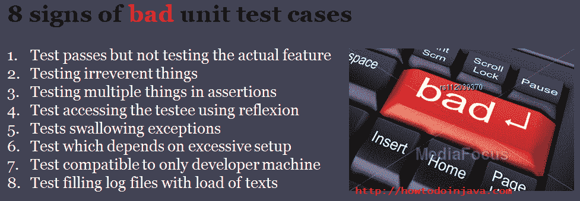

# 不良单元测试用例的前 8 个迹象

> 原文： [https://howtodoinjava.com/best-practices/8-signs-of-bad-unit-test-cases/](https://howtodoinjava.com/best-practices/8-signs-of-bad-unit-test-cases/)

如果您从事软件开发已有很长时间，那么您可以轻松地与单元测试的重要性联系起来。 专家说，如果我们遵循这些 [**最佳实践来编写单元测试**](//howtodoinjava.com/best-practices/unit-testing-best-practices-junit-reference-guide/ "Unit testing best practices : Junit Reference guide") ，那么大多数错误都可以在单元测试阶段本身捕获，并最终传递给质量团队。

```java
"It's overwhelmingly easy to write bad unit tests that add very little value to a project while 
inflating the cost of code changes astronomically."
```

虽然，糟糕的单元测试是现实，并且每个进行代码审查的人都偶尔（可能是定期）面对它。 那么，什么构成不良的测试案例呢？ 如何识别不良测试案例？

在这篇文章中，我试图确定 8 个这样的迹象，这些迹象将为您提供微妙的提示，即一个特定的测试用例不好，需要进行更新。

```java
Table of Contents

Test passes but not testing the actual feature
Testing irrelevant things
Testing multiple things in assertions
Test accessing the testee using reflection
Tests swallowing exceptions
Test which depends on excessive setup
Test compatible to only developer's machine
Test filling log files with load of texts
```



8 signs of bad unit test cases


让我们一一看一下这些指针的含义：

## 1）测试通过但未测试实际功能

相信我，我在以前的项目中看到过这样的测试用例，它们似乎在代码中做了很多工作，但实际上它们什么也没做。 他们正在向服务器发送请求，无论什么服务器响应，它们都在传递。 恐怖！

通过严格的代码审查，当心将此类测试用例放在您的代码存储库中。 一旦它们进入您的代码库，它们将成为您承担责任，每次携带，构建和运行它们，但不增加任何价值。

## 2）测试无关的东西

这是测试用例不好的另一个标志。 我已经看到开发人员检查了多个不相关的事情，以便代码可以执行某些操作，但不一定是正确的事情。 最好的方法是遵循单一责任原则，即一个单元测试用例只能测试一件事，仅此而已。

## 3）测试断言中的多个事物

这个似乎与上面的迹象相似，但事实并非如此。 在以前的符号中，测试正在测试不相关的事物，而在此符号中，此处是对一个正确的事物进行单元测试，但是在一个测试用例中测试了许多这样的事物。 这再次违反了单一责任原则。

好吧，请注意，我不鼓励在每个测试用例中使用单个断言。 要测试单个实体，您可能需要使用多个断言，并根据需要执行。

例如，一个 API 在帖子主体中采用一些参数并创建 Employee 对象并作为响应返回。 此 Employee 对象可以具有多个字段，例如名字，姓氏，地址等。编写一个测试用例以仅验证名字，然后编写一个用于验证姓氏和另一个用于地址的测试用例是代码的重复性，而没有任何值。 不要做

而是编写一个用于创建员工的肯定测试用例，并验证该单元测试中的所有字段。 在这种情况下，负测试用例应单独编写，仅做一件事和一个断言。 例如 一个测试用例用于空白的名字，一个测试用例用于无效的名字，依此类推。 可以使用单个断言来验证所有此类否定测试用例，这些断言可以期望 [**响应中出现异常**](//howtodoinjava.com/junit/junit-testcases-which-expects-exception-on-runtime/ "Junit testcases which expects exception on runtime") 。

## 4）使用反射测试访问被测者

这真是太糟糕了。 尝试将测试对象更改为需要的用户。 在测试对象上进行代码重构时会发生什么。 测试用例会爆炸。 请勿使用或允许使用。

## 5）测试 swalloing 异常

我得到了这些测试用例的应有份额。 在测试用例结束时，他们以小小的 catch 块静默地吞下了异常。 更糟糕的是，它们也不会发出失败的警报。 异常是您的应用抛出的信号，以表明发生了某些不良情况，您必须对其进行调查。 您不应允许测试用例忽略这些信号。

每当您看到意外的异常时，请立即使测试用例失败。

## 6）测试取决于过多的设置

我不喜欢测试用例，它需要在开始测试实际事物之前发生很多事情。 这样的场景可能像：促进在线会议的应用。 现在测试特定类型的用户是否可以加入会议，以下是测试执行的步骤：

*   创建用户
*   设置用户权限
*   创建会议
*   设置会议属性
*   发布会议参加信息
*   [测试]用户参加会议
*   过关失败

现在，在上述情况下，在验证实际逻辑之前必须设置 5 个复杂的步骤。 对我来说，这不是一个很好的测试案例。

正确的测试系统至少要为此活动在系统中存在一个现有用户。 在测试用例中，它将至少减少两个步骤。 如果可以的话，他可以召开一些已经创建的会议，也可以使这个测试用例真正成为重点。

另一种使其正确的方法是使用模拟对象。 他们在那里是为了这个目的。 是吗？

## 7）测试仅兼容显影机

这不是很广为人知，但当新生写的时候有时可见。 他们使用依赖于系统的文件路径，环境变量或属性来代替使用通用属性/路径或类似的东西。 提防他们。

## 8）使用文本加载测试填充日志文件

他们似乎并没有在快乐的日子里制造问题。 但是，在下雨天的时候，它们通过在日志文件中放置没有任何信息的不必要的文本来使人为难，并为试图查找那些日志文件中隐藏的内容的调试器带来了麻烦。

测试不是为了调试应用，因此不要放置调试日志种类语句。 一个通过/失败的日志语句就足够了。 相信我。

这些是我根据最近几年的学习而得出的想法。 我不希望您在上述所有方面都同意我的观点。 但是可能还有其他一些很酷的观点。 但是我肯定会想讨论您对主题的看法。

**祝您学习愉快！**