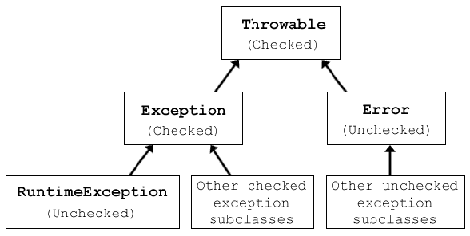

# 20 个 Java 异常处理最佳实践

> 原文： [https://howtodoinjava.com/best-practices/java-exception-handling-best-practices/](https://howtodoinjava.com/best-practices/java-exception-handling-best-practices/)

这篇博文是此博客中[**最佳实践**](//howtodoinjava.com/category/best-practices/ "java best practices")系列的又一篇文章。 在这篇文章中，我将介绍一些众所周知的和鲜为人知的实践，您在处理下一个 Java 编程任务中的异常时必须考虑这些实践。 单击此链接以阅读有关 Java 中[**异常处理**](//howtodoinjava.com/category/java/exception-handling/ "exception handling")的更多信息。

```java
Table of Contents

Type of exceptions
User defined custom exceptions

Best practices you must consider and follow

Never swallow the exception in catch block
Declare the specific checked exceptions that your method can throw
Do not catch the Exception class rather catch specific sub classes
Never catch Throwable class
Always correctly wrap the exceptions in custom exceptions so that stack trace is not lost
Either log the exception or throw it but never do the both
Never throw any exception from finally block
Always catch only those exceptions that you can actually handle
Don't use printStackTrace() statement or similar methods
Use finally blocks instead of catch blocks if you are not going to handle exception
Remember "Throw early catch late" principle
Always clean up after handling the exception
Throw only relevant exception from a method
Never use exceptions for flow control in your program
Validate user input to catch adverse conditions very early in request processing
Always include all information about an exception in single log message
Pass all relevant information to exceptions to make them informative as much as possible
Always terminate the thread which it is interrupted
Use template methods for repeated try-catch
Document all exceptions in your application in javadoc
```

在深入探讨异常处理最佳实践的深入概念之前，让我们从最重要的概念之一入手，这是要理解 Java 中存在三种可抛出类的常规类型：受检的异常，非受检的异常和错误。

## 1\. Java 中的异常类型



Java 中的异常层次结构


#### 检查异常

这些是必须在方法的`throws`子句中声明的异常。 它们扩展了`Exception`，旨在成为“面对您”的异常类型。 Java 希望您处理它们，因为它们某种程度上取决于程序之外的外部因素。 受检的异常指示正常系统运行期间可能发生的预期问题。 通常，当您尝试通过网络或文件系统使用外部系统时，会发生这些异常。 通常，对检查到的异常的正确响应应该是稍后重试，或者提示用户修改其输入。

#### 非受检的异常

这些是不需要在`throws`子句中声明的异常。 JVM 不会强迫您处理它们，因为它们大多数是由于程序错误在运行时生成的。 它们扩展了`RuntimeException`。 最常见的示例是`NullPointerException`（很吓人。不是吗？）。 非受检的异常可能不应该重试，正确的操作通常应该是什么也不做，然后让它从方法中出来并通过执行堆栈。 在高级别执行时，应记录此类异常。

#### 错误

是严重的运行时环境问题，几乎可以肯定无法解决。 例如`OutOfMemoryError`，`LinkageError`和`StackOverflowError`。 它们通常会使您的程序或程序的一部分崩溃。 只有良好的日志记录做法才能帮助您确定错误的确切原因。

## 2.用户定义的自定义异常

每当用户出于某种原因而感觉到要使用其自己的应用特定异常时，他都可以创建一个扩展了适当超类（主要是`Exception`）的新类，并在适当的地方开始使用它。 这些用户定义的异常可以两种方式使用：

1.  当应用出现问题时，直接抛出自定义异常

    ```java
    throw new DaoObjectNotFoundException("Couldn't find dao with id " + id);
    ```

    
2.  或将原始异常包装在自定义异常中，然后将其抛出

    ```java
    catch (NoSuchMethodException e) {
      throw new DaoObjectNotFoundException("Couldn't find dao with id " + id, e);
    }
    ```

包装异常可以通过添加您自己的消息/上下文信息来向用户提供额外的信息，同时仍保留原始异常的堆栈跟踪和消息。 它还允许您隐藏代码的实现细节，这是包装异常的最重要原因。

现在让我们开始探索在异常处理方面明智的最佳实践。

## 3.您必须考虑并遵循的 Java 异常处理最佳实践

#### 3.1 永远不要在`catch`块中吞下异常

```java
catch (NoSuchMethodException e) {
   return null;
}

```

这样做不仅返回“`null`”，而不是处理或重新引发异常，它完全吞没了异常，永远失去了错误原因。 而当您不知道失败的原因时，将来如何预防呢？ 永远不要这样做！

#### 3.2 声明您的方法可以抛出的特定检查异常

```java
public void foo() throws Exception { //Incorrect way
}

```

始终避免像上面的代码示例中那样进行操作。 它根本无法达到检查异常的全部目的。 声明您的方法可以抛出的特定受检异常。 如果此类检查的异常太多，则可能应将它们包装在您自己的异常中，并在异常消息中添加信息。 如果可能，您还可以考虑代码重构。

```java
public void foo() throws SpecificException1, SpecificException2 { //Correct way
}

```

#### 3.3 不捕获`Exception`类，而是捕获特定的子类

```java
try {
   someMethod();
} catch (Exception e) {
   LOGGER.error("method has failed", e);
}

```

捕获`Exception`的问题是，如果您稍后调用的方法在其方法签名中添加了一个新的受检的异常，则开发人员的意图是您应该处理特定的新异常。 如果您的代码只是捕获到`Exception`（或`Throwable`），那么您将永远不会知道更改以及您的代码现在是错误的并且可能在运行时的任何时间中断的事实。

#### 3.4 永不捕获`Throwable`

好吧，这是更严重的麻烦了。 因为 Java 错误也是`Throwable`的子类。 错误是不可逆的条件，JVM 本身无法处理。 对于某些 JVM 实现，JVM 甚至可能实际上不会在`Error`上调用您的`catch`子句。

#### 3.5 始终正确地将异常包装在自定义异常中，以便不会丢失堆栈跟踪

```java
catch (NoSuchMethodException e) {
   throw new MyServiceException("Some information: " + e.getMessage());  //Incorrect way
}

```

这破坏了原始异常的堆栈跟踪，并且总是错误的。 正确的方法是：

```java
catch (NoSuchMethodException e) {
   throw new MyServiceException("Some information: " , e);  //Correct way
}

```

#### 3.6 记录异常还是抛出异常，但不要两者都做

```java
catch (NoSuchMethodException e) {
   LOGGER.error("Some information", e);
   throw e;
}

```

与上面的示例代码一样，由于代码中的单个问题，日志记录和抛出将导致日志文件中出现多条日志消息，并使试图挖掘日志的工程师费尽心思。

#### 3.7 永远不要从`finally`块中抛出任何异常

```java
try {
  someMethod();  //Throws exceptionOne
} finally {
  cleanUp();    //If finally also threw any exception the exceptionOne will be lost forever
}

```

只要`cleanUp()`永远不会抛出任何异常，就可以了。 在上面的示例中，如果`someMethod()`引发异常，并且在`finally`块中，`cleanUp()`引发异常，则第二个异常将从方法中消失，原始的第一个异常（正确原因）将永远消失。 如果您在`finally`块中调用的代码可能会引发异常，请确保处理该异常或将其记录下来。 永远不要让它脱离最后的障碍。

#### 3.8 始终仅捕获您可以实际处理的异常

```java
catch (NoSuchMethodException e) {
   throw e; //Avoid this as it doesn't help anything
}

```

好吧，这是最重要的概念。 不要仅仅为了捕获异常就捕获任何异常。 仅在您要处理任何异常或要在该异常中提供其他上下文信息时才捕获任何异常。 如果您无法在捕获区中处理它，那么最好的建议就是不要仅将其重新抛出就捕获它。

#### 3.9 不要使用`printStackTrace()`语句或类似方法

完成代码后，切勿离开`printStackTrace()`。 很有可能是您的同事之一，最终将获得这些堆栈跟踪中的一个，并且对如何处理它的知识完全为零，因为它不会附加任何上下文信息。

#### 3.10 如果您不打算处理异常，请使用`finally`块而不是`catch`块

```java
try {
  someMethod();  //Method 2
} finally {
  cleanUp();    //do cleanup here
}

```

这也是一个好习惯。 如果在您的方法内部访问某个方法 2，并且方法 2 抛出一些您不想在方法 1 中处理的异常，但是仍然希望进行一些清除以防万一发生异常，那么请在`finally`块中进行此清除。 不要使用挡块。

#### 3.11 记住“早抛出晚捕获”的原则

这可能是有关异常处理的最著名的原理。 它基本上说您应该尽快抛出异常，并尽可能晚地捕获它。 您应该等待，直到掌握了正确处理所有信息为止。

该原则隐含地表明，您将更有可能将其扔到低级方法中，在这种方法中，您将检查单个值是否为`null`或不合适。 并且您将使异常爬升到堆栈跟踪相当多个级别，直到达到足够的抽象级别以能够解决问题为止。

#### 3.12 处理异常后请务必清理

如果您正在使用数据库连接或网络连接之类的资源，请确保清理它们。 如果要调用的 API 仅使用非受检的异常，则仍应在使用后使用`try–finally`块清理资源。 在`try`块内部访问资源，最后在内部关闭资源。 即使在访问资源时发生任何异常，资源也将正常关闭。

#### 3.13 仅抛出方法中的相关异常

相关性对于保持应用清洁很重要。 一种尝试读取文件的方法； 如果抛出`NullPointerException`，则不会向用户提供任何相关信息。 相反，如果将此类异常包装在自定义异常中会更好，例如`NoSuchFileFoundException`，那么它将对该方法的用户更加有用。

#### 3.14 切勿在程序中使用异常进行流控制

我们已经阅读了很多次，但是有时我们会在项目中不断看到代码，在这些代码中，开发人员试图将异常用于应用逻辑。 绝对不要那样做。 它使代码难以阅读，理解和难看。

#### 3.15 在请求处理的早期就验证用户输入以捕获不利条件

始终在很早的阶段就验证用户输入，甚至在输入到实际控制器之前。 这将帮助您最大程度地减少核心应用逻辑中的异常处理代码。 如果用户输入中存在一些错误，它还可以帮助您使应用保持一致。

例如：如果在用户注册应用中，您将遵循以下逻辑：

1）验证用户
2）插入用户
3）验证地址
4）插入地址
5）如果有问题，请回滚所有内容

这是非常不正确的方法。 在各种情况下，它会使数据库处于不一致状态。 而是首先验证所有内容，然后在 dao 层中获取用户数据并进行数据库更新。 正确的方法是：

1）验证用户
2）验证地址
3）插入用户
4）插入地址
5）如果有问题，请回滚所有内容

#### 3.16 始终在单个日志消息中包含有关异常的所有信息

```java
LOGGER.debug("Using cache sector A");
LOGGER.debug("Using retry sector B");
```

不要这样

在测试用例中，将多行日志消息与多次调用`LOGGER.debug()`一起使用可能看起来不错，但是当它显示在并行运行 400 个线程的应用服务器的日志文件中时，所有信息都将转储到同一线程 日志文件中，即使两条日志消息出现在代码的后续行中，它们最终也可能在日志文件中以 1000 行隔开。

像这样做：

```java
LOGGER.debug("Using cache sector A, using retry sector B");
```

#### 3.17 将所有相关信息传递给异常，以使它们尽可能多地提供信息

这对于使异常消息和堆栈跟踪有用和提供信息也非常重要。 如果您无法从中确定任何内容，则日志的用途是什么。 这些类型的日志仅存在于您的代码中用于装饰。

#### 3.18 总是终止被中断的线程

```java
while (true) {
  try {
    Thread.sleep(100000);
  } catch (InterruptedException e) {} //Don't do this
  doSomethingCool();
}

```

`InterruptedException`是您的代码的线索，它应该停止正在执行的任何操作。 线程被中断的一些常见用例是活动事务超时或线程池被关闭。 您的代码应该尽最大努力完成正在执行的工作，并结束当前的执行线程，而不是忽略`InterruptedException`。 因此，请更正上面的示例：

```java
while (true) {
  try {
    Thread.sleep(100000);
  } catch (InterruptedException e) {
    break;
  }
}
doSomethingCool();

```

#### 3.19 使用模板方法重复尝试捕获

在代码的 100 个地方没有使用相似的`catch`块是没有用的。 它增加了代码重复性，无济于事。 在这种情况下，请使用模板方法。

例如，下面的代码尝试关闭数据库连接。

```java
class DBUtil{
    public static void closeConnection(Connection conn){
        try{
            conn.close();
        } catch(Exception ex){
            //Log Exception - Cannot close connection
        }
    }
}

```

这种类型的方法将在应用中的数千个位置中使用。 不要将整个代码放在每个地方，而要定义上述方法，并在如下所示的任何地方使用它：

```java
public void dataAccessCode() {
    Connection conn = null;
    try{
        conn = getConnection();
		....
    } finally{
        DBUtil.closeConnection(conn);
    }
}

```

#### 3.20 使用 javadoc 记录应用中的所有异常

练习 Javadoc 一段代码在运行时可能抛出的所有异常。 还要尝试包括可能的措施，如果出现这些异常，用户应遵循。

我现在所想到的就是与 Java 异常处理最佳实践相关的所有内容。 如果您发现任何缺失或与我的观点无关，请给我评论。 我很乐意讨论。

学习愉快！